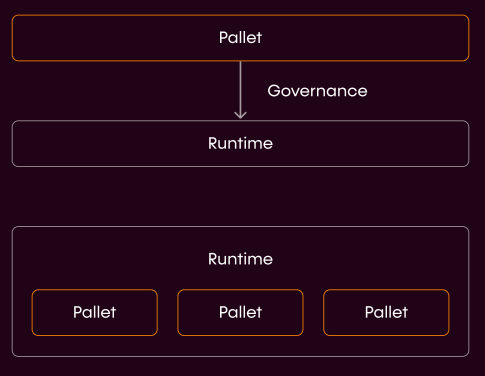

# Pallet Overviews

*Please note; the pallets presented are in active development and may not be production ready.*

# Pallets & Integration

The world of DeFi (primitives, core and applications) continues to edge towards interoperability 
and Polkadot comfortably sits at the epicenter of this natural progression. 
To natively deploy dApps in the DotSama ecosystem, developers need pallets. 
Substrate-based pallets are modular frameworks that enable anyone to create 
purpose-built blockchains (as well as dApps) by composing custom or pre-built components. 
Think of pallets as stackable building blocks that any developer can use to easily build protocols and dApps.

In general, pallets provide a robust and powerful framework to help propel more creativity from developers 
looking to build the future of DeFi’s primitive, core and application functions. 
Given that our parachains are the foundational layer that powers our ecosystem, 
we decided to initially adopt a pallet-centric approach to adding products directly in the runtime of our parachains 
before launching the Composable XCVM where developers will be able to deploy their applications utilizing cross-chain 
smart contracts. 

Developers and projects hold the ability to deploy as pallets on our chain, 
with governance having the ability to upgrade these pallets into the runtime of our chains:

## Advantages:

**Higher performance**: The cost of calling a pallet extrinsic is known beforehand through bench-marking.

**Larger set of capabilities**: Pallets may interact with each other, 
and can hook into different life-cycles of the block production, 
and can launch off-chain workers to handle computation or make HTTP requests.

**It is important to note that projects deployed from ETH that want to become natively cross-chain can deploy as Pallets
on Picasso.**

Pallet Developers on Picasso - What are the Benefits?

Picasso is the cornerstone of Composable Finance’s robust tech stack: 
Pioneered to meet pallet developers’ needs, 
with Picasso, instead of having to use time and resources 
to procure one of the highly sought after parachain slots on Kusama or Polkadot, 
pallet developers can simply launch their projects on Picasso. 
But securing the spot is not the only pain point developers have to overcome. 
The entire set of pallets launched on Picasso will be able to work together — 
resulting in seamlessly interoperable dApps with hardened security. 

Our aim is to supply dApp developers on Picasso with all the necessary tools to build seamlessly interoperable financial
applications ranging from simple to sophisticated. Hence this section of the developer documentation portrays the 
pallets and corresponding integration guides that we have developed and built into the runtime of Picasso.