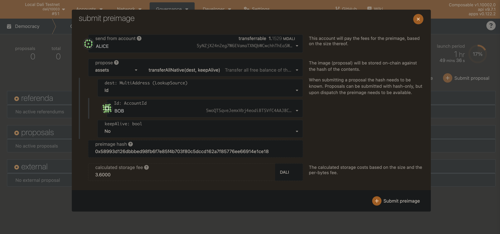

# Democracy usage guide - How to propose

## Requirements
The following requirements must be met.

A sufficient balance of PICA must be available to cover:
- transaction fees
- voting
- proposal submission
- Pre- Image submission

| Chain | Proposal Submission Deposit | Pre- Image Deposit Amount | 
| ----------- | ----------- | ----------- |  
| Dali | 100 PICA |  0.1 PICA | 
| Picasso | 100 PICA | 0.1 PICA |
| Composable | 100 PICA | 0.001 PICA |

## Process
By following the upcoming steps, you will create a governance proposal on Dali/Picasso/Composable.

### 1. Submitting a Pre- Image
To submit a Pre-Image for a proposal, go to the democracy page of the PolkadotJS web interface. Then click on the "Submit preimage" button.
Select the desired proposals extrinsic and outcome, note down the preimage hash, and press "Submit preimage".




### 2. Submitting a proposal
To submit a proposal, go to the democracy page of the PolkadotJS web interface. Then click on the "Submit proposal" button.
Enter your "preimage hash" in the appearing text box, and select the amount of balance you want to lock with your proposal.

Please note that the amount of PICA locked will stay locked for the duration of the proposal. 
To learn more about the locking behavior,
please take a look into the [Polkadot Documentation](https://wiki.polkadot.network/docs/maintain-guides-democracy#proposing-an-action)


### 3. Getting proposal into referenda
By now you will see your proposals in the "proposals" category on the democracy tab of the PolkadotJS web interface.
Other people can endorse your proposal, and the proposal with the most endorsements will get into referenda at the start of the next launch period.
The launch period depends on the corresponding chain in use.
This is defined in the runtime configuration by setting the following parameter for the `Democracy` pallet.
```rust
pub const LaunchPeriod: BlockNumber = HOURS;
```

| Chain | Launch Period |  
| ----------- | ----------- |  
| Dali | 1 Hour |  
| Picasso | 5 Days |
| Composable | 5 Days |

To endorse a proposal, select the "Endorse" button next to a proposal on the PolkadotJS web interface.


### 4. Voting
Now that your proposal is in referenda, people can vote on the outcome of the proposal.
Voters can increase their voting power by locking their tokens for up to a set period, depending on the corresponding chain in use.
For the referendum to be successful, it will need a `50% + 1` approval majority of all votes.
The following parameter defines the voting period length for the `Democracy` pallet.
```rust
pub const LaunchPeriod: BlockNumber = HOURS;
```

| Chain | Voting Period |  
| ----------- | ----------- |  
| Dali | 5 Days |  
| Picasso | 5 Days |
| Composable | 5 Days |


### 5. Enactment of proposal
After the voting period has ended and the turnout has been successful. There will be a delay until the proposal gets enacted.
This delay depends on the corresponding chain in use.
This is defined in the runtime configuration by setting the following parameter for the `Democracy` pallet.
```rust
pub const EnactmentPeriod: BlockNumber = HOURS;
```

| Chain | Enactment Period |  
| ----------- | ----------- |  
| Dali | 1 Hour |  
| Picasso | 2 Days |
| Composable | 2 Days |


This completes the proposal process on our Dali / Picasso / Composable Blockchain.
