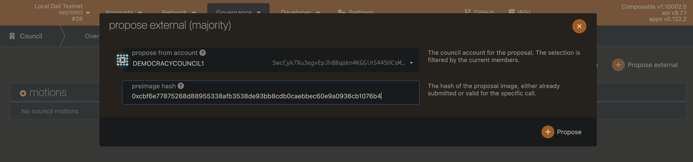
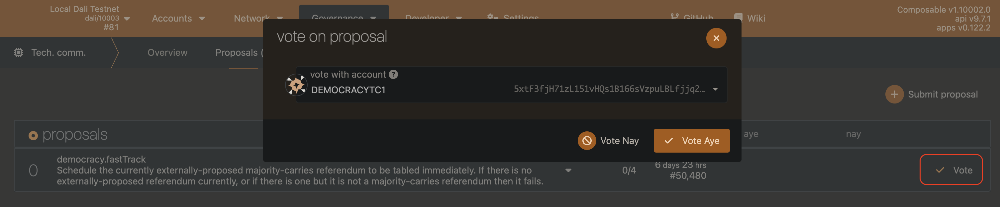
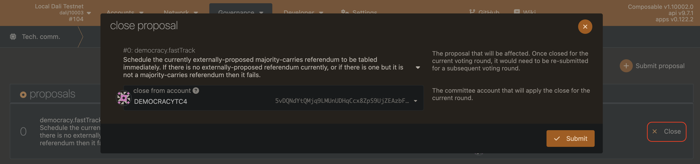
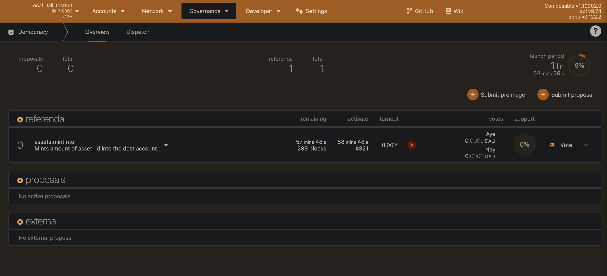

# Democracy - How to fast track
The following guide describes the process of how to fast track an external majority proposal directly into voting.


## Requirements
The following requirements have to be met to fast track a proposal into voting:
1. Council members are available
2. Technical Committee members are available
3. PICA available for transaction fees
4. PICA available for voting
5. PICA available for Pre- Image submission

| Chain | Pre- Image Deposit Amount | 
| ---------- | ----------- |  
| Dali |  0.1 PICA | 
| Picasso | 0.1 PICA |
| Composable | 0.001 PICA |

## Process
By following the upcoming steps, you create an external majority proposal and fast-track into immediate voting.

### 1. Council creates an external-majority proposal
One of the council members proposes an external-majority proposal for the council to vote on.

How long a proposal stays in voting depends on the corresponding chain in use. We are not entirely dependent on the voting period, as after reaching the minimum votes threshold, a proposal can be manually closed & executed.
The voting period is defined in the runtime configuration by setting the following parameter for the `Council` pallet.
```rust
pub const CouncilMotionDuration: BlockNumber = 7 * DAYS;
```

| Chain | Voting Period |  
| ----------- | ----------- |  
| Dali | 7 Days |  
| Picasso | 7 Days |
| Composable | 7 Days |

> Council motions which pass with a 3/5 (60%) super-majority - but without reaching unanimous support - will move to a public referendum under a neutral, majority-carries voting scheme. In the case that all members of the council vote in favor of a motion, the vote is considered unanimous and becomes a referendum with negative adaptive quorum biasing. [^2]



#### Parameters
- `threshold`: The threshold describes the minimum number of council members required to accept the proposal.
- `proposalHash`: Hash of the extrinsic which will be proposed.
- `lengthBound`: a value higher or equal to the length of the SCALE encoded proposal in bytes.[^1]

#### Call example
```typescript
const {
	data: [
		resultAccount, resultProposalIndex, resultProposalHash, resultThreshold
	]
} = await sendAndWaitForSuccess(
	api,
	councilMembers[0],
	api.events.council.Proposed.is,
	api.tx.council.propose(
		threshold,
		api.tx.democracy.externalProposeMajority(hashOfProposalToPropose),
		lengthBound
	)
);
```


### 2. Council votes on the proposal
Now the council members vote on the newly created council proposal.


#### Parameters
- `councilProposalHash`: Hash of the council proposal. Received during step #1 as `resultProposalHash`.
- `councilProposalIndex`: Index number of the council proposal. Received during step #1 as `resultProposalIndex`.
- `voteChoice`: true / false depending on the desired outcome of the council proposal.

#### Call example
```typescript
api.tx.council.vote(councilProposalHash, councilProposalIndex, true);
```


### 3. Council closes the proposal
After enough votes have been collected, any member of the council can close and execute the proposal.
This finalizes the council part of the process. You will find the proposal on the "Democracy" tab in the PolkadotJS web interface as "External Proposal".
Without being fast tracked it will take until the next launch period (see the proposal creation guide) to get into referenda.


#### Parameters
- `councilProposalHash`: Hash of the council proposal. Received during step #1 as `resultProposalHash`.
- `councilProposalIndex`: Index number of the council proposal. Received during step #1 as `resultProposalIndex`.
- `weightBound`: the maximum amount of Substrate weight the proposal can use. If the proposal call uses more, the call will revert.[^1]
- `lengthBound`: a value higher or equal to the length of the SCALE encoded proposal in bytes.[^1]

#### Call example
```typescript
api.tx.council.close(
	councilProposalHash, 
	councilProposalIndex, 
	weightBound, 
	lengthBound
)
```


### 4. Technical Committee proposes to fast track
By now, there exists an external-majority proposal on the chain, waiting to get into voting.
Using fast-tracking, we can skip this wait time & get the proposal into immediate voting.

To do this, the technical committee creates an internal proposal, calling fast-tracking on the proposalHash of the desired extrinsic, similar to step #1.
How long a proposal stays in voting depends on the corresponding chain in use. 
We are not entirely dependent on the voting period, as after reaching the minimum votes threshold, 
a proposal can be manually closed & executed.
This length is defined in the runtime configuration by setting the following parameter for the `Technical Committee` pallet.
```rust
	type MotionDuration = CouncilMotionDuration;
```

| Chain | Voting Period |  
| ----------- | ----------- |  
| Dali | 7 Days |  
| Picasso | 7 Days |
| Composable | 7 Days |


#### Parameters
- `threshold`: The threshold describes the minimum amount of council members required to accept the proposal.
- `proposal`: Defines the extrinsic associated with the proposal, we use democracy.fastTrack, with the following params:
  - `proposalHash`: Hash of the extrinsic which will be proposed. The same used during step #1.
  - `proposalLengthInVoting`: How many blocks the proposal will stay in referenda.
  - `proposalEnactmentTime`: The time in blocks until the proposal will be enacted after successfully being voted on.
- `lengthBound`: a value higher or equal to the length of the SCALE encoded proposal in bytes.[^1]

#### Call example
```typescript
const {
	data: [
		resultAccount, resultProposalIndex, resultProposalHash, resultThreshold
	]
} = await sendAndWaitForSuccess(
	api,
	technicalCouncilMembers[0],
	api.events.technicalCommittee.Proposed.is,
	api.tx.technicalCommittee.propose(
		threshold,
		api.tx.democracy.fastTrack(
			hashOfProposalToPropose, 
			proposalLengthInVoting, 
			proposalEnactmentTime
		),
		lengthBound
	)
);
```


### 5. Technical committee votes on proposal
Now the members of the technical committee can vote on the newly created internal proposal.



#### Parameters
- `technicalCommitteeProposalHash`: Hash of the technical committee proposal. Received during #4 as `resultProposalHash`.
- `technicalCommitteeProposalIndex`: Index number of the technical committee proposal. Received during #4 as `resultProposalIndex`.
- `voteChoice`: true / false depending on the desired outcome of the technical committee proposal.

#### Call example
```typescript
api.tx.technicalCommittee.vote(
	technicalCommitteeProposalHash,
	technicalCommitteeProposalIndex,
	true
)
```


### 6. Technical committee closes the proposal
As soon as the voting threshold is reached, any technical committee member can close the proposal and execute it.



#### Parameters
- `technicalCommitteeProposalHash`: Hash of the technical committee proposal. Received during #4 as "resultProposalHash".
- `technicalCommitteeProposalIndex`: Index number of the technical committee proposal. Received during #4 as "resultProposalIndex".
- `weightBound`: the maximum amount of Substrate weight the proposal can use. If the proposal call uses more, the call will revert.[^1]
- `lengthBound`: a value higher or equal to the length of the SCALE encoded proposal in bytes.[^1]

#### Call example
```typescript
api.tx.technicalCommittee.close(
	technicalCommitteeProposalHash, 
	technicalCommitteeProposalIndex, 
	weightBound, 
	lengthBound
)
```


### Fast Tracking was successful
Now the desired proposal will be in voting and all users can vote for their desired outcome.
This will be the case until it has reached the defined `proposalLengthInVoting` during step #4,
ignoring the default time a proposal stays in referenda.

The only remaining task at this point is to submit the preimage for the proposal.
For an introduction into submitting pre-images, please take a look into the proposal guide.




## References
[^1]: [MoonBeamDocs](https://docs.moonbeam.network/builders/pallets-precompiles/precompiles/collective/)
[^2]: [Polkadot: Learn Governance - Council](https://wiki.polkadot.network/docs/learn-governance#council)
