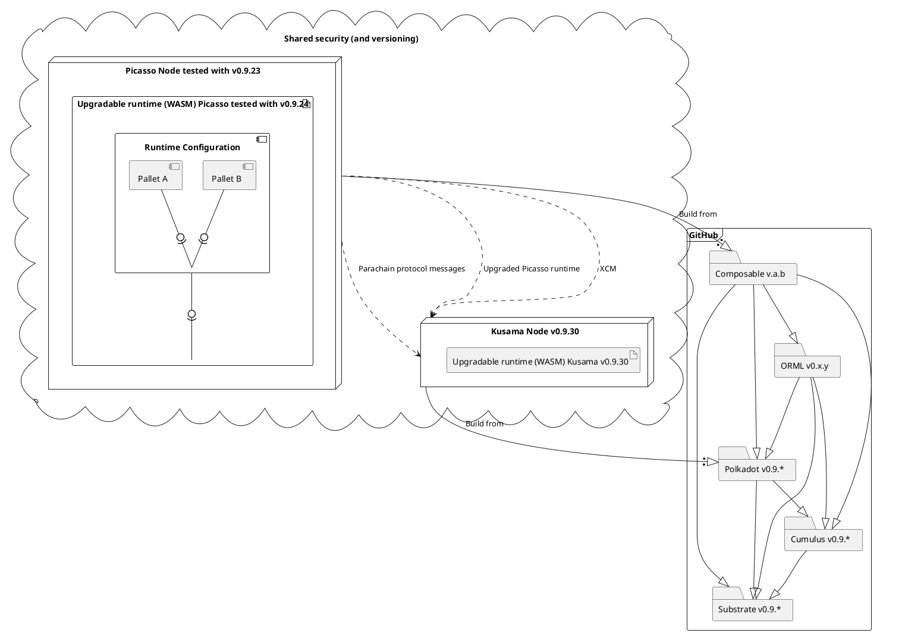

# Runtime Upgrades and Versioning

This diagram shows our compile time and runtime dependencies to guide the upgrade process.

We have to follow Substrate/Cumulus/Polkadot version and relevant ORML closely.

Runtime WASM version of Picasso is bumped automatically. Compile time version of Composable to be defined in release process document.

