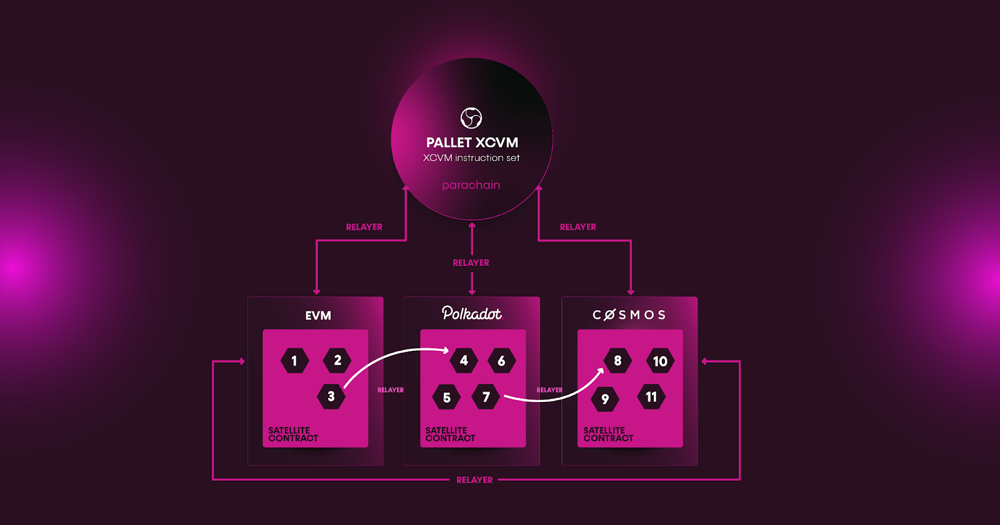

# Introduction

*Composable Finance: The interoperable infrastructure for Modular DeFi*

*Composable Finance: The interoperable infrastructure for Modular DeFi*

## The Vision

**We are crafting a fully interoperable and seamless future for DeFi.**

A natural evolution in a **cross-chain world** entails developers and users interacting unobstructedly across 
ecosystems and protocols, regardless of where their assets lie. That’s why our team at 
[Composable Finance](https://www.composable.finance/) 
is on a mission to build a **fully interoperable future** offering developers and end-users alike 
**seamless experiences and utilities** - while also **enabling new and valuable opportunities** in the space.

## The Problem

Decentralized finance continues to flourish. Many top DeFi protocols are still seeing an influx of users and high total 
value locked (TVL), while stablecoins in circulation are at an all-time high. 

However, **the industry is fragmented**, with the issue worsening as DeFi continues to expand and scale; projects are 
opting to launch on Ethereum layer 2s (L2s) and other layer 1 (L1) networks instead of or in addition to the 
traditional option of the Ethereum mainnet. This results in several ecosystems for DeFi, all with their own unique 
benefits, that largely exist in a silo from one another. 

Current interoperability solutions for cross-layer and cross-chain communication and value transfer between these 
ecosystems lack **number and efficiency**. Moving assets between ecosystems are becoming more intuitive, but with 
several applications segregated within a specific ecosystem, managing assets is not. Thus, all DeFi participants can 
benefit from improvements upon this infrastructure, which would allow them to build and use the most cost-effective 
and performant applications.

Resultantly, in the race for market share and users, two key functionalities are becoming the most important components
for remaining competitive in the quickly evolving landscape: **capital efficiency** and **interoperability**. 
Both developers and users will seek methods to interface with different ecosystems in a scalable, provable, 
and decentralized manner.

It is clear that we are approaching a world in which the future of DeFi will be fully blockchain-agnostic. 
In other words, the solution to the current fragmentation in DeFi is not more of the same bridges being built between 
one chain to another. Instead, it is the unification of all ecosystems via a natively cross-chain infrastructure.

## Limitations in Current Approaches

Current approaches to solving these problems are limited by at least one of the below:

* They are only focused on transfers, and not the broader developer experience
* They are focused on creating an entirely new security model, based on a segregated chain
* They are creating new messaging protocols instead of leveraging existing messaging protocols
* They depend on oracles for finality
* They do not provide a framework for users to navigate these different ecosystems
* They do not focus on the cross-ecosystem user experience (UX)

## The Composable Solution

Composable Finance’s [full technical stack](./products/technical-stack-overview.md) enables the evolution of digital 
assets and DeFi protocols, thanks to its new approach to interoperability. Subsequently, this allows for the 
unification of functionality across all blockchain ecosystems.

Specifically, we are building infrastructure that allows developers to deploy applications natively capable of 
cross-chain functions. This infrastructure also allows users to access previously disparate ecosystems simultaneously, 
autonomously interoperating across layers and chains, all through the same fabric and entry point: 
the Composable ecosystem.

The result is that DeFi users will be able to have their actions reduced to parameters that determine a cascade of 
automated cross-chain transactions to achieve their objectives instead of requiring users to navigate each step in the 
process themselves:

Together with our interoperable infrastructure, we will usher in an era of modular DeFi functionality, unlike anything before it. The basis of modular functionality is that a program, or in this case a decentralized application, can be separated into interchangeable modules capable of functioning independently. This environment will enable a new host of services to be offered to users that abstract complexity away to focus on needs: users will be able to get the best interest rates across lending pools, the best swaps across chains, and allow for a range of other possibilities across new pool types, arbitrage opportunities, and onboarding portals to DeFi. In concise terms, Composable Finance is orchestrating interoperability for modular functionality, to enable composability. 

We are accomplishing these goals through a multifaceted [technical stack](./products/technical-stack-overview.md) 

where we begin by bridging gaps between today’s isolated blockchains and layer 2 scaling solutions in order to create a
single and unified access point that is the 
[Composable Cross-Chain VM (XCVM)](https://medium.com/composable-finance/composable-finance-emerging-as-the-first-cross-chain-smart-contracting-l1-4e837b8bd57e) 
— that serves to orchestrate and compute smart contract functions across the array of EVM, Polkadot and IBC ecosystems 
autonomously, with the purpose of optimizing for best execution and mitigating all user experience constraints for 
developers and end-users. 

Composable Labs, our incubation arm, is on a quest to solidify new interoperability and development standards across 
Web3 and DeFi. One of our key objectives is to develop and deploy a novel set of financial applications to prototype 
the suite of new tools and technologies we are building. Serving to highlight the technical and UX benefits Composable 
offers to applications built atop our ecosystem, we believe our in-house incubation efforts will inspire new 
and existing crypto developers and ignite a Cambrian explosion of Composable Finance-powered technologies and applications.

## Get Involved

We’ve been working on perfecting our ecosystem and vision while ensuring that we are leading the way in terms of 
innovation and accessibility for DeFi. Through our collective vision and our suite of bespoke offerings, we aim to embed 
collaboration in a space where competition has predominated. Returning back to the core values of decentralism, we are 
passionate about collaborating with other projects and investors who share our vision.

The future we are building needs everyone to play a part, and we encourage you to reach out to our team for informal or
formal enquiries to see how we can work together to build tomorrow, today.

**Join the Composable community:**

[Composable Twitter](https://twitter.com/ComposableFin) | [Picasso Twitter](https://twitter.com/Picasso_Network) | 
[Telegram](https://t.me/composablefinance) | [Discord](https://discord.com/invite/pFZn2GCn65) | 
[Website](https://www.composable.finance/) | [GitHub](https://github.com/ComposableFi) | 
[LinkedIn](https://www.linkedin.com/company/composable-finance/)

[Composable Medium](https://composablefi.medium.com/about) | [Picasso Medium](https://medium.com/@picasso_network)

