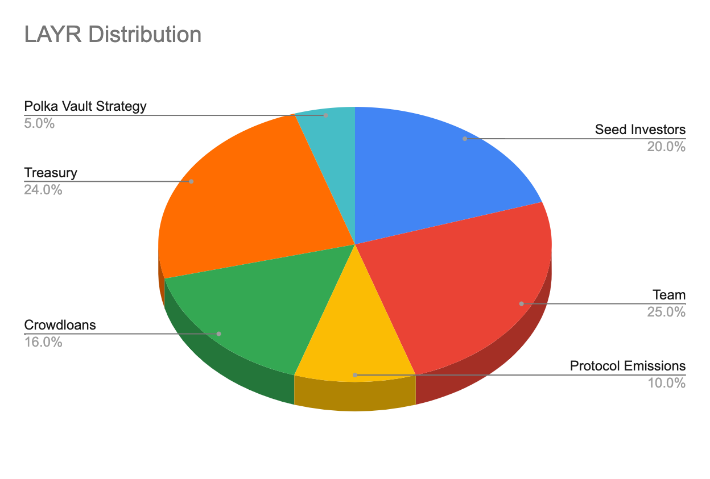

# LAYR Tokenomics 

## LAYR use cases 

### Gas fees 

Transaction fees (or gas) are payable in LAYR. 

### Governance

LAYR will be used in voting to decide on key governance decisions, including: 

* Pallet onboarding: which pallets can be incorporated on the Composable  Parachain
* Ecosystem growth: directing Treasury towards different initiatives in the ecosystem such as grants and incentivizing 
  usage of the initial decentralized apps (dApps) on the network.
* Public goods infrastructure: powering infrastructure providers, block explorers, wallets, and other key ecosystem 
  partners.

### Collator staking 

Collators for the Composable Parachain are required to put down a stake to earn transaction fees.

### Oracle staking

Oracle operators are required to put down stakes to provide price feeds. They will be rewarded/ slashed according to the 
accuracy of the data they provide.

### Liquidity provisioning

Users can provide liquidity for yield through LAYR LP pairs on the Pablo DEX. 

## Total supply and genesis token distribution

The total supply of 100 million LAYR tokens are intended to be distributed and released according to the following:

## Release schedule

LAYR release schedule is envisioned as follows:

**Seed investors**: 20% (or 20,000,000 LAYR) of the total token supply will be distributed to seed investors as a reward 
for their essential early support and strategic backing of the ecosystem. 20% of these tokens will be unlocked at the 
token generation event (TGE), with linear vesting of the remaining tokens over the subsequent two years. 

**Team**: 25% (or 25,000,000 LAYR) of the total token supply will be distributed to founders and the core Composable 
team as a reward as well as incentives for their continued actions in the best interest in the Composable ecosystem. 
The distribution of these tokens will have a six-month cliff with linear vesting of the remaining tokens over the 
subsequent two and a half years. 

**Emissions**: 10% (or 10,000,000 LAYR) of the total token supply will be released from the protocol as rewards and 
incentives for a number of actions involved in the protocol. These are programmatic incentives to bootstrap network 
growth (block validators, decentralized application builders and token holders from other networks) on Composable as 
well as token liquidity (liquidity mining programs). *

**Crowdloans**: 16% (or 16,000,000 LAYR) of the total token supply will be allocated for the purposes of securing a 
parachain slot every two years. 16% is being utilized for the current batches of Polkadot auctions, with a 25% vesting 
on TGE, and the remainder vesting over two years.

**Treasury**: 24% (or 24,000,000 LAYR) of the total token supply will be allocated to the Composable Treasury. *

**Polkadot vault strategy**: 5% (or 5,000,000 LAYR) of the total token supply will be rewarded to participants in our 
Polkadot vault strategy. 50% of this (2,500,000 LAYR) will be released at TGE, with the remaining distributed over six 
months. 

*All terms related to token allocations are subject to change. [Legal disclosures apply.](../../faqs/risks-disclosures.md)
