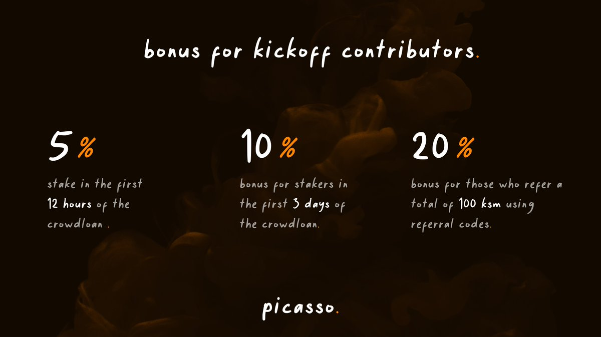

# The Picasso Crowdloan
*Our strategy that lead to a successful parachain procurement.*

## Picasso Crowdloan Details

Composable Finance has won the 13th Kusama parachain auction slot, raising 115,017 KSM and successfully securing a parachain to build out and deploy the Picasso network. 
Crowdloan participation was capped at 200,000 KSM and the crowdloan period will total 48 weeks, broken down into 8 lease periods of 6 weeks each.
 
Initially, 20% of Picasso’s native token supply was allocated to the crowdloan: 2,0000,000,000 PICA. However, as a result of the bonuses awarded to crowdloan participants, the total allocated supply of PICA amounted to 30% (3,000,000,000 PICA).

## Picasso Crowdloan Bonuses

### Referral Bonus

We implemented a referral program where users were able to generate referral codes and obtain a 20% bonus on their PICA tokens if they brought in other users contributing a total of 100 KSM or more.

### Early Participation Bonuses

Users who participated early on in the Picasso crowdloan received a boost on their earnings: participating in the first 12 hours provided such users with a 5% bonus, and participating in the first three days provided a 10% bonus.

### Bonus to Prior Stakers

Within the 30% PICA rewards for crowdloan participants, 5% is allocated as a bonus to contributors who previously staked in our crowdloan, and restake the same amount or greater. 
The bonus will be subject to the amount contributed to the prior round.
