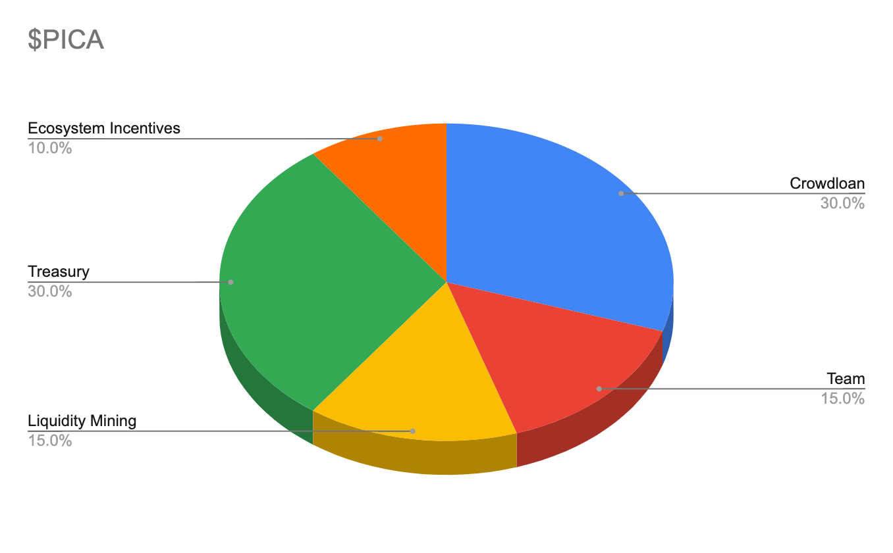

# PICA Tokenomics

## PICA use cases

PICA is fundamental to governance, user dynamics, and network usage on the Picasso parachain. 

### Gas fees

Transaction fees (or gas) are payable in PICA.

### Governance

PICA will be used in voting to decide on key governance decisions, including: 

* Pallet onboarding: which pallets can be incorporated on the Picasso parachain
* Pallet graduation: which pallets on Picasso will be able to “graduate” onto the Composable parachain
* Ecosystem growth: directing Treasury towards different initiatives in the ecosystem such as grants and incentivizing usage of the initial decentralized apps (dApps) on the network.
* Public goods infrastructure: powering infrastructure providers, block explorers, wallets, and other key ecosystem partners.

### Collator staking

Collators for the Picasso parachain are required to put down a stake to produce blocks on the Picasso parachain. In doing so, collators will earn PICA through transaction fees.

### Oracle staking

Oracle operators are required to put down stakes to provide price feeds. They will be rewarded/ slashed according to the accuracy of the data they provide.

### Liquidity provisioning

Users can provide liquidity for PICA-USDC, PICA-KSM pairs on the Pablo DEX for yield. 

## Total supply and genesis token distribution

The total supply of PICA is 10 billion tokens. PICA Token distribution is intended as follows:

**Crowdloan**: 30% of Picasso token supply will be allocated to crowdloan stakers. The crowdloan stakers will earn 50% of their PICA upon TGE, with the remainder being released linearly within 48 weeks. The full balance can be used to participate in governance and other activities besides transferring.

**Ecosystem Incentives**: 10% of PICA’s total token supply will be released from the protocol as rewards and incentives for a number of actions involved in the protocol. These are programmatic incentives to bootstrap network growth such as running an oracle on Apollo. *

**Treasury**: 30% of PICA’s supply is allocated to account for the long-term sustainability of the Picasso Network, the Picasso Network treasury is governed by the Picasso General Council, which will later be governed by PICA token holders. Decisions on grants and incentives will be actioned through the treasury and transaction fees will also flow into the treasury. * 

**Team**: The team will receive 15% of supply (1,500,000,000 tokens) with a 2-year linear vesting.

**Liquidity mining**: 15% of the total token supply will be released from the protocol as rewards and incentives for users on Picasso. *

*All terms related to token allocations are subject to change. [Legal disclosures apply.](../../faqs/risks-disclosures.md)
