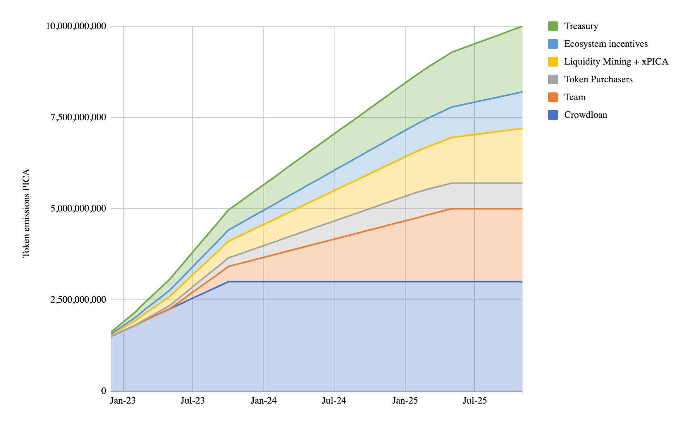
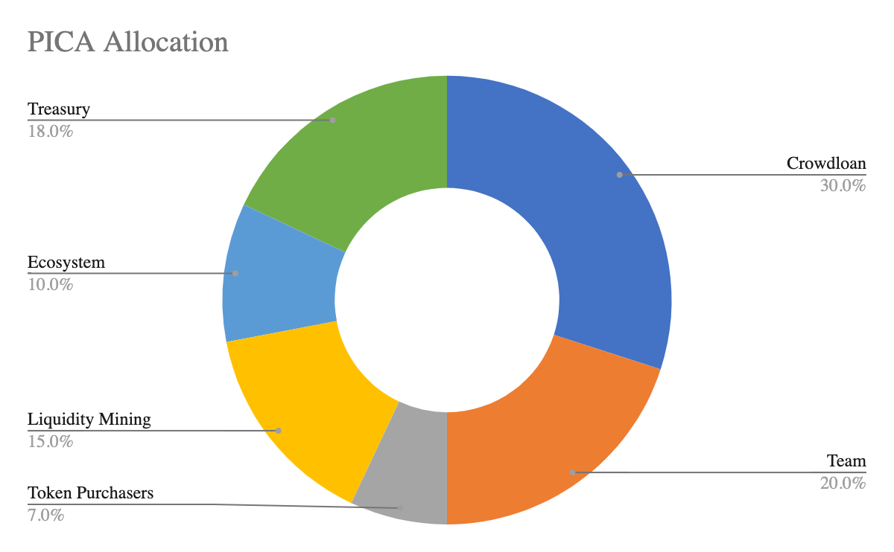

# PICA Tokenomics

## Total supply and genesis token distribution

The total supply of PICA is 10 billion tokens. PICA Token distribution is intended as follows:

|                      Allocation                       |         Amount |  Percentage (%)  | Description                                                                                                                                                                                                                                                                                                                                                                                                                            |
|:-----------------------------------------------------:|---------------:|:----------------:|----------------------------------------------------------------------------------------------------------------------------------------------------------------------------------------------------------------------------------------------------------------------------------------------------------------------------------------------------------------------------------------------------------------------------------------|
| Founders, Early Team Members and Current Contributors |  1,365,000,000 |      13,65%      | 13.65% of PICA are earmarked for distribution to founders, early team members, and current key team members along a 2-year linear vesting schedule with an initial 6-month lock.                                                                                                                                                                                                                                                       |
|                Key Partners & Advisors                |    635,000,000 |      6,35%       | 6.35% of PICA are intended to be distributed to key strategic partners and advisors along a 2-year linear vesting schedule with a 6 month lock. This will form part of the Team allocation.                                                                                                                                                                                                                                            |
|                       Treasury                        |  1,800,297,200 |       ~18%       | Approximately 18% of PICA’s supply is allocated to account for the long-term sustainability of the Picasso Network. Picasso Network treasury receives transaction fees and is governed by the Picasso General Council, which is intended to later be governed by PICA token holders. 75% of spent network fees will automatically flow into this fund (the remaining 25% of spent fees are intended to be distributed to collators).** |
|     Future Employee Incentives (part of Treasury)     |    200,000,000 |        2%        | 2% of PICA is intended to be reserved for future employee incentives. Future issues from this pool will be subject to a 4-year vesting schedule from network launch or grant date (whichever is later) with a 1-year cliff and monthly vesting thereafter.**                                                                                                                                                                           |
|       Additional Allocations (part of Treasury)       |  1,630,000,000 |       16%        | The remaining 16% of Treasury-allocated PICA will be determined by governance voting, including decisions on grants and incentives, developer advocacy, etc.**                                                                                                                                                                                                                                                                         |
|                       Crowdloan                       |  3,000,000,000 |       30%        | 30% of Picasso token supply will be allocated to crowdloan stakers for the parachain lease slot dated November 30, 2021 - October 31, 2022. The crowdloan stakers will earn 50% of their PICA upon TGE, with the remainder being released linearly within 48 weeks. The full balance can be used to participate in governance and other activities besides transferring.                                                               |
|                 Ecosystem Incentives                  |  1,000,000,000 |       10%        | 10% of PICA’s total token supply will be released from the protocol as rewards and incentives for a number of actions involved in the protocol. These are programmatic incentives to bootstrap network growth such as running an oracle on Apollo.                                                                                                                                                                                     |
|           Infrastructure Round Participants           |     72,132,700 |      ~0.72%      | Participants in the Infrastructure Round (i.e., those who will operate collators and oracles) will have their PICA locked for up to 3 months before they are released for staking for a minimum target period of 6 months.                                                                                                                                                                                                             |
|               Series A Token Purchasers               |    699,702,800 |      ~6,99%      | This portion of PICA tokens is allocated to token purchasers that participated in the second Composable Finance token sale, with a 3 month lock-up plus 2 years vesting.                                                                                                                                                                                                                                                               |
|                  Liquidity Programs                   |  1,500,000,000 |       15%        | 15% of the total token supply will be released as rewards for participants in Liquidity Programs on Picasso. This includes programs such as xPICA.                                                                                                                                                                                                                                                                                     |

**Estimated allocation and length of program is subject to change. [Specific Disclaimers and Disclosures for the PICA Token](../../faqs/disclaimer-disclosure-pica-token.md)

*All terms related to token allocations are subject to change. [Legal disclosures apply.](../../faqs/legal-disclaimer-disclosures.md)