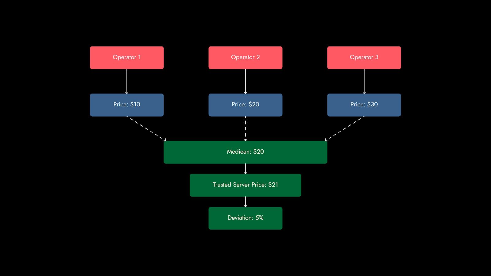

# How it works

Apollo is a permissionless, decentralized DeFi oracle. As a pallet, Apollo is built directly into the base of the 
parachain. As a result, it can use blockchain hooks on either side of the development of a block to find the median 
price and immediately update data. In addition, it is able to provide greater customization in the level of security it 
offers.

Oracle data providers operate nodes and provide a stake of tokens. This stake is slashed by some amount if the node 
provides a price that is different by a preset margin to the median data point submitted in a particular block. To 
verify information from Apollo, an asset is first added to the oracle. Then, an off-chain worker adds the price to the 
chain via a signed transaction. The off-chain worker gets the price via an API call to a pre-configured price server. 
The next block confirms if a threshold of minimum providers have found up-to-date information as well. If so, the price 
will be averaged amongst providers who may then be rewarded or have their stakes slashed based on how close they are to 
the median price. Upon aggregation of the asset price, the median price is stored with a block number to prevent 
front-running. This is made possible through the use of Substrate pallets instead of smart contracts, where such a 
function can be performed in one transaction.

In other DeFi oracles, owners can add or remove different price feeds through permissions, which opens the door for 
price manipulation. In the past, this meant that Chainlink paused an oracle for Luna on the platform Blizz Finance, 
which led to leveraged trades with artificially low collateral ratios that led to Blizz Finance being drained. 
Apollo avoids this by being permissionless and enabling any DeFi user to operate a node.

Apollo further reduces the ability for price manipulation by proving the option of time-weighting, for a time-weighted 
average price (TWAP). Aggregated prices are applied weights proportional to their interval of time. If an aggregated 
price has been held for a longer interval, it is given more weight. Developers are able to use TWAP to a customized 
degree, as longer intervals do open some ability for front-running while avoiding price manipulation through false data. 

In the future, a feature Apollo will incorporate is price banding. This means users will be able to select a 
‘trusted server’ (TS) that measures prices between its own server, and the difference found on other servers. 
If the delta between the two is significantly different, this would alert users to potential manipulation. 
Attackers would have to broadcast the wrong price from multiple nodes, over multiple intervals, which raises the stake 
required on their behalf. The TS would not act as a single trust source for the price either, however, as it would only 
alert users on price differentials, and not price. In the event a TS is compromised, it can be ignored while the oracle 
still provides an asset price.

_Price banding on Apollo_

Through Apollo’s permissionless and MEV-resistant nature, and features like TWAP, it acts as a superior, composable DeFi
oracle.
