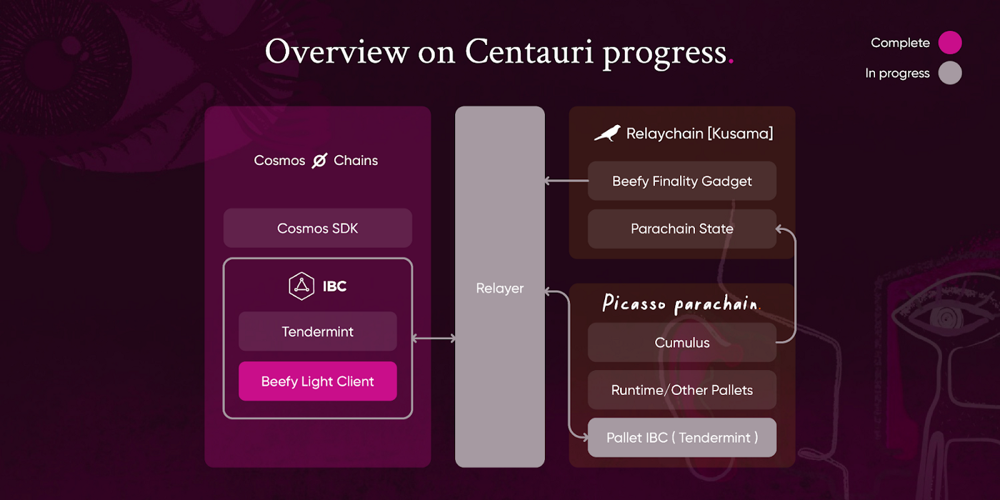

# Centauri

Centauri is our commitment to trustless light-client based bridging. Encompassing Centauri is the first IBC-Substrate 
bridge built on Picasso, and marks the first connection between the DotSama and Cosmos ecosystems. 
Centauri enables the trustless and cost-effective exchange and transfer of assets between the two ecosystems. 
This trustlessness is achieved through light clients and finality proofs. We are connecting the IBC Protocol to chains 
in other ecosystems that support light clients. Centauri can be leveraged by other pallets on Picasso and act as a 
transport layer for the [Composable XCVM](./xcvm-overview.md), facilitating cross-chain movement of 
information and assets.

## How it works

Centauri expands the reach of the IBC to Kusama and Polkadot, through the development of a new proprietary 
iteration of the Bridge Efficiency Enabling Finality Yielder (BEEFY) developed by Parity. 
As a result, Centauri is able to integrate light clients that track the finality of transactions between 
Picasso and IBC-enabled chains, and are able to reach a trustless consensus on finality across two chains. 
This is done in a manner that requires light heavy computational load, and enables decentralization. 
As such, Centauri is both practically useful, cost-efficient, and secure.

Centauri serves to bridge Picasso to blockchains and layers that have light clients installed. 
Through Centauri, the Composable Ecosystem (and the broader DotSama ecosystem) 
are bridged to all blockchains connected to the IBC Protocol.

The key challenge in executing upon the goals of Centauri is to reach consensus on the finality of the two networks 
it is connecting in a trustless manner, which guarantees the correctness and security of cross-chain bridging. 
This is achieved with several pieces of new technology. Firstly, the light clients allow nodes to verify the blockchain 
state without downloading the full block data, thus ensuring light computing requirements and decentralization. 
Secondly, Merkle Mountain Ranges (MMRs) allow new block headers to be hashed in an ‘append-only’ manner, 
which is more suited for use in consensus subsystems other than Merkle trees. Finally, the BEEFY finality gadget makes 
use of Merkle Mountain Ranges to produce finality proofs for parachains in a more efficient way. 
These components are highlighted in the sub sections for Centauri.

To create the proof of concept (PoC) of Centauri, we are working with a variety of projects in the Cosmos ecosystem. 
Then, we will hold a larger-scale launch of the bridge, serving as our fundamental IBC infrastructure for trustless 
bridging.
