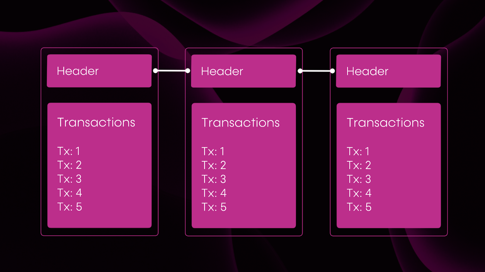
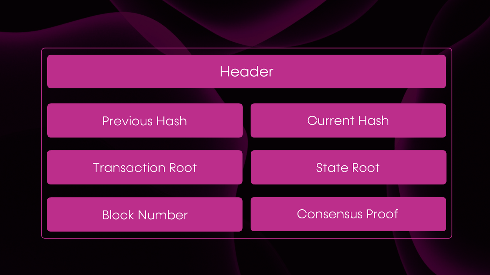
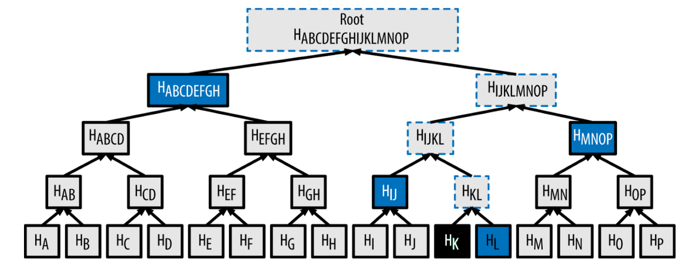
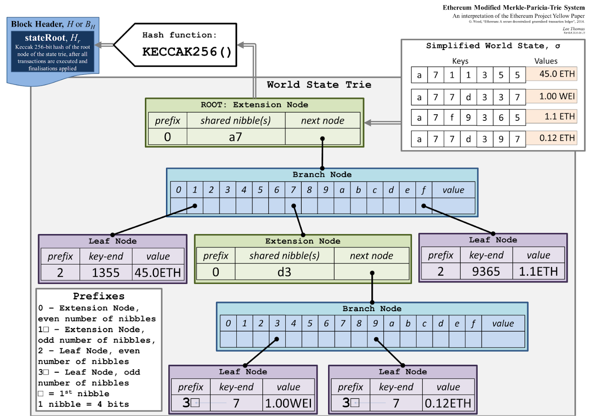
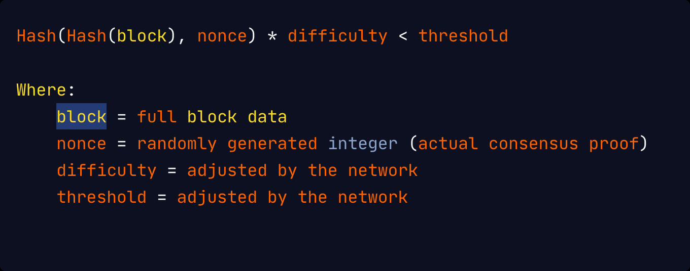
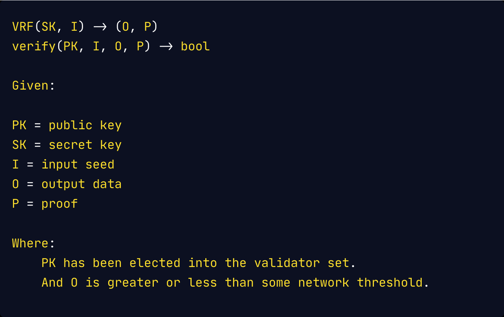

# Light Clients

Light clients are programs that connect to full nodes to interact with a blockchain. Highly efficient light client 
protocols are crucial in enabling the decentralization and mainstream adoption of blockchain protocols. Light clients 
are also what make bridges on the IBC possible; the IBC Protocol bridges to other chains by having light clients on 
either side of the connection. These light clients facilitate the passing of IBC opaque packets of information 
(i.e. transactions and associated information). Centauri leverages these light clients to facilitate connections, even 
further expanding upon the bridging opportunities of the IBC itself.

Light clients provide environments with computation and memory resource constraints (e.g. mobile, on-chain contracts) 
with the ability to verify the latest blockchain state without the need to execute and store the full block data and 
state. Light clients instead track block headers as opposed to tracking the full blocks and executing transactions to 
arrive at the latest state. It is important to note that blocks are simply composed of the header and transactions:





_The size of the transactions in a block might vary, but headers have a fixed size (usually no more than 1kb) and 
contain the following:_





Light client protocols consist of a combination of transaction Merkle proofs, state proofs, consensus proofs, and 
finality proofs, which are all usually included in the block headers with the exception of finality proofs. This is 
because finality proofs may differ from the consensus proof and require data that is an extension of the header. 


## Transactions Root

This is the Merkle root of all transactions that have been executed in this block. This Merkle root can be seen as a 
kind of cryptographic compression that allow trustless verification in the event that some data was part of the original 
data that was compressed by a Merkle proof, illustrated below:





The Merkle proof required to check if some element was included in the root would be log2(n) hashes, which are usually 
32 bytes. In the diagram above, we only need 4 hashes (outlined in blue) to prove or otherwise reconstruct the original 
root hash that K was indeed part of the original Merkle tree. The math is: n = 16, log2(16) = 4. This enables light 
clients to efficiently check which transactions were executed in a block without needing to download the full block that
may potentially contain thousands of transactions and having to scan this list linearly.


## State Root

The state root of a blockchain is similar to the transactions root in that it is the output of the cryptographic 
compression of data. However, where the transaction root is a compression of a list of transaction data, the state root 
can be seen as the compression of a list of keys and values.

Take, for example, the Ethereum state tree architecture:





Hence, the keys and values are the data stored on the blockchain by contracts or core blockchain subsystems, like the 
consensus protocol storing the list of authorities and their stakes. By compressing this data into a kind of Merkle 
root, it is possible to check the existence of some key value against the root hash and a Merkle proof without needing 
to maintain the full blockchain state, but still having the same trustless guarantees as a full node.


## Consensus Proofs

The consensus proof that a block is valid is usually included in its header and its format is entirely dependent on the 
consensus protocol of the blockchain. For proof-of-work (PoW) systems, the consensus proof is a nonce that satisfies the 
equation:





As seen above, finding a value that satisfies this equation would require a significant amount of computation as the 
hash functions cannot be brute-forced, but verifying this consensus proof is relatively inexpensive and fast.

Meanwhile, the consensus proof for a proof-of-stake (PoS) protocol is usually the output of a verifiable random function
where:





Most blockchain protocols’ consensus mechanisms usually only guarantee liveness, hence verifying these consensus proofs 
only tells if this block is valid. It does not, however, tell if this block should be considered as final. In the case 
of PoS, blocks that are not signed by a public key in the known authority set are not considered to be valid. Consensus 
proofs provide trust guarantees about a block to the nodes on the network pending finalization, as competing blocks for 
the same block height may arise in a byzantine system. It is entirely up to the finalization protocol to provide safety 
guarantees.


## Finality Proofs

For light clients to verify that events are happening on chain, they need a finality proof. This is cryptographic proof 
that the transactions in a block are final and that the block can never be reverted. These proofs could be part of the 
headers or could be requested alongside the header from full nodes.

For proof-of-work blockchains, this finality proof is actually embedded in the headers as the proof-of-work nonce. 
However, this alone is not enough to guarantee finality. Rather, we need a certain threshold of similarly valid headers 
that reference this header as its parent in order to be truly convinced of its finality. This vastly increases the 
storage requirements for light clients that want to be convinced of finality, since they must store n headers to verify
the finality of n-1 headers.

Even then, the finality is entirely probabilistic and dependent on the security of the hash functions used in deriving
the proof-of-work nonce.

For proof-of-stake blockchains, the finality proof is usually not included in the header but is optionally available to
light clients to request alongside the headers. The finality proof will usually consist of the signatures of the known
authority set, who have staked their tokens on the network and sign what they think is the latest block in the 
network. \The finality proofs in this system are signatures of this data from 2/3 + 1 of the known authority set, under 
security assumptions that less than a third of the authority set is malicious.


## Ancestry Proofs

Unfortunately, most finality proofs require light clients to be aware of the full chain of headers that have been 
finalized in order to follow the finality protocol. To enable trustless bridging between two networks via light clients 
which run in smart contract environments and have even stringent computation and memory constraints, Composable needs 
smaller-sized ancestry proofs which do not require awareness of every header in the blockchain.

This could be attempted using Merkle trees, where a light client simply tracks the Merkle root of all block headers seen
so far. Merkle proofs could then prove finality about any header to a light client that only knows the Merkle root of 
all finalized blocks. However, because of the structure of Merkle trees, this would require recalculating the full tree 
structure from the genesis block all the way to the latest block, for every new block.

Thus, 2,097,151 nodes would need to be recalculated for every new block for blockchain that already has a million 
blocks:

```markdown
    Tree height = log₂(1,000,000) // a million blocks


    Tree height = 20


    Nodes in the tree = 2^(20 + 1) — 1


    Nodes in the tree = 2,097,151
```

To prevent this staggering amount of work, Composable needs a tree structure that preserves the log2(n) proof sizes of a
Merkle tree but also re-uses in some way the previous hash computations on older nodes in the tree whenever new data is 
added to the tree. 
