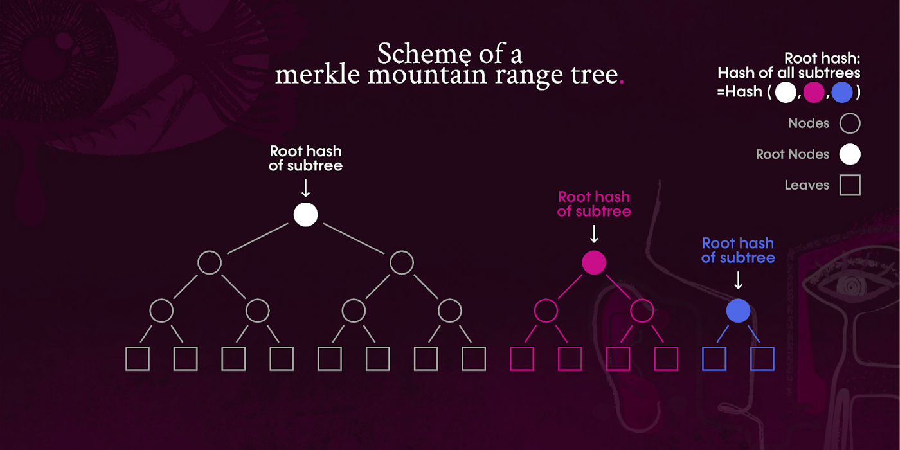
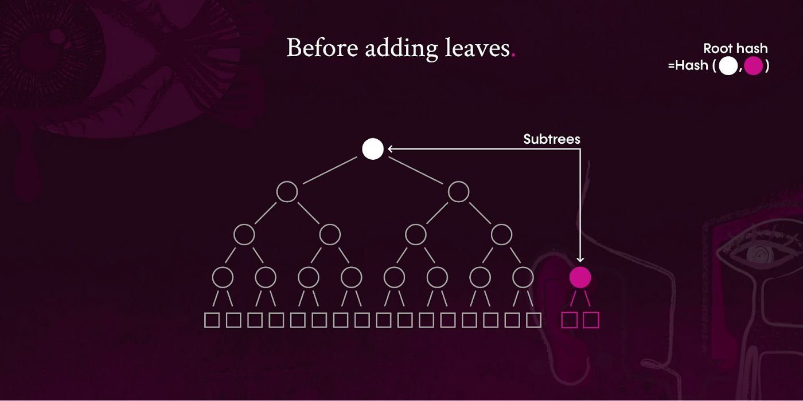
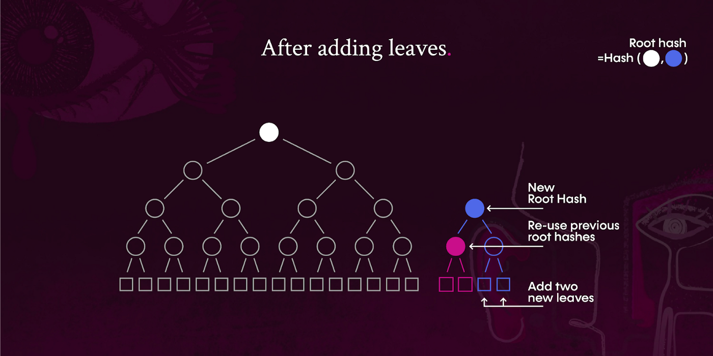
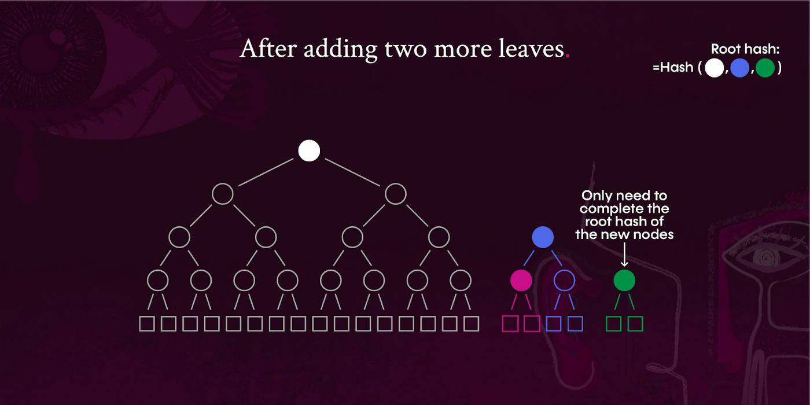
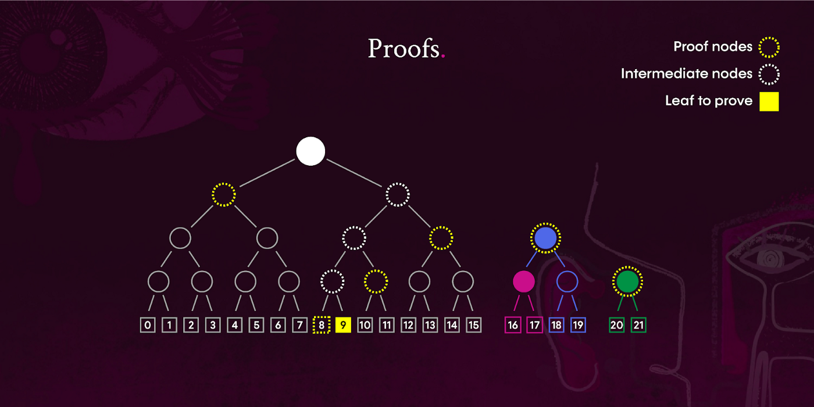

# Merkle Mountain Ranges

Merkle Mountain Range trees resolve the high computational volume problem by enabling highly efficient ancestry proofs. 
Merkle Mountain Ranges (MMRs) are a special kind of Merkle tree that is composed of perfectly-sized binary subtrees in 
descending order of height. For example, an MMR tree with 1,000,000 leaves will be composed of 8 perfect subtrees of 
heights: 19, 18, 17, 16, 14, 9 and 6:

A key feature of MMR is the reuse of the previous computations (root hashes) whenever new leaves are added to the tree. 
The rules for adding new leaves to an existing MMR tree require merging any two subtrees of the same height (i.e. the 
pink section and blue section are merged to the hash in blue in the following two images), so there is only ever one 
subtree per height level:

Merkle Mountain Ranges are also very efficient with proofs where the tree itself is composed of subtrees. Since MMR 
subtrees are presented in descending height, the first subtree is typically the heaviest to compute. This also means 
that, as the list grows, new leaves are actually less expensive to insert and prove.

In the continued example of the above tree, the subtree that requires the most proof items is the first subtree, 4 + 2 
(peak nodes of the other 2 subtrees) = 6 proof nodes. The benefit of the MMR is that, when adding new leaves, there is 
no need to recalculate the hashes of the first subtree, only the more recent ones:

