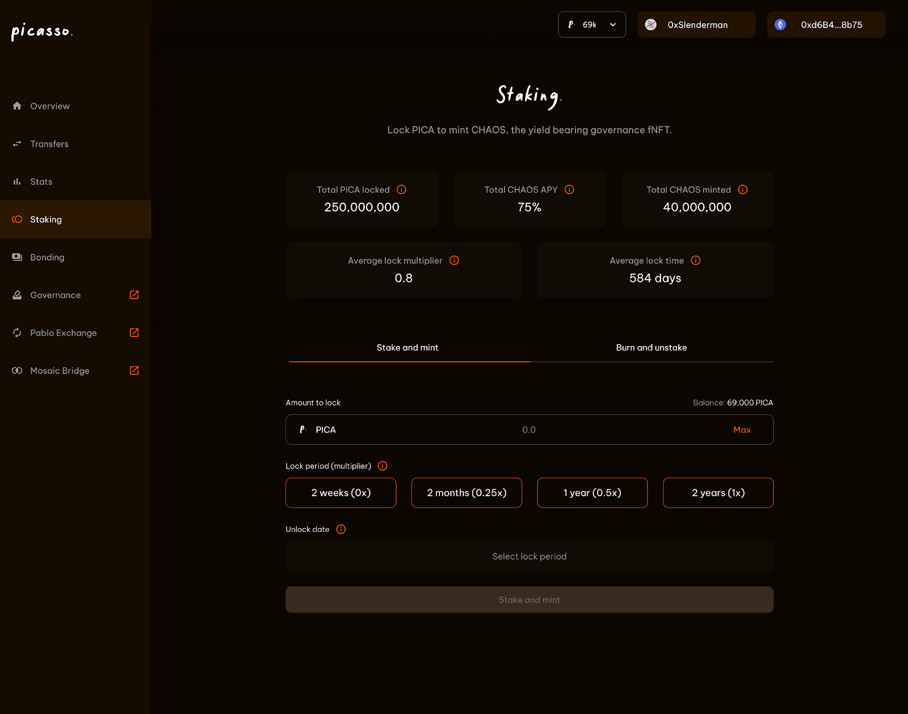

# CHAOS

## Introduction

CHAOS is a financial NFT (fNFT) that represents the locked yield-bearing version of PICA. Users will lock their PICA for
various amounts of time to mint CHAOS, an fNFT that represents the amount of PICA locked and the duration, with the 
relevant multiplier proportional to how long a user locked for. 
Users holding CHAOS will earn yield in the form of PICA and other incubated tokens, as well as the yield from our 
actively managed treasury and various revenue streams such as network transactions.

Financial NFTs (fNFTs) are a form of tokenization that allows composability and utility within DeFi ecosystems. 
The more widely used VE tokens, which function as receipts for locked assets, do not provide this functionality. 
Composable is building the first fNFTs on Substrate enabling users to capture additional utility which overall, 
benefits the entire ecosystem. 

CHAOS holders earn yield returns from the Picasso treasury, directly earn yield in the form of PICA tokens, 
and are returned yield from transactions on the Picasso network. 
In addition, the locked PICA tokens represented by CHAOS will in the future be used for collator staking, 
which will return additional yield to CHAOS holders, and help represent activity on the chain. 
As such the CHAOS token loosely represents the value of the Picasso ecosystem via a mechanism of broad exposure. 
The use of fNFTs will eventually become the standard across all of Composable’s Substrate protocol tokens.

## How to lock PICA tokens and receive CHAOS 

Users are able to gain CHAOS fNFTs in return for locking PICA tokens. 
The amount and tenor of the CHAOS fNFTs you receive differ based on the amount of PICA tokens you lock, 
and the duration of the lock, with the relevant multiplier proportional to how long a user locked for. Upon the end of 
the lock, users will have the option to renew, or burn their CHAOS fNFTs to return their original locked assets. 
CHAOS holders will be continuously earning rewards throughout the lock period of their locked PICA.

## Building deep protocol-owned-liquidity

fNFTs create an even more effective route for bonding and building a treasury of protocol-owned liquidity and strategic 
assets. Instead of selling bonds for PICA, the protocol will be able to offer bonds for CHAOS directly, therefore 
meaning that the PICA has already been committed to longer-term locks. Bonds will be offered for varying tenors of CHAOS, 
e.g different discounts for 1 year locked, 2 year locked etc. These bonds represent longer lock periods of the 
underlying PICA tokens, and as such help deepen liquidity on the Picasso treasury, via protocol-owned liquidity. 
Resultantly, this helps overcome the issue of mercenary capital.

fNFTs create an even more effective route for bonding and building a treasury of protocol-owned liquidity and strategic 
assets. Instead of selling bonds for PICA, the protocol will be able to offer bonds for CHAOS directly, therefore 
meaning that the PICA has already been committed to longer-term locks. Bonds will be offered for varying tenors of 
CHAOS, e.g different discounts for 1 year locked, 2 year locked etc. These bonds represent longer lock periods of the 
underlying PICA tokens, and as such help deepen liquidity on the Picasso treasury, via protocol-owned liquidity. 
Resultantly, this helps overcome the issue of mercenary capital.

Using bonds to accumulate protocol-owned-liquidity will be a significant benefit to the ecosystem in the following ways:

* Establishing sufficient and permanent liquidity across our key protocols will be a core objective in ensuring users 
  can perform necessary actions and trades.
* Protocol owned liquidity will additionally be earning the revenue through trading fees generated. 
  These will therefore provide additional forms of yield that will be distributed back to CHAOS holders.
* As well as trading fees, the initial benefits of increased liquidity will therefore also mean network activity 
  increases, with network fees also generating revenue that can be distributed back as yield to CHAOS holders.
* The Picasso treasury will be holding tokens of our incubated protocols, with these tokens offering a multitude of 
  opportunities to provide liquidity and generate more revenue, or even distribute the tokens themselves back to CHAOS holders.

## User rewards from holding fNFTs

CHAOS holders receive returns from multiple different streams. They earn yield directly in the form of PICA returns, 
earn revenue from the Picasso treasury, and earn yield from transaction fees on the Picasso network.

![CHAOS_architecture](../../static/img/products/chaos/architecture
