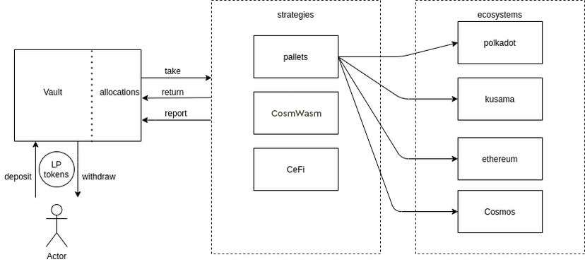

# Cubic: The Vault Pallet

Cubic is Composable’s vault pallet and is part of the primary pallet core infrastructure that forms our DeFi 
infrastructure. Currently, no vault infrastructure exists on Substrate. Therefore, the hope is that Cubic will set the 
standard for what vaults will be in the Polkadot and Kusama ecosystems, which are a commonly used primitive in Ethereum 
ecosystems.

## How Our Vaults Pallet Powers Our Infrastructure

Composable is working to deliver a comprehensive DeFi ecosystem to Polkadot and Kusama, and our vaults pallet will be a 
crucial driver in this endeavor.

Vaults aggregate user funds into a single managed pool. These funds are then used to execute different financial 
strategies, such as yield farming. As a consequence of pooling funds, and then executing them in aggregate through an 
individual managing agent (either a human, or through some form of automation), users face less gas fees, and burdens on 
their time and labor.

In the Composable ecosystem, developers can leverage Cubic which enables users to deposit liquidity provisioning (LP) 
tokens into vaults. Funds can then be routed to various strategies like those in other pallets, those in other 
smart contracts, or even those in centralized finance. This means that funds can be transferred to and from several 
ecosystems, including Polkadot, its canary network Kusama, Ethereum, and Cosmos. This relationship is depicted below:

## Use Cases

Cubic will become core infrastructure for projects that utilize vaults, such as AMMs, strategies, lending protocols, 
and other DeFi money legos. The broader hope is that with vault infrastructure, Ethereum projects that leverage vaults 
will have familiar infrastructure to build analogous pallet iterations of their protocols. By accomplishing this, we 
anticipate that Cubic will set the standard for cross-chain vault infrastructure used by the broader Web 3.0 ecosystem.

## Advantages Over Solidity Vaults

Vaults provided through a pallet become the core infrastructure of the Picasso and the Composable Parachain. Usage 
of the vaults incurs lower fees as result of optimized pallet design. Strategies on our chain may still be implemented 
as smart contracts or pallets. The latter is capable of far more complex operations, such as cross-chain investing, 
which delivers advanced functionality to our ecosystem.

Through this novel infrastructure, Cubic offers unique functionality for the DotSama ecosystem (cross-chain vaults). 
Cubic is positioned to be both a critical component of Composable and a plethora of other dApps emerging in the 
cross-chain DeFi space. Check out the standard implementation and extrinsics of Cubic 
[here](https://dali.devnets.composablefinance.ninja/pallets/vault.html).
