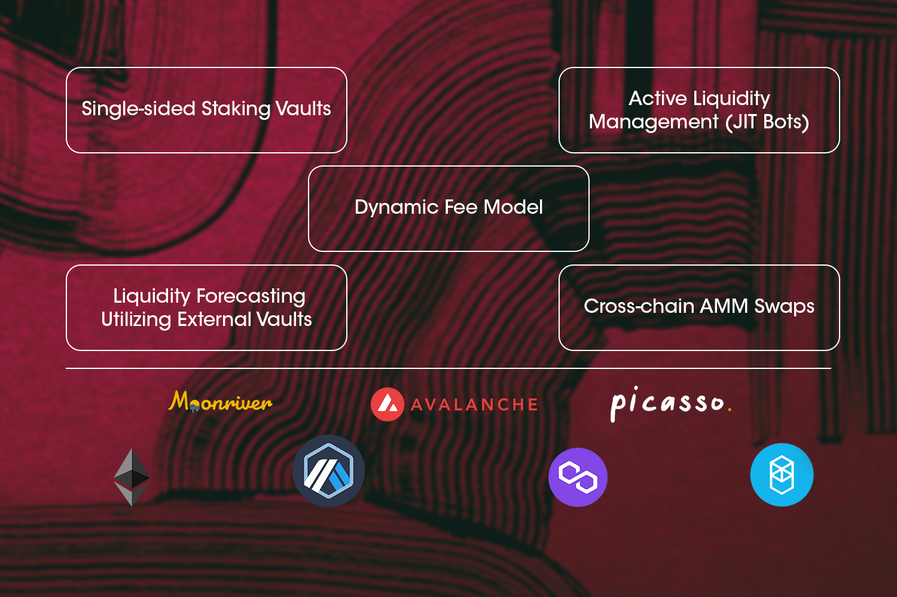

# Mosaic Overview (Discontinued)

---

**The initial iterations of the Mosaic bridge focused on aggregating liquidity and facilitating transfer availability
for the ecosystem, but in order to align with our vision, our bridging solution needs to be optimized for security,
efficiency, and user design. Therefore, the development of Mosaic has been discontinued.**

**As Mosaic showcased a pioneering design in UX, it will serve as the UX that underpins the trustless bridging
infrastructure that we’ve built — to Polkadot, NEAR, Cosmos, and many other chains to come**

Mosaic is Composable Finance’s cross-chain transfer availability layer that combines a 
[dynamic fee model](https://medium.com/composable-finance/the-dynamic-fee-model-powering-mosaics-transfer-availability-layer-f91011309592), 
[liquidity forecasting](https://medium.com/composable-finance/liquidity-forecasting-in-mosaic-part-iv-machine-learning-based-methods-17e8f2e5de14), 
[active liquidity management](https://composablefi.medium.com/understanding-mosaics-active-management-e1894fc90a00), and 
passive liquidity rebalancing to create a transfer availability layer. As a proactive bridging infrastructure, 
Mosaic leverages a network of existing bridges to manage its LP vaults on different layers ensuring the ability to 
transfer assets cross-chain regardless of volume or size.

Mosaic launch was planned in three phases. Phase 1 has been completed, which is the current version consisting of a 
Proof of Concept that only connects Ethereum, Arbitrum, and Polygon to gather data on transfer sizes and fees. 
Phase 2 delivers the core features of Mosaic, including dynamic fees, passive liquidity forecasting and rebalancing, 
and active liquidity management. Phase 3 adds new functionalities like decentralized executors and on-chain dispute 
resolution. 

Mosaic Phase 2 has already integrated several L1s and L2s, including Polygon, Arbitrum, Optimism, Starknet, Avalanche, 
Fantom, Moonriver, and more to be announced. Passive liquidity rebalancing is a key new module introduced in Mosaic’s 
[Phase 2](https://medium.com/composable-finance/introducing-mosaic-phase-2-10d1bfe5f6f8). 
Meanwhile, the dynamic fee model ensures that transfer fees stay low while LPs earn high yield from single-side staking. 
High-velocity bots provide an additional layer of transfer support to enable liquidity provision in a just-in-time 
manner in case passive liquidity rebalancing fails.

*High level view of Mosaic architecture*

## Rationale

Presently, the existing nature of bridges makes it infeasible for them to scale and meet increasing demand from both 
institutional or retail decentralized finance (DeFi) users. Existing bridges can only accommodate small transfer amounts, 
often resulting in liquidity lags or are unable to support transfers of all users and sizes. 
In most cases, high fees accompany transfers, as users have to compete to access the liquidity that is available. 

These limitations are understated today but will only grow more significant and stunt the growth of DeFi as the 
complexity, size and quantity of cross-chain-and-layer transfers increases.

These bridges are hindered by a lack of smart liquidity movement and an inability to support cross-chain-and-layer 
transfers and LP token swaps. The inefficiencies of current bridges hinder end-users from harnessing the full potential 
of DeFi. For instance, arbitrage opportunities and other time-sensitive transfers may often fail as a result of the 
reactive method of liquidity movement utilized by the current generation of bridges. Liquidity should be automatically 
rebalanced to ensure that it is available on the right layer at the right time to guarantee transfers.

At the core of their value proposition, existing bridges need to be able to guarantee transfers. However, insufficient 
liquidity on a necessary layer at the time of a transfer often hinders this guarantee. A major contributing factor to 
these limitations and failure of guarantee is the slow, manual process of liquidity movement.
