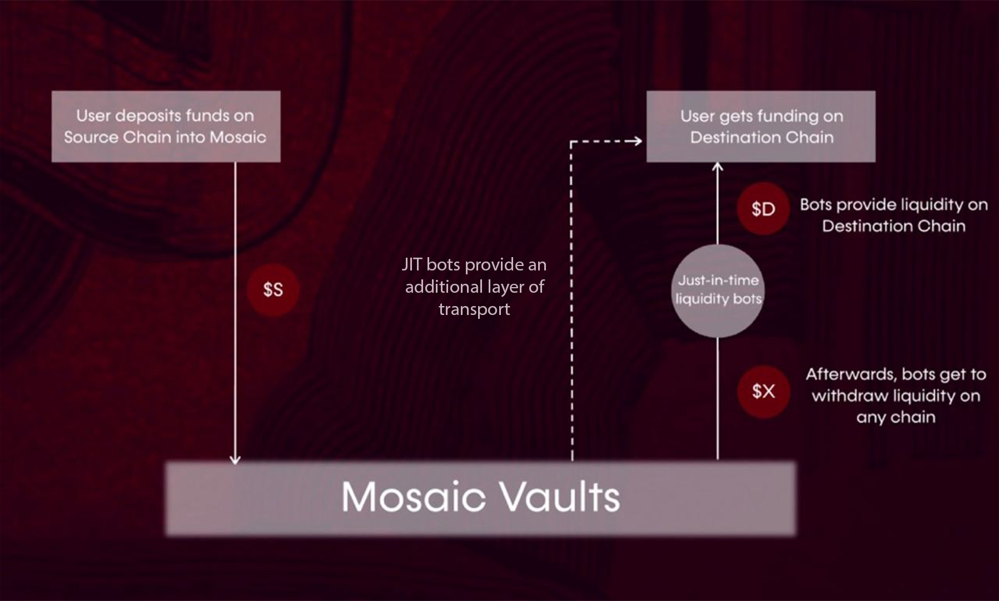
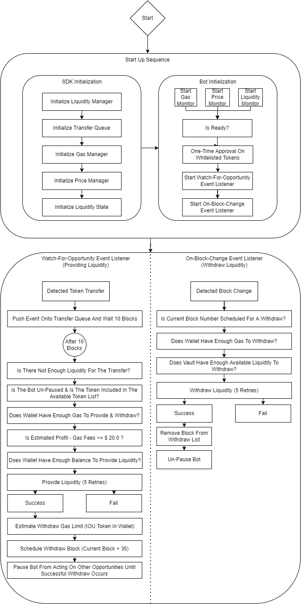

# Active Liquidity Management

## Passive vs Active Liquidity

**Passive liquidity** involves providing liquidity in the Mosaic Vaults. Capital is provided up-front, before any 
particular transfers are identified that need this liquidity. 

In contrast, **active liquidity** can be thought of as JIT liquidity, where a particular immediate need for liquidity is
identified and then actively met by a liquidity provider.

### Active Liquidity

Users program active liquidity bots on Mosaic that provide temporary liquidity, with increased compensation, when a 
liquidity gap is identified in a pending transfer. When rebalancing falls short, Mosaic’s active bots can intelligently
detect transfer attempts and front-run the relayer with JIT liquidity, thereby guaranteeing the success of such 
transfers at all times.

This creates a sort of synergistic competition between active management bots and passive LPs, thereby ensuring the 
constant availability of liquidity on the Mosaic bridge. As active bots have the ability to front-run incoming transfers
and in most cases settle them, they earn a higher portion of the fees as compared to their passive LP counterparts 
(70:30 active bots:passive LPs). 

#### Running your own liquidity bots on Mosaic 

A vital feature of the active management module is that JIT liquidity bots can withdraw liquidity on any chain, in any 
token. For instance, a user holding USDC on Fantom, that provides his tokens as liquidity to the Fantom network through 
Mosaic, will be able to withdraw to all other networks that can interact with Mosaic. As such, the user gets 
unparalleled multi-chain exposure, This feature enables many new strategies for active liquidity provisioning:

* Withdraw to the same network a user provided liquidity on.
* Withdraw to the network where the fee is lowest.
* Set a certain network to withdraw into and earn transfer fees while doing so.
* Set up several bots to monitor different networks and loop the liquidity provisioning/withdrawal strategies on 
  different networks to compound returns.
* Convert part of the liquidity withdrawn to native gas tokens to get a discount on the gas fees the next time the user 
  provides liquidity on a network.

#### Setting up liquidity bots 

A user can configure a JIT liquidity bot using a free public RPC endpoint for interacting with the blockchain or a 
paid-for custom RPC endpoint. A JIT liquidity bot can be initialized using the active liquidity SDK. 

By using highly familiar tools like [Node.js](https://nodejs.org/), [Typescript](https://www.typescriptlang.org/), and 
[Ether.js](https://docs.ethers.io/v5/), barriers to entry will be further broken down and a community of developers will
be fostered that make this built-in maximal extractable value (MEV) opportunity more accessible. Once the bot is set to 
monitor certain parameters, it can begin scanning for opportunities to provide or withdraw liquidity actively as 
opportunities arise.

Additionally, this is a system that is easy for users to utilize as they can participate without the need to run a full 
node. Users can now benefit from otherwise unused collateral in wallets being used by active bots to provide liquidity 
and generate returns. This highlights how bots can benefit all users, even those with little to no capital.

#### Partnerships and Integrations

[Instrumental ](https://www.instrumental.finance), a decentralized app (dApp) for cross-chain yield optimization, 
leverages the cross-chain function calling capability of the Composable SDK to transfer LP tokens to the 
highest-yielding pools across layers and chains.  

Community members can use the Composable SDK to integrate cross-chain transfer functionality in their dApp, or use it 
to build novel applications, such as cross-chain asset management, cross-chain lending, etc. 

Once Mosaic Phase 3 is complete, we will further decentralize validation and executor architecture.
