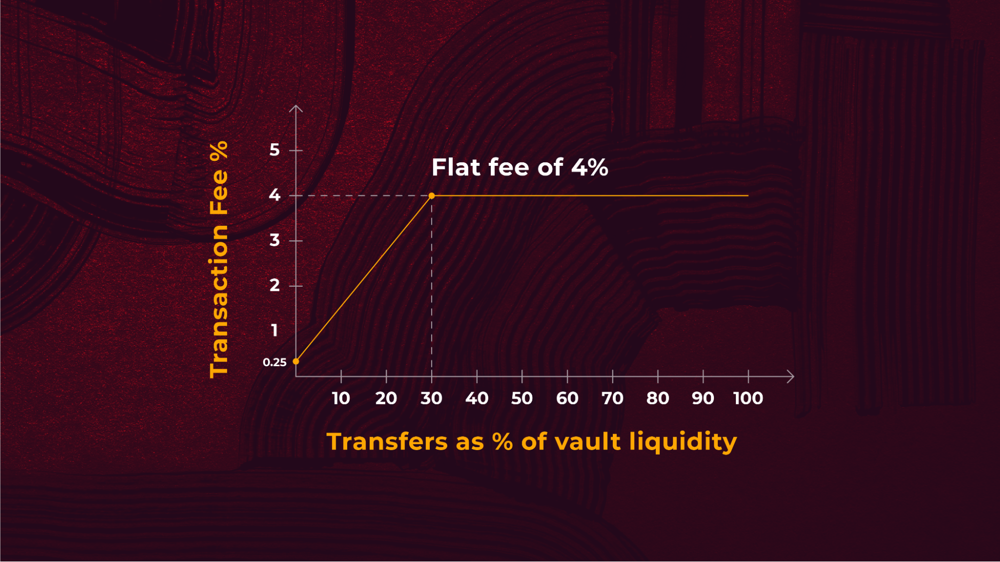

# The Dynamic Fee Model

Composable has taken different fee models into consideration in order to adopt best practices and ensure fees are 
competitive with the industry. It is not uncommon to find that other operators charge a fixed fee of 0.50% for all 
transfers while— almost 0.2% more than Mosaic’s average fee.

Mosaic’s dynamic fee is based on the available liquidity on the source and destination layer. The dynamic fee model has
a maximum fee of 4% and a minimum fee of 0.25%. The fee is based on a linear curve until the trade size is greater than 
30% of the available liquidity on the destination layer. At this point it became a flat fee of 4%. Considering the above
conditions, 
[Mosaic’s dynamic fee model](https://medium.com/composable-finance/the-dynamic-fee-model-powering-mosaics-transfer-availability-layer-f91011309592) 
could offer:

* An annual percentage yield (APY) of 10.0% for USDC for LPs.
* An annual percentage yield (APY) of 10.7% for wETH for LPs.
* An average fee of only 0.32% per transfer for users accessing fast transfers across EVM layers.

Composable will utilize the data obtained throughout Phase 1 of Mosaic to further refine the dynamic fee model to strike
a balance between lowering fees and enabling LPs to earn the highest possible yield.
