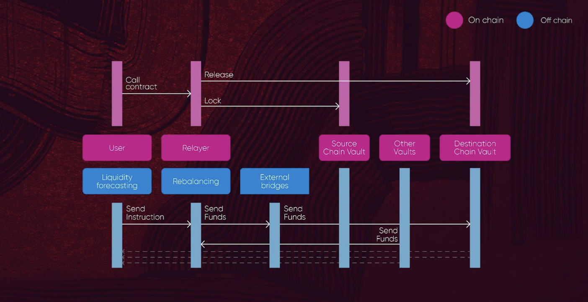
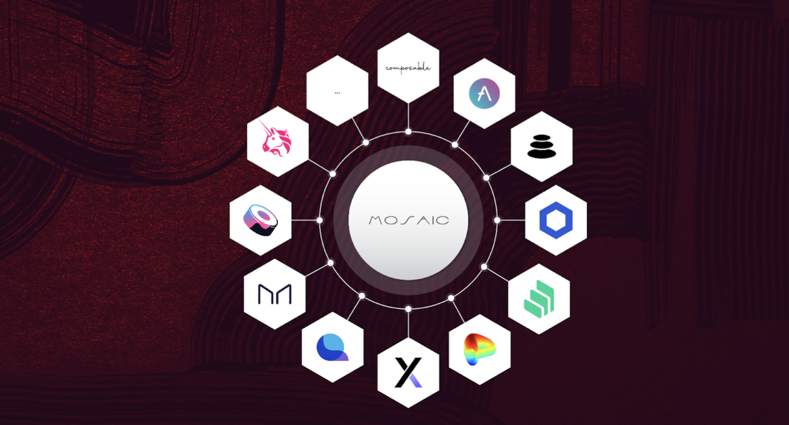

# Integrating with Mosaic using the Composable SDK

Composable SDK allows developers to embed the Mosaic infrastructure in the dApps they are building. This enables new functions, such as:

* Providing unused capital to Mosaic’s vaults for additional yield. For example, the integration of Mosaic with Crocswap 
  will provide Crocswap additional access to liquidity transfer across various L2s. By virtue of Mosaic’s design, its 
  collaboration with Crocswap will enable access to greater TVL for single-sided liquidity provision. Hence users who 
  provide liquidity in single-sided vaults, especially stablecoins and wETH, can earn attractive yields.
* Building cross-chain borrowing/staking protocols using Mosaic’s cross-chain function calls.

Mosaic V2 comes with the following extra features: 

* Withdrawing liquidity on any layer
* In any token, transfer & swap
* Cross-layer function calls
* Providing active & passive liquidity on all layers
* Producing additional yield from farming with the unused funds.

The following steps are taken whenever a transfer is initiated:

* The token amount selected by the user is locked on the source layer
* An off-chain relayer listens for events generated by the deposit transaction that happened on the source layer
* Relayer decodes the message and notifies the destination layer for releasing funds to the selected destination address
* On the destination layer, a dynamic fee which depends on the available liquidity and the amount that is being 
  transferred is subtracted from the amount
* The computed amount (initial - fee) is sent to the destination address

The following steps are taken whenever a liquidity withdrawal request is initiated:

* The user requests withdrawing x amount of liquidity. If liquidity is of type active, the user is also able to select
  the token he wants to receive, making so a withdraw & swap operation
* An off-chain relayer listens for events generated by withdrawing request transaction that happened on the source layer
* Relayer decodes the message and notifies the destination layer for releasing funds to the selected destination address
* On the destination layer, an amount representing "the value the user requested + rewards accumulated so far for that 
  respective amount - transaction cost" is sent to the user
* The transaction cost amount is sent to the relayer

Mosaic V2 is constructed to be modular. It allows any system to be created or integrated. 

For example, in Aave, we could create a strategy for A and whitelist aUSDC for Mosaic enabling users to stake their 
aUSDC within the strategy and providing liquidity into Mosaic. Users can now earn from both Aave and Mosaic.

People can benefit from the [passive liquidity rebalancing](./passive-liquidity-rebalancing.md) and 
[active liquidity management](./active-liquidity-management.md) modules, lend their assets and earn rewards from all 
the layers Mosaic integrates with.
Also, you are not limited by the layer you are lending your liquidity into, as Mosaic allows you to withdraw on any 
other layer connected to the system.

Protocols can leverage our Active Liquidity Bots SDK to leverage capabilities that can provide higher rewards. Being an 
active provider means you’re part of JIT (just in time) liquidity and working for balancing the system’s liquidity 
across layers.
 

**_How To:_**
---
On a technical level, to be a liquidity participant in the system, there are 2 options:

``providePassiveLiquidity(uint256 _amount, address _tokenAddress`` which makes you a passive liquidity provider.
 or
``provideActiveLiquidity(uint256 _amount,address _tokenAddress,uint256 _blocksForActiveLiquidity)`` which makes entitled
to earn more rewards than the passive providers.

As you can see, the `active liquidity` option has a parameter called **blocksForActiveLiquidity, **as the active 
liquidity will be considered active up to initial block.timestamp + blocksForActiveLiquidity. After this time range, 
it will act as a passive liquidity if not withdrawn.

Liquidity can be withdrawn by making a request to the same MosaicVault contract 
``withdrawLiquidityRequest(address _receiptToken,uint256 _amountIn,address _tokenOut,address _destinationAddress,uint256 
_ammID,bytes calldata _data,uint256 _destinationNetworkId,WithdrawRequestData calldata _withdrawRequestData)``

A relayer will pick up your operation and your `_destinationAddress` will receive funds on `_destinationNetworkId` 
(your initial liquidity + accumulated rewards - transaction cost)

Also, if you are an active liquidity provider, besides withdrawing on any other layer, you can also withdraw in any 
token supported by that layer. For example, assuming you provided USDC on Ethereum mainnet, you can withdraw on 
Avalanche in USDT.e
