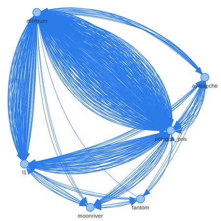
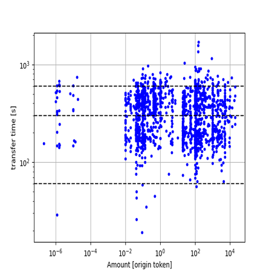
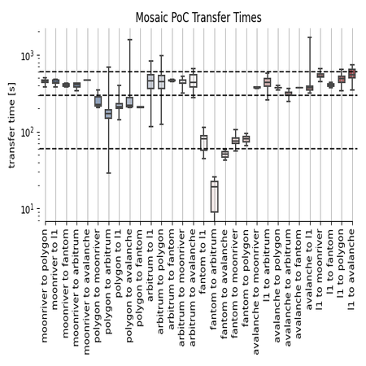
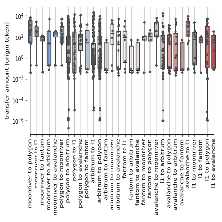
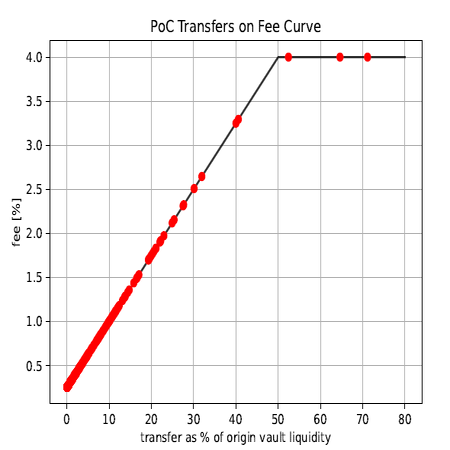
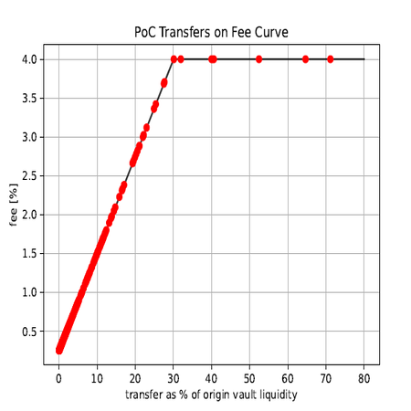

# Mosaic Phase 1 Result

The following information in this section is related to the design of Mosaic v1 and outdated. Composable’s data team 
extracted Proof of Concept (PoC) preprocessed on-chain data and ran the following analyses:

### Transfer Visualization

To visualize the PoC transfer data, Composable mapped each supported network as a node. Each line between the nodes 
represents transfers between networks.

This graph was generated using a ForceAtlas2-based algorithm simulating the nodes and edges of a physical system to 
spatialize the network. Band thicknesses were not necessarily indicators of network popularity or volume, as the 
networks were not added at the same time — Arbitrum and Polygon were a part of the PoC from the beginning, while 
[Avalanche](https://composablefi.medium.com/integrating-avalanches-c-chain-into-the-mosaic-poc-631a75e8be23) 
was added on Oct. 6, 
[Moonriver](https://composablefi.medium.com/composable-integrates-moonriver-into-the-mosaic-poc-bridge-73442af528cc) 
on Oct. 13, and 
[Fantom](https://composablefi.medium.com/composable-integrates-fantom-into-its-mosaic-poc-bridge-25a4a5569875) 
on Oct. 22.

### Transfer Times

To analyze transfer times, Composable looked at transfer time versus transfer size through the amount of tokens moved 
denominated in the origin token.

In the figure above, the three horizontal black dashed lines delineated, from low to high, one minute, five minutes, 
and ten minutes in transfer time. This distribution was generally a flat band between one to ten minutes — even for L2 
to L1 transfers. For high transaction amounts, the time could be longer, but the two were mostly independent.

Then, Composable compared transfer times versus the type of transfer in the form of the origin and destination networks.

 

This figure depicts transfer times in seconds for various network transfers irrespective of the token moved. 
The three horizontal black dashed lines also delineated, from low to high, one minute, five minutes, and ten minutes in 
transfer time. Composable found that 90% of transfers are completed within ten minutes, 95% within eleven minutes, and 
99% within fourteen minutes. regardless of which supported network is bridged. 

For the PoC, Composable used 35 confirmations to transfer to L1. Some other bridges in DeFi use much lower values, such 
as 10 confirmations. Thus, Composable concluded that in 95% of cases transfers could have been sped up by lowering this 
confirmation threshold.

### Transfer Amounts

Transfer amounts per network are shown in the figure below.

Composable saw an equivalent distribution of data across all networks. The PoC capped transfers at $20,000, which was 
also seen in the data. Most transfers were in the order of 0.01 to 10,000 in units of origin tokens, which was also 
subject to the PoC’s cap.

### Mosaic Fee Model

This graph shows the fee charged versus the transfer amounts as a percent of available liquidity in the origin vault. 

The following parameters were set:

* The liquidity % at which the maximum fee kicks in: 40%
* The maximum fee % to charge: 4%
* The minimum fee % to charge: 0.25%

At the beginning of the PoC, vaults were in the order of $100–200k. The outlined fee curve led to an APY of 8.5% for 
passively contributed capital during the POC for LPs across all USDC-equivalent assets and ETH. Outside of this APY, 
the average fee charges were low at 0.32% per transfer. 

### Optimizing Mosaic’s Fee Model

Composable compared Mosaic’s fee model with the fee landscape of the general cross-ledger community to optimize it. 
The following parameters were set:

* The liquidity % at which the maximum fee kicks in: 30%
* The maximum fee % to charge: 4%
* The minimum fee % to charge: 0.25%

Using these parameters, Composable found that the optimized fee model ensured that LPs earned 10% APY when contributing 
USDC and 10.7% when contributing wETH.
