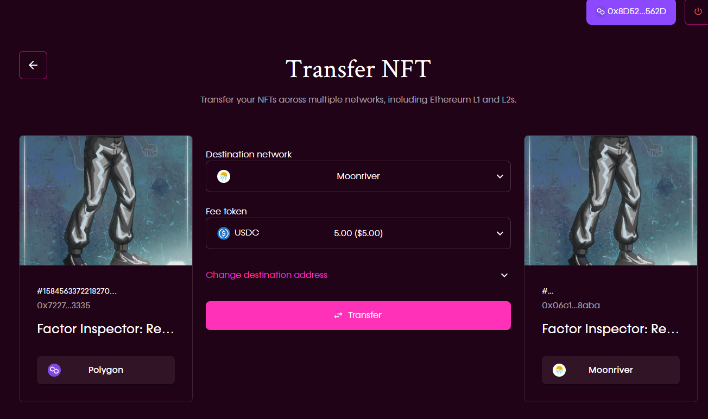
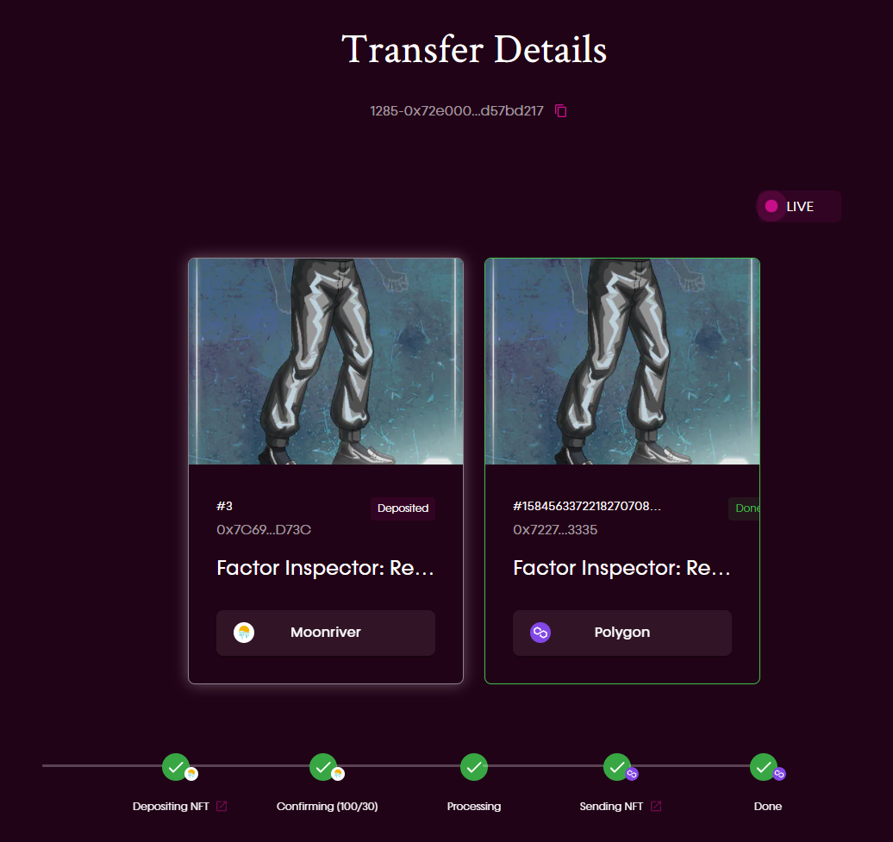

# NFT Transfer Flow

## General Transfer Flow

The transferal of an NFT from the source to destination locations involves the following steps, referencing the blow 
screenshot of Composable's Mural NFT transferal interface:

_The "Transfer NFT" page of Composable's Mural NFT transferal system interface._

1. **Deposit**: The user deposits the NFT into Composable’s Summoner Vault directly from the source layer where the NFT 
   was originally located. Fee is charged with the token specified by the user.
2. **Lock**: The Summoner Vault locks up the NFT on the source layer, rendering it inaccessible on the source layer  
   when it was minted and unlocked on the destination layer.
3. **Mint**: Composable will mint a replica of the NFT (a Mosaic NFT with the same properties as the original, such 
   as image/URL, etc.) onto the Mosaic smart contracts. The Mosaic NFT will be minted onto the source layer of the user’s choosing (out of any layers or chains that are linked to the Mosaic system).

## Transfer Details

The "Transfer Details" page of Composable's Mural NFT transferal system interface.

This process of transferring NFTs can be repeated using the Mosaic NFT to move the NFT onto any other layer or chain 
linked to Mosaic as well. In other words, the Mosaic NFT on a particular destination layer can be locked up in the 
Summoner Vault there, and then a new Mosaic NFT will be minted onto another destination layer.

Moving the NFT back to the source layer involves the opposite process:

1. The creators of the NFT (the gaming platform, artist, etc.) can create a contract within Mosaic that allows the 
   NFT to maintain usability in their game (or other platform). The creator will maintain possession over this contract.
2. Users can lock NFTs that match this contract.
3. The contract will mint the NFT with the same functionality for the user as it originally had, though it will be 
   replicated on the destination layer of the user’s choosing. Users will still be full owners of the NFTs themselves, 
   with all original properties maintained.
4. For this process, we will adhere to the [OpenSea Metadata Standards](https://docs.opensea.io/docs/metadata-standards) 
   that most NFT platforms follow.