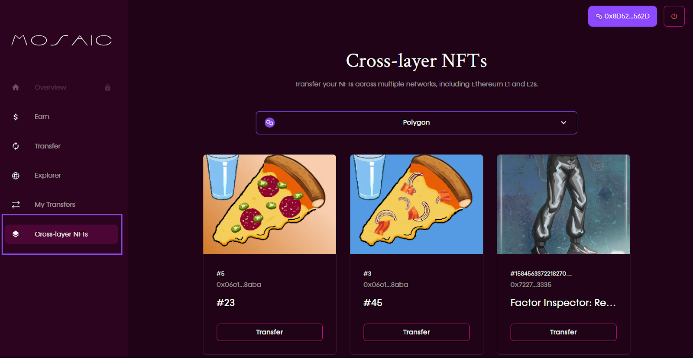

# Mural: NFT Transfers on Mosaic via the Summoner Vault

Composable understands that non-fungible tokens (NFTs) are an exponentially growing part of the DeFi ecosystem. Thus we 
have built full compatibility for these unique tokens into our Mosaic cross-layer asset transferal system, facilitated 
by our Summoner Vault.

## NFT Transfer Overview

Composable allows users to deposit their NFT into our Summoner Vault from any source layer that is linked to Mosaic. 
We then lock up this NFT and mint it back onto any destination layer of the user’s choosing that is also linked to 
Mosaic. Through this simple vault lockup process, we ensure that the novelty of the NFT is maintained, while allowing 
the user to move it across different ecosystems in the DeFi space.
