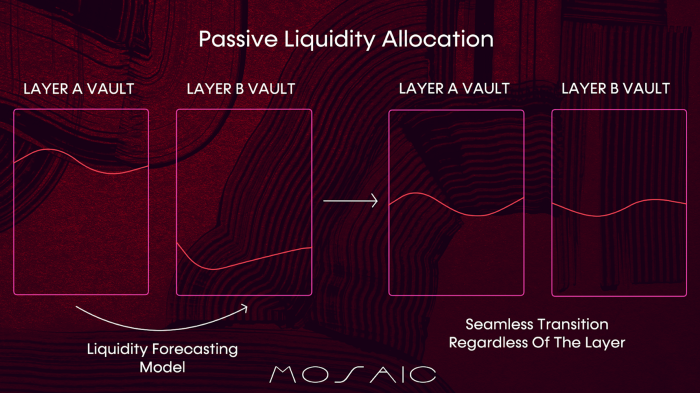

# Passive Liquidity Rebalancing

It is possible that a transfer on Mosaic may be initiated that exceeds the available liquidity in Mosaic’s passive 
liquidity vaults. The transfer need can be met by proactive rebalancing of the Mosaic vaults.

Mosaic will automatically detect liquidity imbalances arising within the vaults system. At a high level, there are two 
stages involved in passive rebalancing: firstly, forecasting and monitoring for liquidity shortfall using a liquidity 
imbalance auto-detection mechanism and secondly, rebalancing by tapping into external liquidity vaults to 
algorithmically move liquidity across external bridges based on forecasted demand.

When a liquidity shortfall is detected, Mosaic selects the best route to redirect necessary liquidity to a vault on that
layer, using a range of external bridging solutions. This ensures that liquidity is restored to a sufficient level so 
that transfers can go through. While LP returns are maximized through rebalancing, the dynamic fee model works to keep 
transfer fees low for most of the retail transfers.

Mosaic is integrating several leading bridges, including the following, with more to be announced soon:

* **[Hop](https://hop.exchange/)**: a protocol enabling asset transfers across EVM-compatible scaling solutions 
  (rollups, sidechains, etc.).
* **[Connext](https://connext.network/)**: a cross-chain liquidity protocol enabling non-custodial asset swaps 
  across EVM-compatible chains and L2 networks.
* **[Multichain](https://multichain.org/)**: a cross chain router protocol that allows users to swap with no 
  slippage between any two chains seamlessly.
 