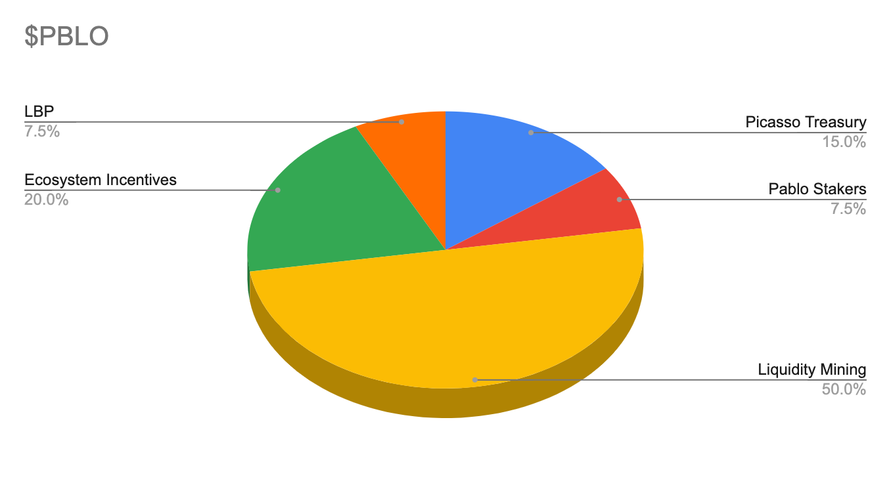
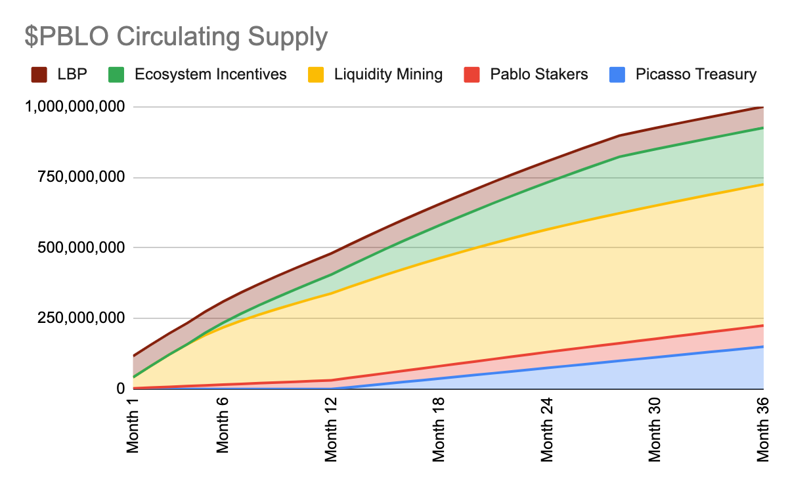

# Governance & Tokenomics

## Governance

Users who stake their PBLO tokens are given xPBLO fNFTs. They are able to use xPBLO in order to partake in governance 
decisions affecting the protocol and control routes for liquidity gauges.

In the future, Pablo will deploy the first liquidity gauges in Dotsama, allowing xPBLO holders to effectively vote and 
allocate where incentives should be allocated - therefore increasing value for the PBLO token whilst improving 
efficiency of the incentives too.

Pablo will roll out the use of liquidity gauges to provide incentives to different pools. Staked PBLO holders can use 
xPBLO to direct liquidity. Voters choose on a periodic basis which trading pair pools should be given additional 
incentives, wherein users provide liquidity to that pool.

## Tokenomics

The total supply of $PBLO, its distribution and vesting schedule:
* There will be a total capped supply of 1,000,000,000 PBLO tokens. The PBLO token is 100% community-owned.

| Allocation                    | Distribution |
| ----------------------------- | ------------ |
| Liquidity Mining Incentives   | 50%          |
| Ecosystem Incentives          | 20%          |
| Picasso Treasury              | 15%          |
| Pablo Stakers (xPBLO holders) | 7.5%         |
| LBP                           | 7.5%         |

##### $PBLO token use-cases and utility

The $PBLO token has several uses which incentivizes its ownership:

* 20% of the total transaction fees on Pablo are distributed to users that lock PBLO to mint xPBLO fNFTs
* PBLO tokens are used for protocol governance. Users who lock their PBLO tokens are able to receive proportionally 
  increased governance power.
* In addition to existing governance, xPBLO holders will be able to participate in bribes and liquidity gauges

Pablo undergoes continuous security audits, which will be published alongside any fix logs (if required) on the 
[audits page](https://github.com/ComposableFi/composable/tree/main/audits) on our Github.

