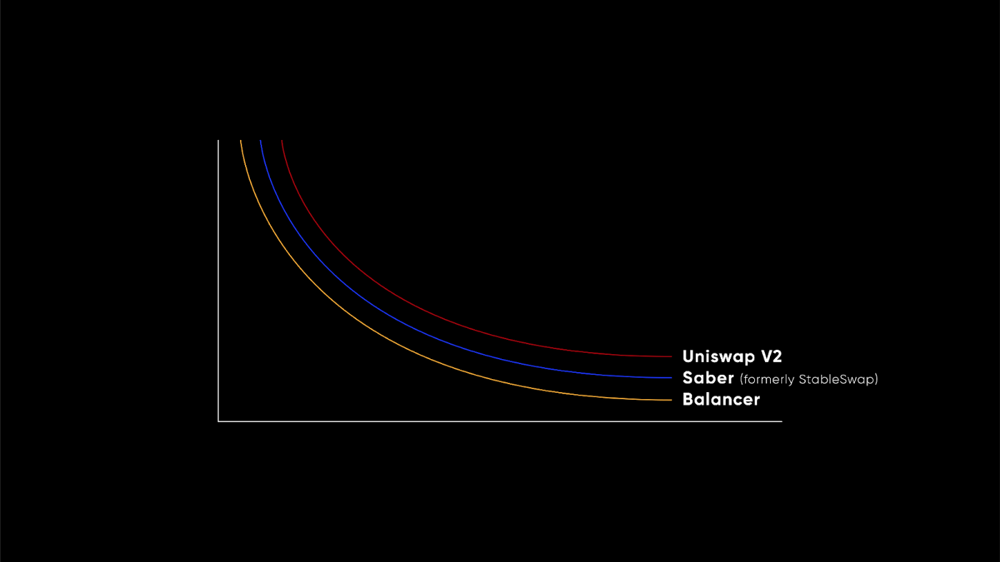

# Swaps/Trading

Pablo’s primary function is token exchange, to enable users to trade and exchange assets. Like other DEXs, Pablo 
accomplishes this through automated market maker (AMM) pools, which also act as a yield generation opportunity for 
liquidity providers.

Pablo is distinct from other DEXs, however, in that it allows users to select between different pools which all use 
different AMM-types, to better optimize for their needs. As such users can select between pools that enable higher 
efficiency, less slippage, and incentivize a use to trade more. Greater volume leads to higher transaction fees, which 
are all distributed back to liquidity providers (LPers) and PBLO token holders.

On launch Pablo will support Uniswap 50/50 pools, Balancer pools, Stableswap pools, as well as our custom LBP 
implementation. Stableswap pools allow for superior trading of stablecoins or assets of the same price, providing 
greater yield to LPs, and less price slippage for traders.  Balancer pools, which are commonly deployed as 80/20 pools, 
are better suited for high volatility assets and blunt the impact of impermanent loss. In addition, pool creators are 
able to set fees based on the relative risks of their provided assets, whereas other protocols often set fixed fees at 
0.3% across all pairs. The volatility and volume can depend significantly depending on the pool assets, and therefore 
increasing the customizability will boost efficiency of the DEX.
