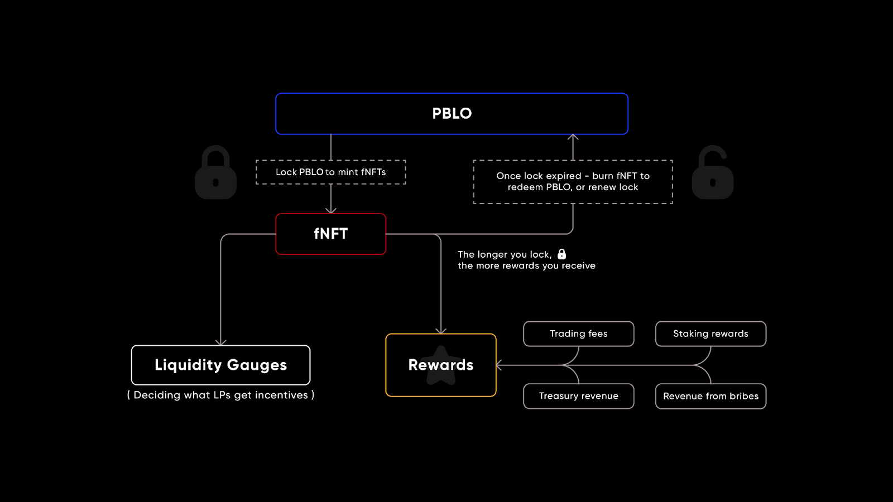

# xPBLO fNFTs (staking)

Users are able to stake their PBLO native token in order to earn yield. 20% of the total trading fees on Pablo will be 
distributed to xPBLO stakers. In addition to trading fees, xPBLO holders will receive rewards in the form of additional 
PBLO and other incentives.

Users can stake PBLO by locking their tokens for different durations. In return, they are given xPBLO fNFTs, which serve
as composable representatives of the value of their asset which can then be used for different purposes across DeFi 
ecosystems. Users can then burn their xPBLO tokens at the end of their lock period in order to receive their original 
assets.

_High level overview of Pablo_

The above exhibit captures the basic flow of assets and yield that undergirds Pablo. The bottom right represents users. 
Users provide their assets to liquidity pools (LPs) to gain LP tokens, and then bond those LP tokens in order to buy 
PBLO at a discounted rate. The LP tokens are then owned by the Picasso treasury, which will use its assets, bolstered 
by PICA liquidity incentives, to provide and incentivise liquidity and trading on Pablo. Users will stake their PBLO 
tokens in order to make governance decisions, and generate yield from Pablo’s DEX transaction fees, via its AMM 
functionality.
