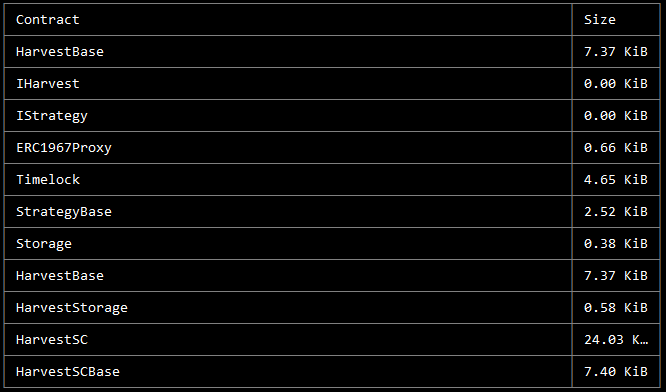

# Contracts - Technical Details

**For transparency, we are continuing to publicize the parachain vault approach we took when bidding for our Kusama and 
Polkadot parachains, as well as the contracts used in this process. This strategy is no longer being implemented to 
support parachain procurement, as this milestone has already been achieved. Please note that the information in 
italicized text below is outdated for this reason:**

_Our options for vault strategies were as follows:_

1. _Harvest dai with ETH // Harvest dai with DAI_
2. _Harvest usdc with ETH // Harvest usdc with USDC_
3. _Harvest usdt with ETH // Harvest usdt with USDT_

_The contracts being used to power the vaults are as follows, with definitions below:_

* **_HarvestBase_** _- base contract for all strategies using Harvest as the underlying strategy_
* **_IHarvest_** _- interface for Harvest strategies_
* **_IStrategy_** _- interface for all strategies_
* **_ERC1967Proxy_** _- the proxy contract that points to a specific implementation_
* **_Timelock_** _- contract to which ownership of all strategies will be transferred_
* **_StrategyBase_** _- base contract for all strategies_
* **_Storage_** _- base storage contract_
* **_HarvestStorage_** _- Harvest strategies contract_
* **_HarvestSC_** _- contract used for Harvest strategies where users enter with a stablecoin_
* **_HarvestSCBase_** _- base contract for all Harvest strategies where users enter with a stablecoin_

_The following are the contract addresses for the deployed strategies:_

**_HarvestDaiStableCoin:_** _0x4A03ea61E543eC7141a3f90128B0c0c9514F8737 (proxy)_

**_HarvestUsdcStableCoin:_** _0xF12dA8470E2643cCb39a157e8577D9AA586a488f (proxy)_

**_HarvestUsdtStableCoin:_** _0x1941441d31809e9E1828Da0cE6d44175F657E215 (proxy)_