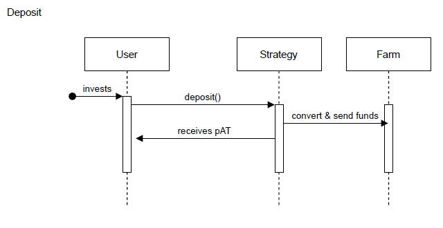
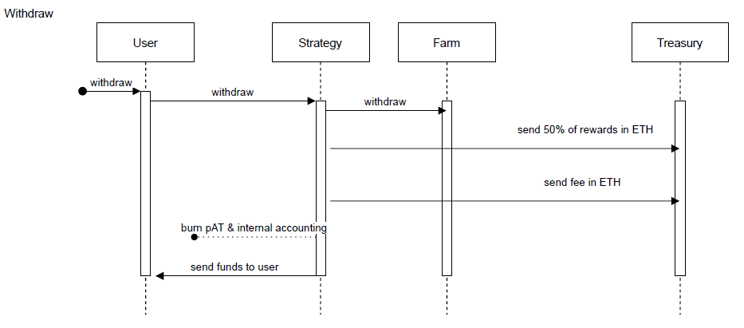
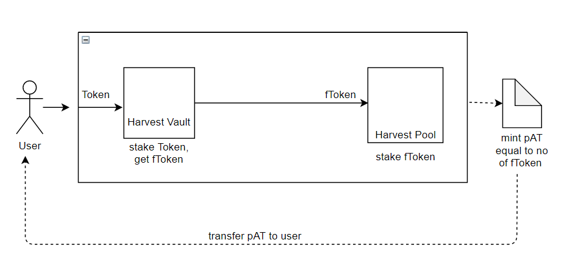
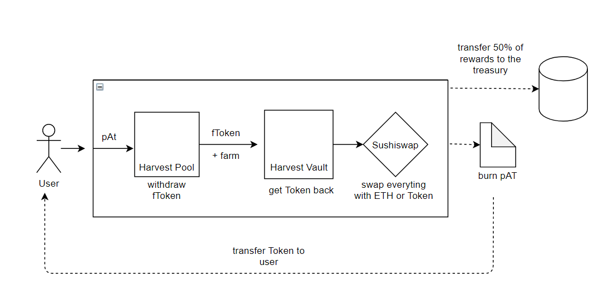

# Vault Process in Detail

**For transparency, we are continuing to publicize the parachain vault approach we took when bidding for our Kusama and 
Polkadot parachains, as well as the infrastructure used in this process. For our Polkadot crowdloan, participation was 
capped at 25 million DOT and for our Kusama crowdloan, participation was capped at 200,000 KSM.**

**Our crowdloan strategy improved upon existing crowdloans by offering augmented flexibility and earning opportunities 
for users, such as the depositing of stablecoins and enhanced incentives for participants. These strategies are no 
longer being implemented to support parachain procurement, as these milestones have already been achieved. Please note 
that the information in italicized text below is outdated for this reason:**

## General Vault Flow

### Deposit

_The diagram above illustrates the generic flow of all the vault strategies. The user first invests ETH or a specific 
stablecoin and gets back pAT. The investment is routed to specific yield farming strategies that have shown to be stable 
and secure._

_For each one of the strategies, the detailed flow can be seen later on this page._

### Withdrawal

The above flow illustrates the generic withdrawal flow of all the strategies. The user returns either a portion of his 
or her pAT (or even the entire amount) and gets back the same token they entered with(either ETH or a specific stable 
coin) and 50% of the rewards obtained (in the same token they invested - ETH or a specific stable coin). The rest of 
the rewards (the other half) is sent to a treasury account, and funds from that treasury are later used to participate
in the KSM/DOT auction.

At the beginning of this process, a fee is taken from each withdrawal, encouraging users to stake for a more extended 
period.

## Harvest Vault Flow

### Harvest Stablecoin Strategies

#### Deposit

The above diagram illustrates the summarized flow for “deposit” action of what happens internally in the case of a 
Harvest strategy (ex: Harvest DAI or Harvest USDC). The average gas used by a deposit transaction for a stablecoin 
Harvest strategy is 409684. Strategies that we will release initially are Harvest Dai, Harvest Usdc, and Harvest Usdt.

#### Withdrawal

The “withdraw” action is a bit more complex, as you can see in the diagram below:

In the case of Harvest, when you withdraw from the Harvest Pool, you get back your fToken as well as Farm tokens. Also, 
for the same amount of fToken that you withdraw from the Harvest Vault, you might get back more Token than what you 
initially deposited. As an example, if you stake 100 DAI, you get back 95 fDai and after 1 year you come back with 
these 95 fDAI, you will probably get more than 100 DAI, as well as Farm tokens).

The difference between the amount of Token you got now and the amount you had initially, plus the Farm tokens, are 
considered rewards. All the rewards are then converted to ETH. 50% of that ETH amount will be routed to the treasury, 
and 50% is swapped with Token (Dai, in the previous example) sent to you.

The average gas used by a withdrawal transaction for a stablecoin Harvest strategy is 819300.

Let’s take the Harvest DAI strategy as an example where you enter with DAI and get the rewards later. A full deposit 
and withdraw flow is explained below:

1. _The user invests 4000 DAI._
2. _4000 DAI are deposited to Harvest Dai Vault and you get back an amount of fDai; let’s consider you receive 3500 
   fDai._
3. _3500 fDai are invested into the Harvest Dai Reward Pool._
4. _3500 pAT are minted and they are transferred to the user, alongside all the internal accounting done in the contract._
5. _Two months go by._
6. _The user wants to withdraw and sends 3500 pAT to the withdraw method._
7. _3500 pAT is burned._
8. _3500 fDai is retrieved from Harvest Dai Reward Pool._
9. _At this step we now also have Farm tokens obtained from Harvest. Let’s consider that 1 Farm was obtained._
10. _3500 fDai is sent to Harvest Dai Vault and an amount of Dai is received by the contract. At step #2 we added 
    4000  DAI, but in this case, Harvest might give back more than 4000. We will consider that 4350 DAI was received._
11. _At the current step, we have 4350 DAI and 1 Farm tokens into the contract. Given the fact that the user's 
    initial  investment was 4000 DAI, we consider 350 DAI and 1 Farm as rewards._
12. _175 DAI is left aside for the user._
13. _175 DAI and 1 Farm tokens are swapped with ETH at the current ETH/DAI and ETH/Farm prices. Let’s assume total  
    rewards are 0.125 ETH_
14. _50% of the rewards are marked and sent to the treasury: 0.0625 ETH._
15. _The other 50% of the rewards are converted to DAI, so the user will be entitled to around 90 more DAI._
16. _The user gets back 4000 DAI (initial investment) + 175 DAI (extra tokens) + 90 DAI (rewards) = 4265 DAI total._
17. _0.0625 ETH (that was sent to the treasury) is designated to purchase KSM/DOT tokens. Besides the base APY the 
    user  had (4265 DAI compared to 4000 DAI minus their initial investment), they are also entitled to Composable
    Tokens resulting in a much greater APY._

_Please note that Composable Tokens will be distributed after TGE to everyone who participated in the vault strategies. 
The APY entitled to each user depends on the total value locked (TVL) of all the strategies._

## Parachain Auction Tokens

Parachain Auction Tokens (or pAT) are the receipt token minted for participation in our parachain vault strategy, 
representing a user’s stake in the vault. Whenever someone deposits in our vault, they get back pAT in an amount 
depending upon their investment and strategy type.

If we take Harvest stablecoins strategies as an example, whenever you invest Token (Dai/Usdc/Usdt), you’ll get back 
fToken (fDai/fUsdc/fUsdt). The value of fToken is usually a bit lower than the amount of token you invested. 
For example, investing $100 in DAI in the Harvest DAI strategy will get you around 95 fDai, and the amount of pAT you’ll
receive is equal to the amount of fDai, which is 95 in this case.

Each strategy has its own pAT token, similar to how an AMM transfers LP tokens once you add liquidity.