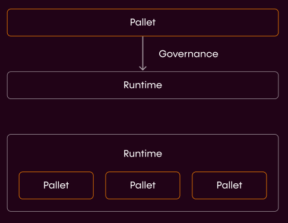

# The Picasso Parachain

*The Picasso Parachain is realized!*

## Picasso has been Procured

Composable is devoted to making DeFi truly interoperable, user-friendly, and flexible — and the support by our community
has demonstrated the need for our solutions within this space. You, the community have all shown your support in 
many ways, particularly by helping us to stake an impressive 115k KSM in the most recent Kusama parachain auction. 
As a result, [Composable is the 13th project to earn a piece of this highly in-demand technology](https://composablefi.medium.com/celebrating-our-procurement-of-a-kusama-parachain-for-picasso-887eb60d7092).

Read more about the [Picasso Crowdloan strategy](../parachains/picasso/picasso-crowdloan) 
that we implemented to help us achieve this major milestone.

## The Picasso Vision

Composable Finance seeks to build an entire ecosystem around the Composable and Picasso parachains.

Through its parachain incubator model, Composable will be able to provide a broadly accessible decentralized economy to 
developers, applications, and users. This solution will enable developers to have access to a well-maintained 
parachain that they can build on - with a mechanism for voting on which pallets they want to add - without having to
jump through the hoops required for obtaining and maintaining their own parachain.

Picasso has a built-in mechanism for users to vote on which pallets they want to add to a run time. 
This will be accomplished through our parachain's native Picasso (PICA) tokens, which act to provide token holders 
with governance votes.

Through Composable, developers can have easy, customizable access to a broadly reaching network of various applications
and tools, all in one cohesive space, facilitating unlimited creativity and innovation.

## Why Pallets and not Smart Contracts?

The world of DeFi (primitives, core and applications) continues to edge towards interoperability and Polkadot 
comfortably sits at the epicenter of this natural progression. To natively deploy dApps in the DotSama ecosystem, 
developers need pallets. Substrate-based pallets are modular frameworks that enable anyone to create purpose-built 
blockchains (as well as dApps) by composing custom or pre-built components. Think of pallets as stackable building 
blocks that any developer can use to easily build protocols and dApps.

Although smart contracts continue to serve vital and critical functions through their deterministic and built-in parts
of blockchains’ consensus mechanisms, they add an additional layer of logic on top of an existing blockchain’s core 
logic, which creates some inflexibility. While smart contracts do an excellent job at triggering specific trustless 
agreements and subsequent automated actions, developers prefer greater flexibility — which pallets provide. 
Moreover, pallets provide a more robust and powerful framework to help propel more creativity from developers looking 
to build the future of DeFi’s primitive, core and application functions.

Given that our parachains are the foundational layer that powers our ecosystem, we have adopted a pallet-centric 
approach to adding products directly in the runtime of our parachains. We will offer projects the ability to deploy as 
pallets on our chain, with governance having the ability to upgrade these pallets into the runtime of our chains:

### Advantages

* **Higher performance**: For smart contracts, the VM needs to insert checks to meter the gas usage, since the contract
  cannot be trusted (possibly user submitted). The cost of calling a pallet extrinsic is known beforehand through 
  bench-marking

* **Larger set of capabilities**: Pallets may interact with each other, and can hook into different life-cycles of the 
  block production, and can launch off-chain workers to handle computation or make HTTP requests.

### Opportunity

Projects from ETH that want to become natively cross-chain can deploy as Pallets on Picasso.

## Pallet Developers on Picasso - What are the Benefits?

**Picasso is the cornerstone of Composable Finance’s robust tech stack**: Pioneered to meet pallet developers’ needs, 
with Picasso, instead of having to use time and resources to procure one of the highly sought after parachain slots 
on Kusama or Polkadot, pallet developers can simply launch their projects on Picasso. But securing the spot is not the
only pain point developers have to overcome. Picasso provides the ideal environment where pallet developers can 
rigorously test, iterate and successfully launch their projects leveraging Composable’s suite of pre-existing, 
yet highly customizable and governance-selected pallets on Picasso.

**Launch your pallet on Picasso, draw from Picasso’s network effect**: all of the pallets launched on Picasso will be
able to work together — resulting in seamlessly interoperable dApps with hardened security. As Picasso is the foundation
for our interoperable Innovation Availability Layer (IAL), pallets will be able to tap into our parachain’s native 
communication instantly upon their launch.

## Be First in Line to Launch on Picasso

We’re facilitating an entire ecosystem from the ground up, aggressively onboarding pallets that help to create the 
building blocks required for DeFi primitive, core, and application functionalities to thrive. Our aim is to supply 
dApp developers on Picasso with all the necessary tools to build seamlessly interoperable financial applications 
ranging from simple to sophisticated.

As we work to procure a Polkadot parachain, pallets in our expansive Picasso environment will have the chance to mature 
and thrive. Overtime, the most promising pallets will have the opportunity to graduate onto our Polkadot parachain upon 
its launch. This graduation process will be overseen and approved by the Picasso token (PICA) holders who help to ensure
that actions are taken in the best interest of our ecosystem.

To help support pallet development on Picasso, we have launched the 
[Composable Grant Program](https://grants.composable.finance/) to assist some of the most promising upcoming pallet 
projects. Selected projects will receive full hands-on support from the entire Composable team in addition to funding.

For anyone looking to gain more technical insights into our vision for pallets, check out 
[this article from Composable’s head of product](https://0xbrainjar.medium.com/calling-all-pallet-developers-8e5ff77871f9), 
0xBrainjar. We are excited to be working with teams and individuals looking to launch pallets in this watershed moment 
for Composable and DeFi. Look forward to more information and updates on pallets coming from our team in the near future.

