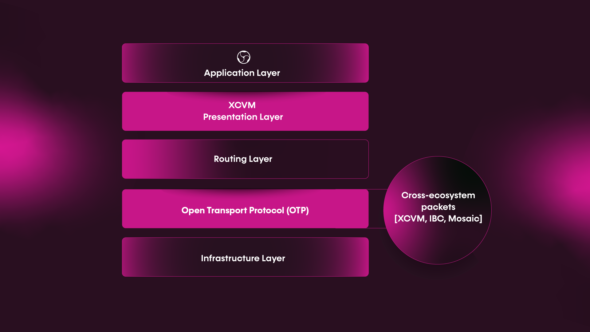

# XCVM

The Composable XCVM allows for cross-ecosystem communication enabled through cross-chain smart contracts.

The current siloed nature of DeFi hampers interoperability between layers and chains. 
The **Composable Cross-Chain Virtual Machine (XCVM)** will facilitate easy and accessible cross-chain-and-layer 
communication and is our answer to this issue. The XCVM is a single, developer-friendly interface designed to interact 
and orchestrate smart contract functions across the L1 and L2 blockchains connected to our ecosystem. 

In short, the XCVM **abstracts complexity** from the process of having to send instructions to the Routing Layer, 
**initiates call-backs** into smart contracts, **handles circuit failure** such as network outages, 
**provides finality**, and perhaps most notably, **allows for the deployment of natively cross-chain protocols and smart
contracts**. Throughout this experience, we enable users to tailor their experience by maximizing for a desired 
parameter while minimizing ecosystem-specific decision making.

We do not aim to create a new standard for cross-chain communication, which is already the object of numerous projects. 
Instead, the XCVM will serve as the orchestration layer for existing bridging protocols, as depicted below:

*Features and order execution within a XCVM environment*

## The Problem in Current Interoperability Solutions

**The XCVM creates an environment where smart contracts on different chains can interoperate in a** 
[**trustless way with finality proofs in the Centauri bridging infrastructure**](https://medium.com/composable-finance/trustless-bridging-438a6e5c917a)

Unlike existing iterations of blockchain virtual machines, the XCVM does not force applications and smart contracts to 
be deployed onto one particular chain. Instead, the XCVM provides a novel opportunity for applications to be 
**natively cross-chain**. The goal is to facilitate a top-down approach to interoperability and composability instead 
of connecting different pre-existing pieces together.

During the pre XCVM era, developers who wished to create an interoperable application needed to consider the various 
chains they wanted their applications to operate between and narrow down their choice to just one as their native chain. 
Then, they must deploy their project to work with that specific chain’s virtual machine (for instance, the EVM for a 
project built on Ethereum). An additional burden to developers is finding an interoperability solution that works with 
Ethereum and the other chains they wish their applications to communicate with, integrate that solution, and use it any 
time there’s a need to bridge to other applications that are not on Ethereum. Further, suppose they want to deploy that 
project on additional chains. In that case, DeFi developers must completely recreate their projects and then link them 
with their existing ones - possibly many times over, depending on the number of instances they desire to create.

## The XCVM and its Vision for Composability

Our vision is to create **a cross-ecosystem communication solution, top-down**. Our XCVM serves as an 
**orchestration layer** for existing bridging protocols. As a result, these applications can be 
**not just interoperable but also composable**; developers can use the XCVM to compose protocols across various 
existing chains to allow for maximal customization and effectiveness.

The XCVM is built using the CosmWasm framework. CosmWasm is the default smart contract framework for the Cosmos 
ecosystem, made to ensure security and interoperability and built. Composable will be the first to deploy it within 
DotSama. The XCVM will be a novel union of the DotSama and IBC ecosystems and their relative advantages and drive 
forward Composable’s vision for absolute ecosystem agnosticism. 

Any blockchain that is XCVM-compatible can upgrade the overall product by tapping into cross-chain functionality at its 
core, opening up the user base to a variety of ecosystems and their communities. The result is multifaceted; users can 
perform cross-chain actions, and the blockchain ecosystem is repositioned as a network of agnostic liquidity and 
available yield.

More specifically, the XCVM enables developers to write smart contracts that span multiple ecosystems, 
all in a single easy to use interface. The XCVM itself orchestrates interaction with different bridges, manages routing,
and handles smart contract requirements like callbacks, reliability, and finality. It is the virtual machine engine that
drives all cross-chain and cross-layer interoperable transactions within the Composable ecosystem.

Composable recognizes the different approach to safe messaging passing in Polkadot and Cosmos networks, 
which leverage the [Inter-Blockchain Communication (IBC) Protocol](https://ibcprotocol.org/) and
[ Cross-Chain Message Passing (XCMP)](https://wiki.polkadot.network/docs/learn-crosschain) respectively. 
The XCVM augments these existing projects and synergizes to act as orchestration layer for both messaging protocols. 

Developers do not have to focus on the complex technicalities  required for interoperable transactions. Instead, 
it serves as an orchestration framework for cross-chain communication and function calling across multiple ecosystems. 
It pushes DeFi further along the spectrum of interoperability, and takes the first steps towards making blockchain 
agnosticism a reality.
