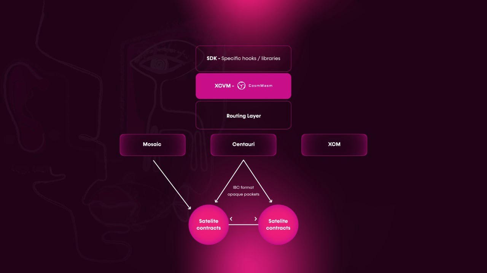
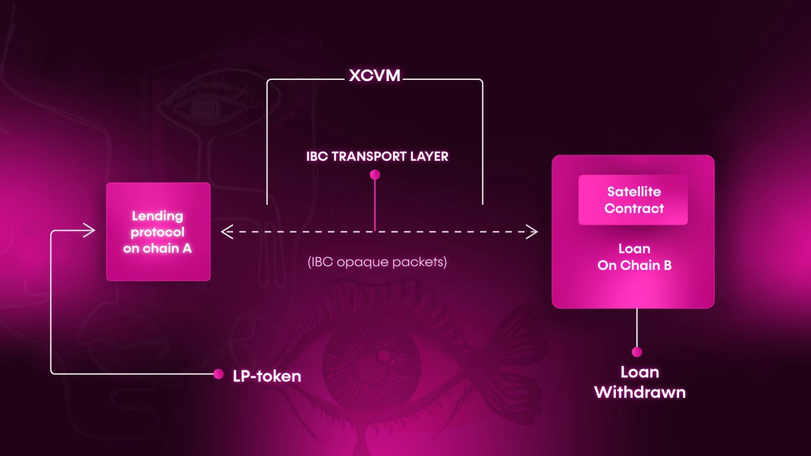

# How the XCVM works

*For more details, head to the XCVM technical specification on 
[GitHub](https://github.com/ComposableFi/composable/blob/main/code/xcvm/SPEC.md).*

Virtual machines are abstracted away from activities required for cross-chain operations such as security, finality in 
different networks, fee calculation, and provide a simple interface for developers to build on. The security and 
finality are dependent on the bridging technology used and fees will vary according to network traffic. 

The XCVM combines different bridging protocols, such as IBC, XCM, and Mosaic Phase 3, and is capable of integrating new 
bridging technologies. For example, for a cross-chain transfer, we model it as a set of reversible state transitions 
with different approximate costs for each transition. The XCVM offers Picasso-based decentralized applications (dApps), 
different hooks, and updates on the status of any cross-chain transfers, as well as RBAC-based flow control for actively
managing the execution of different stages. dApps incur transaction fees for calling into the XCVM. 

For example, let’s say a user wants to borrow with USDC (collateral) on Angular Finance, a secondary pallet on Picasso, 
and invest into a liquidity pool on SushiSwap. Thanks to our technology, this process can occur cross-chain-and-layer. 
Upon instruction and orchestration by the Composable XCVM, the Routing Layer selects the optimal route for the user’s 
desired outcome, which propagates communication cross-ecosystem, and to our transfer availability layer, Mosaic, which 
then facilitates the transfer of the borrowed asset to a liquidity pool on SushiSwap, with settlement being recognized 
on our parachain. This process, as facilitated by Composable and the XCVM, is depicted below:

*An cross-chain lending example using the Composable XCVM*