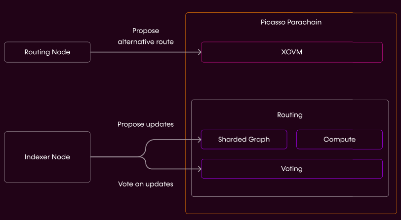

# Routing Layer

*Incentivized pathway selection to allow for users to perform actions, in an ecosystem agnostic manner.*

Our Routing Layer will assess all of the possibilities for a given action (i.e. taking out a loan of 1000 USDC) across 
all potential layers and chains, and selects the optimal pathway for a user. This layer will be crypto-economically 
secured, with incentives provided for actors to properly select the best routes for user actions. Thus, this will act as
a function aggregator, providing optimal services to users without them having to scour the entire expanse of the 
DeFi space themselves for the most promising opportunities and best deals.

One exciting application for this pathway execution layer is in cross-chain fee management. Our infrastructure as a 
whole intends to support a network of blockchain networks, meaning that there will be multiple potential pathways to the
same destination. In this scenario, without a tool to do so for them, users would have to pathfind the most efficient 
and compliant route for value packets. Users may need to prioritize efficiency if the pathway must be especially liquid 
or secure, or if a specific regulatory requirement must be enforced (such as know your customer/anti-money laundering 
requirements, abbreviated KYC/AML). Therefore, the routing process would be both incredibly important and very time 
intensive. Our pathway execution layer will make this process simple for users and enable them to customize which 
parameter they want to optimize for when completing a given transaction.

Upon instruction and orchestration by the [Composable XCVM](../xcvm-overview.md) the routing layer selects
the most optimal route for the user’s desired outcome, which propagates communications cross-ecosystem, and to our to 
the dApp transport module, Mosaic, which then facilitates asset transfers, with settlement being recognized on the 
parachain.

Our Routing Layer includes the following components:

*Our Routing Layer leverages indexer and routing nodes.*

**Indexer** nodes to regularly cache The Graph data (quick to compute route).

**Routing** nodes to find the best path.

- We run our own baseline algorithm
- We then compare this to Router node results (who have staked LAYR)
- If some solvers are worse than some threshold: slash them
