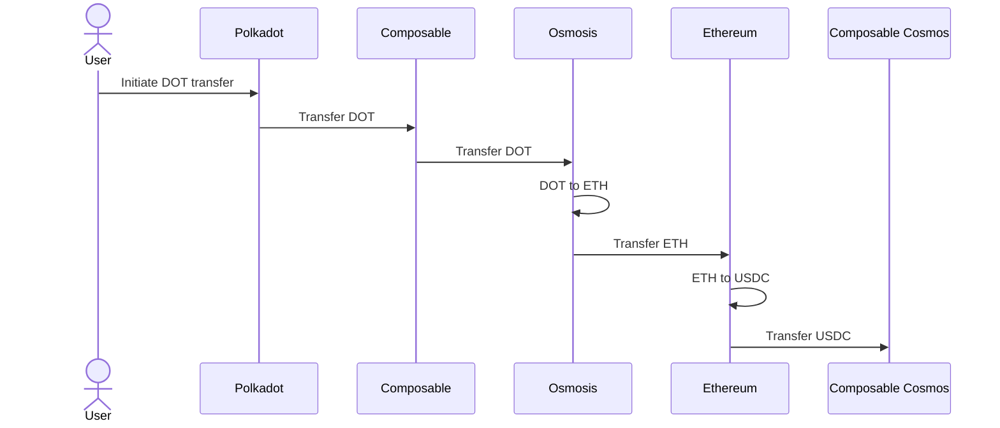
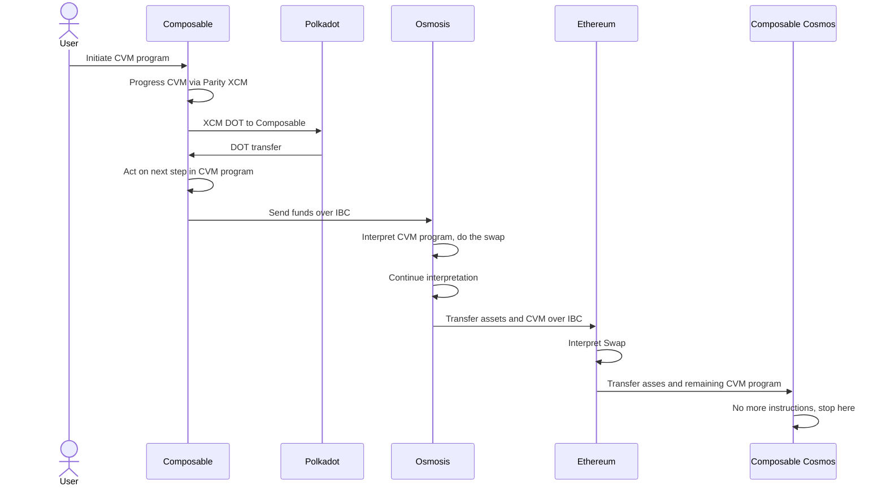
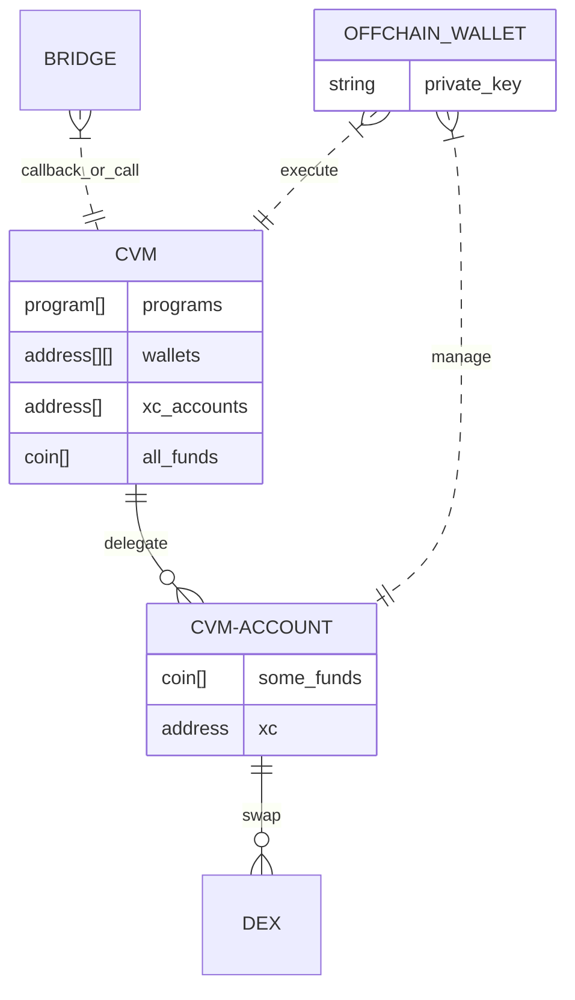
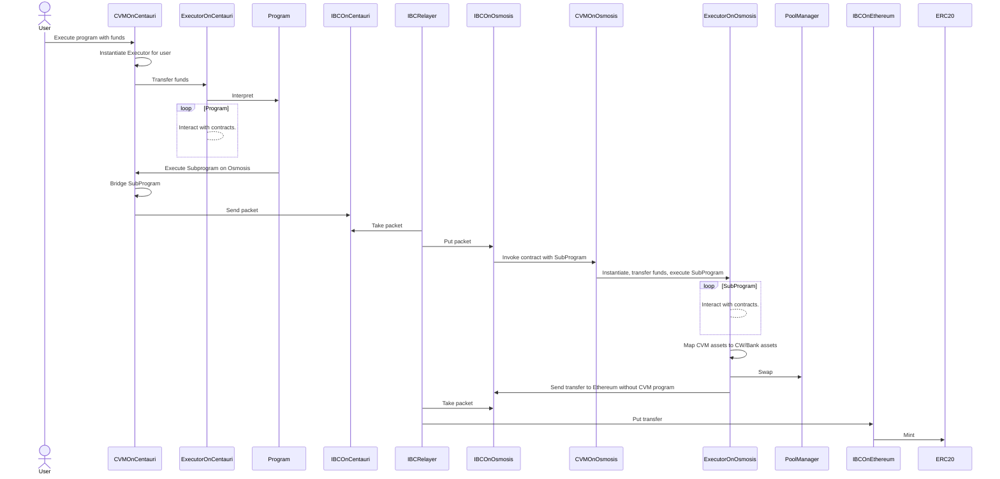
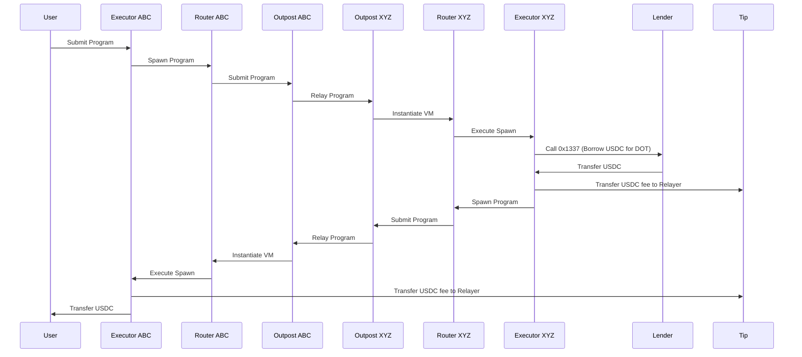

# Specification

The CVM is made of opaque contracts for execution of non-atomic, asynchronous, trustless, transparent, non-custodial, bridge-agnostic, generalized and [Turing decidable language](https://www.educative.io/answers/what-are-recursive-languages) cross-chain programs and intents.

## Why CVM?

To enable users to perform cross-chain intent settlement such as `transferring DOT to Osmosis, swapping to ETH, transferring ETH to Ethereum, swapping to USDC, and moving funds to Composable Cosmos or any desired destination chain, in one user signed transaction`. Users should be able to express in simple english their desired actions.

Here is what should happen semantically:



This sounds simple, but you need to know several encodings, transports protocols, and SDKs to do this. Also, without the CVM, one may not easily start on Polkadot and proceed to the end using a single transaction.

CVM solves it this way (displayed in a simplified manner):


More detail on this architecture can be found in the rest of this documentation. Carrying out cross-chain swaps is just one of the many possible operations

## Definitions

- Assets, tokens, coins, funds, amounts: used interchangeably
- Chain, blockchain, consensus, domain: also used interchangeably to refer to `execution systems using different instances of proofs systems`
- Address, account, wallet: also used interchangeably; each can do something on-chain from its own identity, and hold some funds
- Bridge, relayer: Something which can act on one chain on behalf of another, for example mint tokens (transfer)

### Definition deconstruction

`Opaque contracts` - In the CVM, these may be module or contract, executing on one or many chains

`Non-atomic` - the whole program is not executed in single block; it is not an all-or-nothing transaction

`Asynchronous` - two Spawns in single program, but are sent to bridges at same time, execute concurrently on on several chains; other instruction are sequential

`Trustless` - internally, the  CVM uses the most secured, trustless bridges, to execute CVM programs; CVM contracts are subject to cross-chain governance

`Non-custodial` - each user owns all assets on each chain; they delegate the ability to move these funds cross-chain from their cross-chain account (executor)

`Turing decidable language` - that there are no procedural loops or recursion, meaning that CVM programs are predictable, deterministic, and will stop

`Transparent` - reading and auditing CVM program much easier than set of cross chain contracts, code of propagated along with data, you do not need to deploy programs, you just send programs; as subprograms move from chain to chain, they move assets along

`Bridge-agnostic, generalized` - CVM abstracts away several underlying transports,encodings, assets systems, and messaging protocols, you do not need to know assets systems, how to talk to bridges, or how to encode common operation on each chain you want to act on; you learn the CVM, and it helps you to handle these details

`Cross-chain programs` - the same program input works consistently on all supported chains; you can write it once to run anywhere

`Accessing de facto native liquidity markets` - the CVM uses native assets contracts on each chain and each bridge it uses, so programs can leverage existing liquidity on chains; as new bridges and chains are added, the CVM incorporates these without any modification from the user


## Additional References

Cross-chain DeFi gets complicated. To understand this documentation at the deepest level, it is helpful to have existing knowledge about the application side of messaging protocols, like [Parity’s XCM](https://github.com/paritytech/xcm-format), [Cosmos’s IBC-ICS-20/27](https://github.com/cosmos/ibc), or [NEAR’s multi block execution](https://docs.near.org/concepts/basics/transactions/overview). Also has some resemblance to [Fluence Aqua](https://fluence.dev/docs/aqua-book/language/) and [Anom Juvix](https://docs.juvix.org/)


## What is CVM, and what are its functions?

The following aims to answer this question. You can being reading any of these sections first, perhaps switching back and forth between sections several times as needed; the contents of these categories partially overlap

### Building blocks

The CVM is a set of opaque contracts on chains. Each `opaque contract` may be one contract on a specific chain or several, or it can be a module. We will refer to this simply as a contract from this point onwards.
 
A CVM `program` is a tree of instructions with attached assets. Each opaque contract has a program as input. The program format is an executable language to describe what the user wants to do across chains.

Instructions inside programs are interpreted by the `Executor`. It owns all of the user's funds. The executor delegates bridges to manage funds operations cross-chain. The `executor` is the user's cross-chain account.

Instructions include, but are not limited to:
- Transfer: transfer funds from account to account on a single chain
- Spawn: transfer leaf of tree (subprogram) to other chain with assets, for further execution
- Call: arbitrary ABI builder call per chain allowing invoke arbitrary opaque contracts
- Exchange: the most used operation, allowing the provision of some tokens in order to receive other tokens in return

A detailed description of each instruction is described later, but the most important aspects are described in this section.

Spawn uses a path-dependant reserve transfer escrow/mint protocol to move funds.

Call is a way to represent a native call in encoding that is executable on each chain, and yet able to fill in (bind) some context details like the amount of assets and some addresses in a cross-chain (CVM) way.

Exchange requires configuration of the pool in CVM contract storage. So do mapping of native assets and chains’ routing capabilities available for CVM programs. Routing information describes the type of bridge and what capabilities and limitations connecting chains it has. There is no requirement for CVM contracts to be deployed on chains as long as chains are reachable by some form of execution.

Exchange/Transfer/Spawn are shortcuts for specific Calls. From here onwards, we will use `Call` to refer to any of these types of on-chain execution.

During program interpretation, while the instruction is executing, the result of call execution and bridging state (internal of Spawn) are recorded in executor state. In case of a CVM program error, funds are retained on the sending or receiving executor. Users can observe the state of the executor and send a program to handle the current state. For example, they can move funds to another account or chain.

### Simplified CVM Design

```typescript
/// CVM may be physically implemented differently on different chains
type OpaqueContract = SmartContract | Module 
type OpaqueUser = OpaqueContract | Wallet

type Network = number

interface Program {
    instructions: Instruction[]
}

/// random number to easy invocation tracing
type Tag = Uint8Array


/// allows one user to have several Executors to isolate funds and allowances
type Salt = Uint8Array

type Instruction = Transfer | Call | Spawn | Query | Exchange | Stake | Order | Abort | If | Unstake | Prove | Delegate | Undelegate

// Venue can convert one AssetId into other using internal rules.
// There can be more than one venue for same input or output asset.
// Different venues can map to same on chain contract, so with differnt default coniguraition.
type VenueId = ExchangeId | StakingId | VerifierId

interface Venue {
    // not whole amount can be taken in some cases
    in: (AssetAmount | BindedAmount)[]
    // give to account abstrctions immediately
    min_out: AssetAmount[]
}

/// Is atomic without position recorded for user
/// Exchange - can be deposit into pool for LP token, Stake to get liquid stake token, borrow or lend.
/// So it is super set of what usually called swap over CFMM(AMMs). 
/// Set `ExchangeError` to result register in case of fail.
interface Exchange {
    venu: Venue
    condition : ExchangeCondition? 
}

/// in CFMM and OB, there are always fluctuations,
/// allows to decide if steel want to exchange if difference from
/// window on average is too far       /// in CFMM and OB, there are always fluctuations,
/// allows to decide if steel want to exchange if difference from
/// window on average is too far   
interface ExchangeCondition {
    /// minimum number of blocks to consider averaging
    window : number?
    type : AggregationType

} 
type AggregationType = TimeWeightedAverage

// Time locks(bond) tokens, potentially getting some tokens out.
// Can be Stake or liquidity provision.
interface Stake {
    staking_id: Id
    venue: Venue 
    /// maximum time for bonding, so as close as possible to it 
    time: Duration
}

// when executed, consequences may be Slashing or Reward.
// usually called by off chain bots like AVS or relayers
interface Prove {
    verifier_id: Id
    // optional proof, opaque data
    // simplest prove is just empty crank
    proof: bytes[]?
}

interface Unstake {
    staking_id: Id
    // if user does not expects imeddite untake, `min_amount` can be set to zero 
    venue : Venue
}

/// intention for exchange which may happen in future
/// puts into ResultRegister either cross chain error error or OrderPositionId
interface Order {
    venue : Venue
    timeout : Duration
    partial: Ratio[]
}

type OrderPositionId = Uint128 

/// cross chain transaction/tracing identifier
interface ProgramInvocation {
    /// for tracing
    tag : Tag
    /// network on which to execute program
    network : Network
}
    
interface Spawn {
    invocation: ProgramInvocation
    program : Program
    salt : Salt
    assets : Assets
}

interface Delegate {
    subject: UserOrigin
    premissions: Permissions
}

/// is target chain dependant
type Payload = Uint8Array

/// copies RegisterValue into program stack which drained into first Spawn 
type Query = RegisterValue | Id

type RegisterValue = RegisterValue[]

type RegisterValue = ResultRegister | IPRegister | TipRegister | SelfRegister | VersionRegister | Carry

/// id sorted coints which was transferred into this `Spawn` (may be less then sent from original chain because if fee)
type Carry = AssetId[]

type IPRegister = Uint8

type TipRegister = Account

interface Call {
    /// most chains have one default executor
    /// tells how to interpret `payload` 
    executor : NativeExecutor?
    payload : Payload
    bindings : Bindings?
}

type NativeExecutor = PolkadotPallet | CosmosModule | Evm | CosmWasm | SVM

interface Binding {    
    index : Uint8
    value : BindingValue
}

/// sorted keys by `index`
type Bindings = Binding[]

interface AssetAmount {
    asset_id: AssetId
    balance : Balance
} 

/// amount from Carry register or part of it
type BindedAmount = {Carry , Ratio? }

type Account = Uint8Array

/// Self is account of Executor
type Self = Account

/// Pop - pops value from program stack into binding placeholder
type BindingValue = Self | Tip | Result | AssetAmount | GlobalId | Pop | Home

/// binds to chain id which originated message on this chain
/// can be used just to spawn back
type Home = NetworkId

/// Aborts transaction on execution chain if BindingValue contains Error.
/// In comparison with ResultRegister just set to error and stop executing (with funds retained on CVM Executor), 
/// this instruction rollbacks changed made by this transaction (including results and funds) up to sender network if possible. 
interface Abort {
    abort_of_error: BindingValue
}

/// transfer from Executor account to
interface Transfer {
    assets : Assets,
    to: Tip | Account
} 

/// sorted with unique ids
type Assets = [AssetId,  Balance][]

type AssetId = GlobalId | LocalId
type GlobalId = Uint128
type LocalId  = Uint8Array

// Source of amount, either account abstraction or carry register (examples, amount received with `Spawn` or after `Exchange`) 
type BalanceSource = Carry | Account

type Balance   = { AbsoluteAmount, Ratio,
Source}

type AbsoluteAmount = Uint128

type Unit     = Uint128 Ratio
/// parts of whole
type Ratio    = { numerator : Uint64, denominator: Uint64}

/// deterministic encoding of user wallet on each chain (part of [account abstractio](composable-account-abstraction.md) )
interface UserOrigin = {
    account : Account
    network: Network
}

type ExecutorOrigin = Account

/// data send to other chain
interface SpawnPackage = {
    Executor_origin : ExecutorOrigin
    user_origin: UserOrigin
    /// used by the while instantiating the Executor
    /// so user can have several Executors on same chain or reuse existing (same salt)
    salt: Salt
    program : Program
    assets: Assets
    stack: ResultRegister[]
}


type ResultRegister = Error | ExecutionResult

type Error = CallError | TransferError | SpawnError | QueryError | OrderError | StakeError | ExchangeError

/// open set of well know exchange errors
type ExchangeError = Uint8

type ExecutionResult = Ok | bytes
type Ok = '0'

/// One or more ordered set of unique cross chain accounts. 
/// Owners have full control over funds in CVM Executor
type Owners = Identity[]

/// Network prefixed cross chain native chain Account 
type Identity = [Network, Account]

/// this happens in Executor
function execute_program(caller: Account, program: Program) {
    ensureOneOf(caller, this.owners, this.outpost)
    
    // reset from the last execution
    this.InstructionPointer = 0;
    this.TIP = tip;


    for (var instruction in program.instructions) {
        this.InstructionPointer += 1;
        this.result = this.execute_instruction(instruction);
        if (is_error(this.result)) {
            break;
        }
    }
}
```

The model above does not map exactly what chains receive as bytes that are being input and then outputted to the bridge, rather it outlines the correct semantic model of execution. 

## Detailed CVM Design

Here are more details for instructions, roles, and the security model of the CVM.

### Architecture and Flow

Here is the logical state of the CVM:



So, the user (wallet) has an executor (CVM account) on each chain (instantiated on demand).

The CVM account delegates a CVM contract to bridge assets and execute on behalf of the user across chains.

The CVM is bridge agnostic, with full capabilities when the target chain allows permissionless contracts and general message passing, as well as limited shortcuts when no custom code is allowed and only a subset of target cross-chain operations are possible.

Let’s look into one hop from one chain to another chain in detail (additional hops will just repeat part of the picture):




The diagram starts with a fully CVM-enabled flow.

In the end, it shortcuts VM execution to a standard protocol without doing SubProgram execution. This happens if there is an incentive to do a shortcut (for example, gas costs or limited CVM support on the target) and the subprogram is simple, like transfer (or another build in a cross-chain protocol).

All the CVM receives is CVM programs. It then uses routing configuration (of assets and bridges, and their features) to dispatch programs over underlying protocols.


### Instructions

Spawn instructions are executed concurrently. All other instructions are executed sequentially in a subprogram. 

### Call

This executes a payload which is an ABI call to an opaque contract within the execution context of the chain.

The call instruction supports bindings values on the executing side of the program by specifying the `Bindings`. This allows us to construct a program that uses data only available on the executing side. Binding values are lazy filled in on the target chain.

The binding value `Self` injects the account in the Executor into a call.

Besides accessing the `Self` register, `BindingValue` allows for lazy lookups of `AssetId` conversions. This is done by using `BindingValue::AssetId(GlobalId)`, or lazily converting `Ratio` to `AbsoluteAmount` type.

Bindings support byte aligned encodings (all that are prominent in crypto).


**Example**

For example, the swap call of the following contract snippet expects a `to` address to receive the funds after a trade.

```typescript
function swap(in_amount: number, in_asset: String, min_out: number, out_asset: String, to: AccountId) { 
  // ...
}
```

If the caller wants to swap funds from the Executor account and receive the funds into the Executor account, they need to specify the BindingValue `Self`, using the index of the `to` field for the payload being passed to the contract.

The sender chain spawns with  `swap(100, "dot", "eth", 1, BindingValue::Self)` call, and on target chain Self replaced with address on execution Executor.  


### Spawn

Sends a `Program` to another chain to be executed asynchronously. It is only guaranteed to execute on the specified `Network` if its `Program` contains an instruction to execute on the `Network` of the `Spawn` context.

If `Spawn` fails, it may fail on the sender chain or on the receiver chain, but not both. 

Funds are retained in the Executor. 

`ResultRegister` is written.


`AssetId` in `Assets` are converted from the sender to receiver identifiers by the Executor. 

#### How Spawn fails

Failure on the sender chain is asynchronous too.

There are two types of failures.

1. When `SpawnPackage` fails fully without even calling the `executor`, in this case all funds are rolled back to the executor. Target chain will not have an on-chain trace of execution.

2. When `SpawnPackage` reaches the target chain, starts execution in the Executor and fails. In this case `ResultRegister` is filled on the target chain and funds remain there. The sender chain considers Spawn to be a success.

There no in-between scenario when the failure is spread onto both chains.

### Query

Queries register values of a `CVM` instance across chains. It sets the current `Result Register` to `QueryResult` on the semantics of registers and `RegisterValues`.


###  Balances

The amount of assets can be specified using the `Balance` type. This allows foreign programs to specify sending a part of the total amount of funds using `Ratio`.  Or, if the caller knows amount of the assets on the destination side using `AbsoluteAmount`.

### Registers

Each executor keeps track of persistent states during and across executions, which are stored in different registers. Register values are always updated during execution and can be observed by other contracts.

#### Result Register

The result register contains the result of the last executed instruction.


If `ResultRegister` was set to `Error` and there is `Restoration` register containing a CVM program, it will be executed.

#### IP Register

The instruction pointer register contains the instruction pointer of the last executed program and is updated during program execution. Querying for the `IP` and `Result` can be used to compute the state of the Executor on another chain.


#### Tip Register

The `Tip`` register contains the `Account` of the account which incentives relayers pay gas fees for program propagation from chain to chain and execution. 
This can be the IBC relayer or incentive protocol. 


#### Self Register

The self register contains the `Account` of the `Executor`. 
Most implementations will not need to use storage, but have access to special keywords, such as `this` in Solidity.

####  Version Register

The version register contains the semantic version of the contract code, which can be used to verify the subset of CVM functionality supported by the contract. Implementations that support upgradable contracts MUST update the version register. Functionality advertised through the version register MUST be supported by the contract.

### Program Execution Semantics

Execution of a program is a two-stage process. 

1. First, the virtual machine MUST verify that the caller is allowed to execute programs for that specific instance, by verifying that the caller is one of the owners. 
2. Second, the instructions are iterated over and executed. 

Implementers MUST execute each instruction in the provided order and MUST update the IP register after each instruction is executed. After each instruction is executed, the result register MUST be set to the return value of the instruction. The executor SHOULD NOT alter the return values but store them as returned. Because the return values are chain-specific, the actual structure is left undefined.

If an error is encountered by executing an instruction, the defined transactional behavior for that instruction should be abided by. All instructions defined in this documentation require the transaction to be aborted on failure. However, subsequent addendums may define new instructions with different behavior.

After the final instruction has been executed and registers are set, the execution stops and the transaction ends.

See Appendix A for the algorithm.

## CVM Execution Semantics

Each chain within the `CVM` contains a singleton entity consisting of the Router, and the Outpost. Implementors MAY choose to create a monolithic smart contract or a set of modular contracts.

### Outpost

Each chain contains a singleton bridge aggregator, the `Outpost`, which abstracts over transports.

### Router

Each program arriving through the `Outpost` is passed to the `Router`, which becomes the initial beneficiary of the provided `Assets` before finding or instantiating an `Executor` instance. The router then transfers funds to the `Executor` instance.

Subsequent calls by the same `Origin` will not result in an instantiation, but instead in a re-use of the `Executor` instance. This allows foreign `Origins` to maintain state across different protocols, such as managing LP positions.

If no Executor instance has been created for a given caller, the call to the `Router` must either come from the `IBC`, `XCM`, or a local origin. After the instance has been created, it can be configured to accept other origins by the caller.

**Example**

For a given CVM program, its Executor instance is derived from `Network Account Salt`. This allows users to create different Executor instances to execute programs against. Note that the `Salt` is not additive and only the composite `Network Account` is forwarded to remote chains as the user origin:
```kdl
spawn network=A salt=0x01 { // the origin for the instructions is (A, AccountOnA, 0x1)
    call 0x1337 // Call instruction executed on A
    spawn network="B" salt=0x02 {} // Sub-program spawned on B, with 0x02 as salt, the origin for the instructions is (A, AccountOnA, 0x2) 
}
```
A possible usage is to allow one program execution to act on the state of another program execution to restore funds. 


In the CVM program above, the parent program salt `0x01` is not a prefix of the sub-program salt `0x02`. The user is able to make its Executor origin using a fine grained mode. The following program is an example on how we can spread a salt:
```kdl
spawn A 0x01 {             // Parent program spawned on A, with 0x01 as salt, the origin for the instructions is (A, AccountOnA, 0x01)
    call 0x1337                                        // Call instruction executed on A
    spawn B 0x0102 {}, // Sub-program spawned on B, with 0x0102 as salt, the origin for the instructions is (A, AccountOnA, 0x0102)
}
```

In next program, all spawned instances on all chains share state (including assets):
```kdl
spawn A 0x01 {
    call 0x1337
    spawn B 0x01 {}, // Sub-program spawned on B, with 0x01 as salt, the origin for the instructions is (A, AccountOnA, 0x01) allows to share 
}
```

### Ownership

Executor instances maintain a set of owners.

Programs are only executed by the Executor if the caller is in the set of owners.

On initial instantiation of the `CVM` Executor, the calling `Identity` is the owner. This can be a local or foreign account, depending on the origin. The owning `Identity` has total control of the Executor instance and the funds held can make delegate calls from the instance's account.

Oftentimes, multiple `Identities` represent a single real-world entity, such as a cross-chain protocol or a user. To accommodate for shared/global ownership of resources, each Executor keeps track of a set of `Identities`, which share ownership of the Executor. Each owning `Identity` has full permissions on the Executor instance.

Owners may be added by having the Executor call the appropriate setters. We will consider adding specialized instructions later. Owners may be removed by other owners. An CVM instance MUST always have at least one owner.


# Fees

Execution fees are opt-in and paid by the user by using the `Tip` registry value. 

The following example program performs an operation, and rewards the tip address:

```kdl
{
    call 0x13371337
    transfer tip 15000000000000cvm/42
}
```

## Configuration and routing registry

Registry stores information about the mapping of native identifiers to CVM such as an asset and inter chain connectivity on chain.

### Routing

The `Spawn` instruction uses the registry to lookup CVM cross chain capability with connection.
Per chain registry stores its immediate neiborhood info, and may store more hops.  

Propagating updates across registries is handled by the `CVM` too.

### Assets and other CVM identifiers

Each asset identifier `AssetId` is 128 bit number in which the 32 initial bits represent the network identifier `NetworkId`. 
It is impossible for a scenario where the same asset id is different on another chain. To put it simply, it will not be possible that on one chain 123213 means PEPA and on other chains 123213 means SHIB.
The Prefix allows you to find which network to look at for asset information as each chain introduces new assets independently.

**Local**

Each chain contains data which maps assets to their local representations, such as ERC20 address. 
The `Transfer` instruction uses the registry to look up the correct identifiers. 

## Security Considerations

Ensuring that the caller is an owner is an incredibly important check, as the owner can delegate calls through the Executor, directly owning all state, funds, and possible (financial) positions associated with the Executor account. Since each Executor has their own `Identity`, they might own other accounts as well. Thus the owners control more accounts than just the contract storing the owners.

The `Call` instruction has the same security risks as calling any arbitrary smart contract, such as setting unlimited allowances.

Adding an owner to the set of owners grants them the ability to evict other owners.

Failure to execute an instruction will lead to a transaction being reverted, however, the funds will still be in the Executor account's control. Ensure that changing ownership is always done atomically (add and remove in the same transaction) to ensure funds are not lost forever.

Using bridges is equivalent to adding them as owners on your Executor instance.

In general different security can be applied to different programs.

### Anonymous programs

These programs operate only on funds inside a program and a limited set of instructions can be executed without sender authentication. 

A specific case of this occurence can be in a program that consists of `Transfer`, `Spawn`, `Exchange` only on assets transferred.


### Cross protocol verification

**Example**

When a program needs to transfer assets in the IBC, it will use the ICS20 protocol. In order to execute remote transactions on behalf of an account, it can use ICS27. In both packets, the same program can be sent as part of the batch and verified on the other end to be exactly the same when assembled for execution. For this, if one protocol is compromised we are still able to validate via the second one.


### Trusted topology

A program can be executed if these are sent only from some subset of trusted channels.

### Cross chain multisignatures

In this case, a program can be executed if it was sent by several chains.

### Signatures

For operations of high importance, the EDSCA signature of the program can be propagated from the sending chain and verified on the target chain.  

## Cross chain Transfer

Transfer is most common operation in blockchain, that why it deserver to be more detailed.

CVM on CW Cosmos to Cosmos uses ICS20 for value transfers. Each ICS20 channel must be upserted into CVM config.

CVM uses ICS-20 assets transfers on Cosmos chains. On Polkadot and Ethereum it uses escrow/mint, path dependant semantics compatible with ICS-20.

## Data encoding

There is no single encoding used across all CVM hosts.

But encoding is always deterministic(like SCALE) or using deterministic subset of well known encoding(for example protobuf). 

Specific encoding usage is subject to price, performance and usability constraints decided per chain to chain connection. 
Please look into code and/or indexers. 

## Deployments

CVM is deployed in different hosts which are different in their capabilities.

CVM handles differences without chaining program semantics and reaches chains without contracts too.

Security of such multi deploy is described in other section.

### Deployments (Feature lowering)

Can be considered as 3 layers,

1. Full deployment of contract with all capabilities. Can do anything.
2. Partial fulfillment of CVM spec using on chain features in case not deployment is possible (usually can multi hop transfer, swap). 
3. Edges which may start or terminate CVM programs, but do not execute anything except simple sings (like one hop final transfer). Csapable doing only limited subset of operation on top of existing cross chain protocol.


For each chain and protocol it makes pragmatics solution to use existing liquidity and execution primitives.

### High price of compute (Route lowering)

Like Ethereum, in this case sender chain (or wallet) transforms CVM (using  registry) into native ABI stucture. In this case Executor does minimal overhead and no need for [routing](lowering-routing.md) to be executed on that chain.

### No support for arbitrary contracts

Some chains do not support arbitrary contracts, but support a limited subset of instructions. In this case, only programs which use a limited subset of instruction will be executed on the target chain via virtual spawns.

**Example**

The Cosmos Hub complies with the IBC ICS Atomic swap spec, but does not host a contract runtime.

In this case, programs trying to reach the Cosmos Hub from other chains will not spawn full programs on it. However, it will send only swaps and handle the invocation return on the sender chain.


### No support for contract postconditions

Some chains cannot abort transaction based on arbitrary check after ABI invocation. 
In this case for specific subset of instructions to specific whitelisted contracts list will be allowed.

**Example**

On Near, you cannot abort a Swap transaction if the amount is less than the expected limit. In this case, only trusted Swap contracts will be callable.

## Examples 

This documents shows some usages example of CVM.

### Unwrap token

Shorten path of wrapped token. 

Just spawn on unwrapping chain and spawn to target chain for execution.

### Stake (bond, lock)

Call `Stake` instruction or do raw Call for Staking.

**Example**

Program to `Stake` on Stride and transfer staked token to Osmosis
is detected as pattern expressed in CVM.

That part of program is translated to IBC calls to Stride without contracts deployed.
 
So this program is possible
```kdl
execute amount=100atom { // on osmosis
    spawn Osmosis amount=100atom {
        spawn CosmosHub amount=All {
            spawn Stride amount=All {
                stake amount=All
                spawn Osmosis amount=100%stAtom {
                    spawn Composable Cosmos amount=All {

                    }
                }
            }
        }
    }
}
```

### Restake (reward/slash)

Al state tracking in CVM is on per chain and behind composable account abstraction (virtual wallet),
uncluding positions(NFTS) and delegation of users.
Rules of operations are hidden behind venue idenfifiers used.
Dynamic targets of operations are encoded as user origins or other parameters in specific operations (for examle validator ids).

```kdl
// stake

```

```kdl
// prove to Reward

```

```kdl
// unstake

```


### Borrow

A concrete example of using the CVM protocol is to transfer funds to a different chain, use them as collateral in a loan, transmit funds back to the source chain, and use them there. For this example, we'll omit querying for current account `health` and repayments.

Concretely, we want to execute the following operations:

- Transfer funds to chain XYZ.
- Call a smart contract to take out a loan.
- Reward the relayer, to incentivize execution.
- Send funds back.

Since we might not know the current interest rates, we'll use relative values for fund transfers, instead of absolute ones.

For this example, we have the source initiator be a regular user, however, a smart contract is capable of executing the same operations.



Although these operations are quite complicated to code by hand, using the CVM protocol, we can very succinctly express them:

```kdl
spawn "XYZ" 0 {
    call "0x1337"                           // chain-specific encoding to make a smart contract call
    transfer tip=50usdc                     // 50 bucks for the fee. The relayer earns this if the inner spawn is dispatched
    spawn HOME 0 amount=ALL {              // We send over 100 DOT from ABC to XYZ.
        transfer tip=50usdc                // Another 50 bucks fee for the operation, but now reverse direction.
        transfer to=Alice amount=All       // On ABC, we transfer all USDC to the user.
    }
}
```

### Cross-Chain Exchange (swap)

Traditionally, users and applications were trading tokens that were only
available on their native chain. If you were operating on a chain **X**, you
would only be able to **swap** tokens that were registered on **X** (be it
native, ERC20 virtualized or even virtualized and wrapped like WETH).

Manipulating tokens is very complex already. Users willing to move assets
between chains are facing incredible difficulties. Not only bridging is hard,
but also insecure. In most cases, the bridges are centralized and hackable by
design. We, at Composable, try to push the blockchain vision forward, trustless
from the start to the end.

In this example, we will execute a cross-chain swap through CVM and understand
how programs are relayed, instructions executed and funds transferred. Be aware
that this use case can be generalized to any DeFi protocol and it is the reason
why **CVM makes protocols cross-chain native**.

Under CVM, tokens are **free to fly** between any chain connected to its
network. Not only they can be traded regardless of their origin, but they are
completely abstracted thanks to a globally unique CVM **asset identifier**.

**Alice** could submit the following **CVM program**, along **250 PICA** to execute a cross-chain swap:

```kdl
spawn network=Osmosis amount=250PICA { // Move to Osmosis with 250 PICA 
    transfer to=Tip amount=25PICA // optional tip to the relayer for the journey
    // Execute a swap, effectively trading 200 PICA for OSMO with 1% slippage tolerance.
    // This might be replaced by an arbitrary `call 0x042502` representing the swap,
    // but for some well-known protocols, we decided to include a custom, strongly typed instruction.
    exchange give=200PICA want=99%OSMO
    // At this point, we don't know how many OSMO/PICA we have.
    // But we can ask CVM to move 100% of both!
    spawn network=Picasso amount=100%OSMO,100%PICA {
      // optional tip the relayer for the cosy home with the remaining PICA.
      transfer to=Tip amount=100%PICA
      // 1.3.2. Funds are safu.
      transfer to=Alice amount=100%OSMO
    }
}
```

1. Alice submits the CVM program and the instruction **1.** is executed,
   resulting in:
   1. the **child CVM program**, consisting of the instructions **[1.1., 1.2.,
     1.3.]** is being submitted within an IBC packet to **Osmosis**.
   2. the funds attached to the child program, **250 PICA**, are being
transferred to **Osmosis** using an [**ICS20
transfer**](https://github.com/cosmos/ibc/blob/f6371ffd5de3787eb4b85f9fe77f81be4a5993a0/spec/app/ics-020-fungible-token-transfer/README.md).
2. An IBC relayer, listening to on-chain events, determine that relaying the IBC
  packet containing the CVM program is profitable. It proceeds and relays both
  the funds and the packet to **Osmosis**.
3. The packet is being submitted by the relayer and subsequently processed on
   **Osmosis**, resulting in the **child CVM program** being executed:
   1. the instruction **1.1.** is executed: **25 PICA** are transferred to the
      relayer.
   2. the instruction **1.2.** is executed: **200 PICA** are traded against an
      unknown amount **X** of **OSMO**.
   3. the instruction **1.3.** is executed, resulting in:
      1. the **second child CVM program**, consisting of the instructions
      **[1.3.1., 1.3.2.]** is being submitted within an IBC packet to
      **Picasso**.
      2. the funds attached to the second child program, **100% of the OSMO and
         100% of the remaining PICA** are being transferred to **Picasso** using
         an **ICS20 transfer**.
4. Finally, an IBC relayer determines that relaying the program is again
   profitable, the packet and the funds are relayed to **Picasso**.
5. The packet is being submitted by the relayer and subsequently processed on
   **Picasso**, resulting in the **second child CVM program** being executed:
   1. the instruction **1.3.1.** is executed: **100% of the remaining PICA**
      (25 + dust from the swap) is transferred to the relayer.
   2. the instruction **1.3.2.** is executed: **100% of the OSMO** is
      transferred back to **Alice**.


### Prove/Verify

```kdl
execute chain=Namada {
    verify verifier_id=42 payload=<solution specificaiton> # off chain data with solution info
    push Register.Result # puts result of verify onto stack
    spawn chain=Osmosis { # capture stack with result and jump to Restaking chain
        spawn chain=ComposableCosmos {
           verify verifier_id=123 payload=Register.Pop
           # verifier here checks if he sent that solution to Namada chain
           # in case of solution was sent and did not settled as promised, Solver slashed, of Fisherman is slahed if lied
        }
    }
}
```
