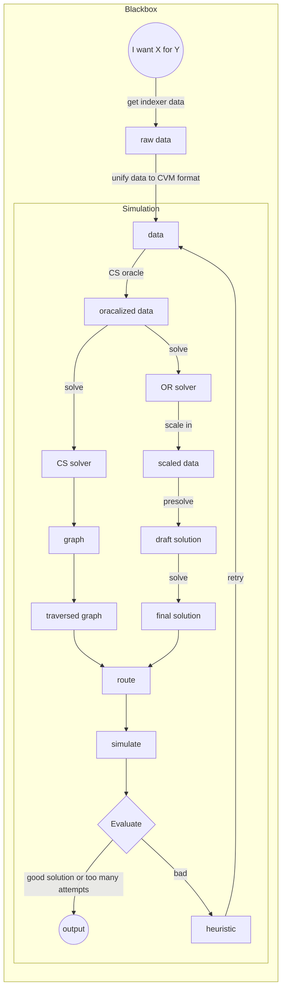

# Overview

MANTIS Blackbox is algorithmic server doing some data mangling and number crunching to find routing solutions. 

Blackbox server depends on Simulation package. Simulation solve and verifies solution given existing data and heuristic constraints.

Here is software diagram of interacting components.

Details of each step are outlined elsewhere in more low level places.