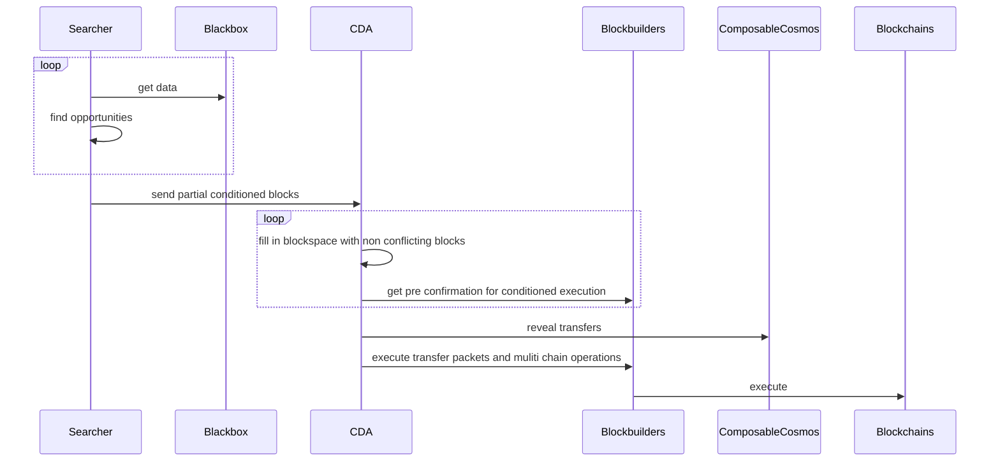
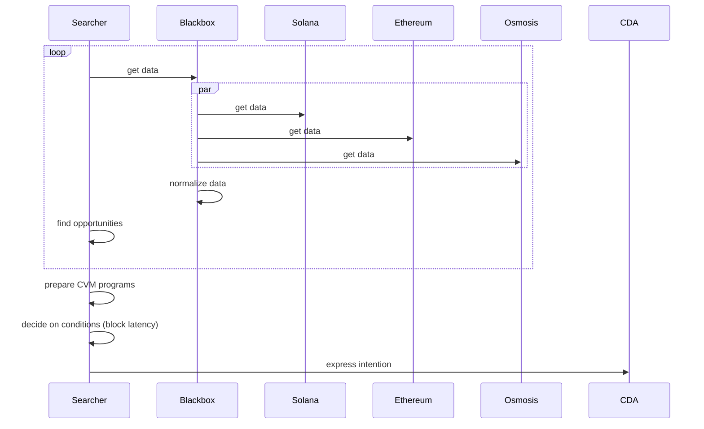
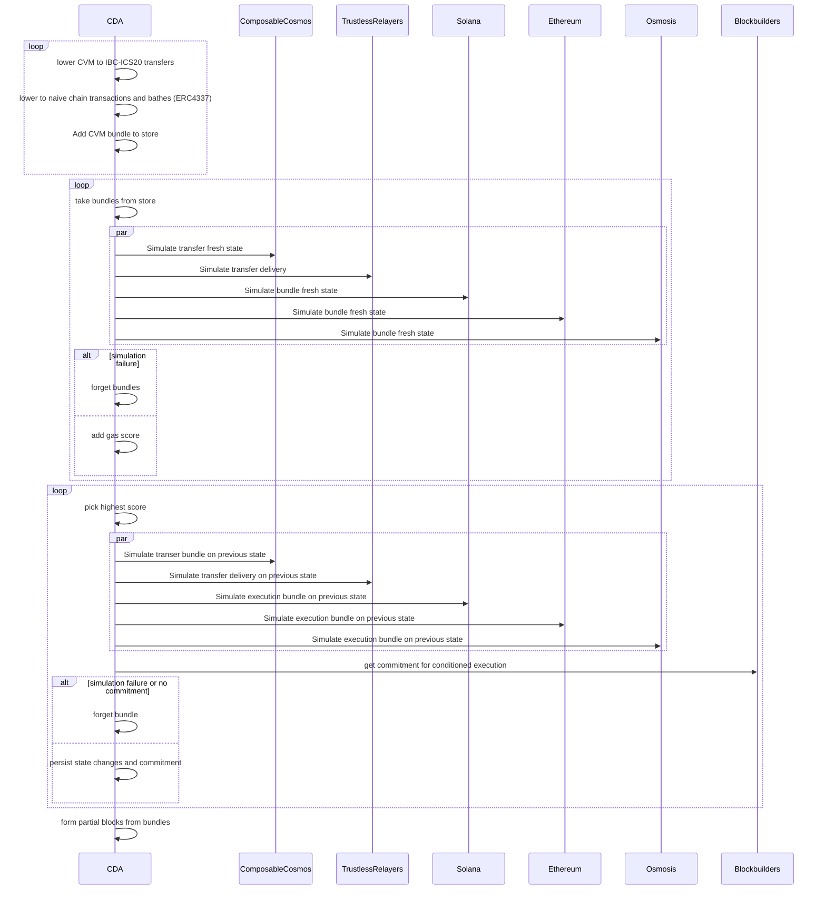
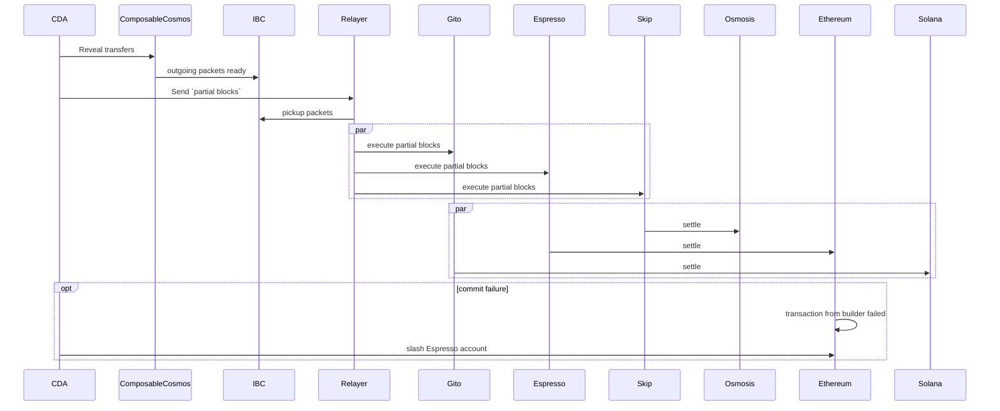

# Cross Domain Auctioner Execution Architecture

Cross Domain Auctioner(CDA) is cross chain atomic block builder purposed to replace CEX role in cross chain atomic execution.

CDA gives higher security and decenralization than CEX, and routes CEX revenue steam to Validators and other decenralized networks paricipants.

We start from simple diagram of participants and parts, following some explanation and commentary, and continue with more detailed diagrams of subflows.

After that we deine MVP solution which proves posibility cross chain atomicity and reveals needed latency requirments to be ensured in final product.

Please note that this description omits how CDA achieves secured privacy, that is subject of other research.

## What is there

Here is general outline with all flows and participants. Will zoom into each step with some explanation one by one next:

Seachers run their own arbitrage algorithm to find out opportunities. There are many searchers.
After that they form CVM(cross chain execution) intentions and decide on conditions they want that to be handled.
The end result for follow **Searchers buy cross chain atomicity**. Searchers CVM transactions will not be reverted on any Blockchains.

CDA is private execution node, estimates cross chain normalized gas costs of proposed CVM programs.
In order to do so CDA lowered CVM into multi chain packets and cross chain packets.
Execution part is lowered to into per chain format and revealed only to `Blockbuilder`s.
Transfer part lowered to cross chain packets, particularly to IBC. We need IBC to move funds to do cross chain CEX like arbitrage.

Set of transactions formed from on a Searcher CVM program is is `bundle`.
After, CDA fills in blockspace with non conlicting bundls.
CDA negotiates conditions with Blockbuilders for bundles to be executed at some block at some chains.
Only bundles approved by Blockbuilders are included into `partial blocks`, several bundles from Searchers.

Final step is execution and slashing for failing to execute on commitments.

Blockbuilders lock slashable amount on chain it builds for.

Commitment can be Blockbuilder signature to allow slash locked amount if thumbstone of `partial block` execution was not created.

### Bundling aglorithm

0. Preapare normalized gas pricess accross all chains
1. Sort bundles by highest gas (paying most of fees)
2. Take first bundle and simulate.
3. If simulation success, added to partial block.
4. Repeat 2 for next bundle