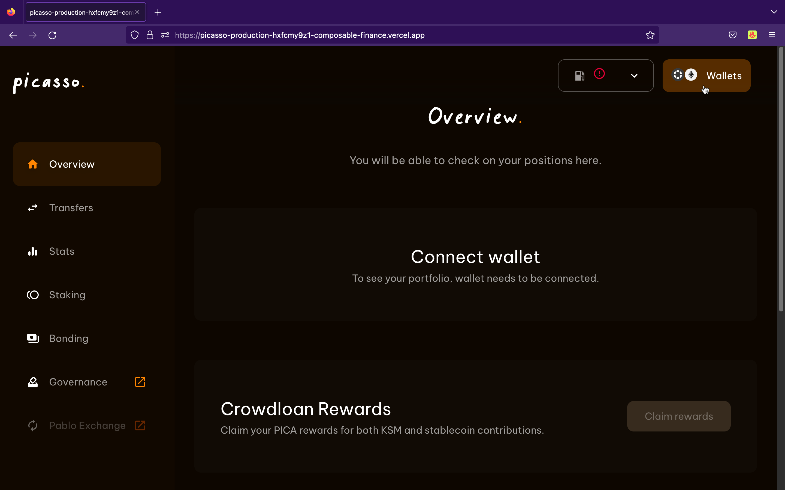
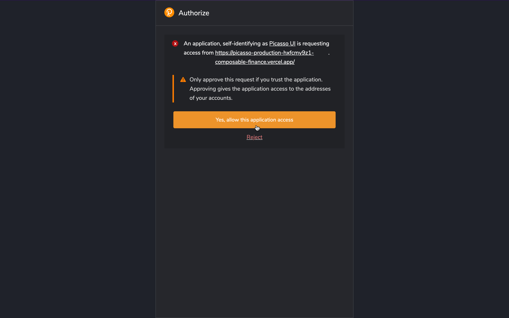
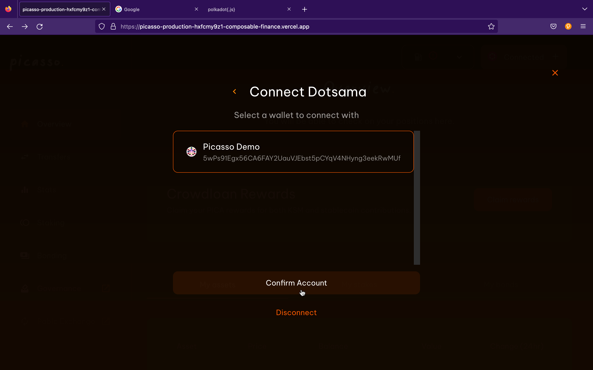
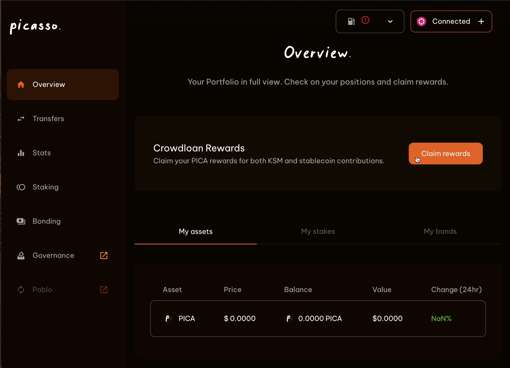
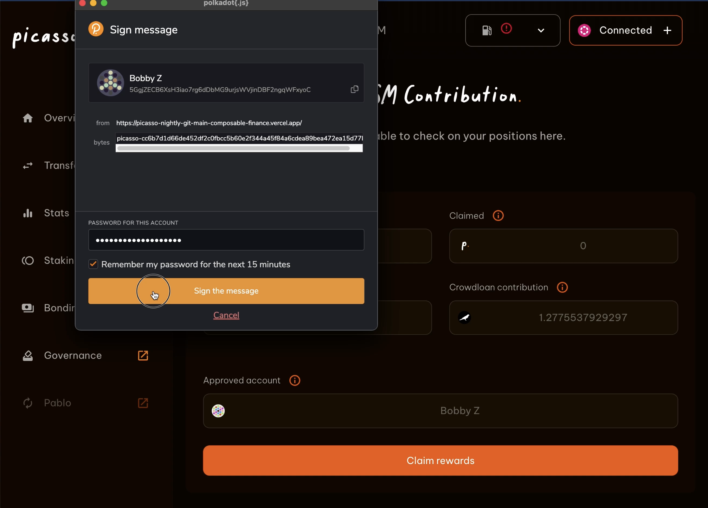
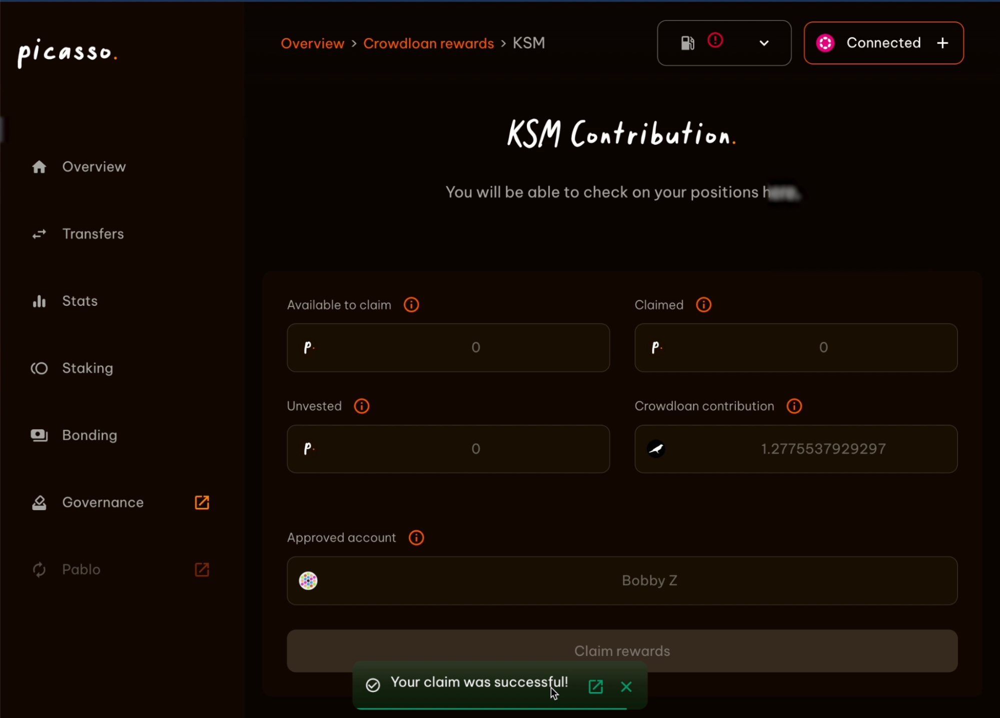

# How to claim your crowdloan rewards

Those who have participated in our crowdloan and want to claim their rewards, first, 
need a wallet to connect to Picasso. 
Click the link to read our guides on how to create a Polkadot.js or Talisman wallet for Picasso.

[https://docs.composable.finance/user-guides](https://docs.composable.finance/developer-guides)

This guide will show you how to claim your crowdloan rewards. For the purpose of this guide, we chose to showcase the process using Polkadot.js.
We recommend reading through the complete instructions at least once before following along.

## Connect Your Account to Picasso

To use the complete feature set of Picasso, a wallet needs to be connected. 
You can use a Polkadot.js or Talisman account.

1. Click “Wallets” in the top right corner
2. Click “Polkadot”
3. Select a wallet of your choice. In this case, we use Polkadot.js

You will be prompted to allow Picasso access to your account's addresses. 
Make sure it identifies as Picasso and its origin "app.picasso.xyz"

1. Click "Yes, allow this application access"

On the following page, you will see all the wallets associated with the connected account.
If you create/derive more wallets in the future, they will show up here.

## Claim Your Rewards

Now that your wallet is connected to Picasso you can claim your crowdloan rewards.
You can simply replicate the following steps in Talisman, they are virtually the same.

1. Click “Claim Rewards”
2. Confirm the transaction with your password
3. Wait for your claim to be processed

Processing your claim should only take a few seconds. Once you see this screen your claim was a success. 

