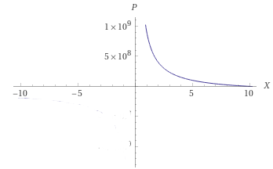

= Design Proposal: Oracle Rewards & General Inflation
:math:
:stem:
:imagesoutdir: images
:imagesdir: images
:toc:
:toclevels: 4
:sectnums:
:sectnumlevels: 4

== Abstract

This proposal lays out agreements on  https://docs.composable.finance/products/the-picasso-parachain/the-picasso-tech-stack/apollo[Apollo oracle] rewards based on discussions for the task https://app.clickup.com/t/27xkb7w[Control Oracle inflation].

== Background

Composable parachains Picasso in Kusama (now), Composable in Polkadot (later) depends on external price Oracles(Apollo) to provide reliable prices for chain internal components such as DeFi pallets and smart contracts. In order to incentivize the provision of accurate, regular assets for required asset class Composable intends to reward the Oracles regularly based on a tokenomics model.

== Requirements

. An Oracle provider MUST be able to earn an economically viable reward for submitting a price for a given pre-configured asset type.
. Governance MUST be able to adjust the possible reward based on the economic factors such as,
.. Oracle provider viability based on their infrastructure costs.
.. Competition and demand for the provision of Oracle services.
.. Opportunity cost of capital in staking for Oracles.
. Governance MUST be able to set the maximum amount of rewards earned by all oracles across all asset types.
. The system MUST NOT run out of funds for rewarding Oracles at any point in time as this is a critical service for all other DeFi protocols within the chain. This sets a hard requirement on being able to inflate the supply for Oracle rewards.

== Method

To formalize and make the analysis easier one can follow the model established in the following sections for Oracle rewards.

=== Governance Adjustable Parameters for Deciding Oracle Rewards

An adjustable parameter is needed to adjust rewards for Oracles as well as managed the inflation. Following a similar relationship outlined in https://research.web3.foundation/en/latest/polkadot/overview/2-token-economics.html#inflation-model[Polkadot Token Economics], one can come up with the following relationship for the total inflation(I) rate in runtime based on the current implementation,

stem:[I = I_("oracle") + I_("treasury") - I_("burnt-tx-fees")] - (1)

Here,

stem:[I_("treasury") = ] Any amount that is minted through governance to fund the treasury. Generally to be kept close to zero for all runtimes.

NOTE: Above equation ignores any slashing mechanics as the slashed amount is not burnt in the current implementation

At the moment the following code decides the transaction fee distribution ratio,

[source,rust]
----
include::../../../../runtime/common/src/impls.rs[lines=6..28]
----
Therefore,

stem:[I_("burnt-tx-fees") = ] 30% of the transaction fees. It is recommended here that this percentage be defined as a governance parameter(stem:[f]) to serve as possible mechanism to balance inflation.

Inflation for rewarding Oracles, stem:[I_("oracle")] is the main topic of concern here, and it can be defined to be governed as an annual ratio(stem:[e]) of the total issuance of the base currency(stem:[T]) of the runtime to serve as a clear APY indicator for Oracles.

With this taken into account the final equation for stem:[I] becomes,

stem:[I = e.T + I_("treasury") - f."Tx Fees"] - (2)

Here for Oracle economics to work,

stem:[C . X_(ideal) < e.T] - (3)

stem:[C = ] expected average annual cost of running an Oracle for a given year.

stem:[X_(ideal) = ] ideal number of oracles.

So the governance of Oracle reward inflation can be defined as adjusting stem:[e] as,

stem:[(C . X_(ideal)) / T < e] - (4)

It also follows from (3) that annual profit(stem:[P]) per Oracle is,

stem:[P = (e . T) / X - C]

With stem:[X = ] the instantaneous number of Oracles replacing stem:[X_(ideal)]. With stem:[e] varying based on governance and stem:[X] varying when Oracles join and leave following is the graph visualization of the equation (Note stem:[T] as it's annual and stem:[C] as it's mostly infra cost are assumed largely constant).

Assuming stem:[e = 10%], stem:[T = 10^10] and stem:[C = 10^8], the graph becomes,

Here stem:[P] goes to zero as stem:[X] approaches 10, making 10 the ideal number of Oracles at the limit. But this can not be considered the ideal as the Oracles still need to make a profit for them to be incentivized.

Therefore, from (4) we can deduce the following equation to adjust stem:[e] as,

stem:[e = (C . (X_(ideal) + delta X)) / T] - (5)

Here stem:[C](cost per Oracle) as well as stem:[X_(ideal) + delta X](number of Oracles to support) can be considered governance inputs to the rewarding model and based on that the model can calculate the necessary inflation stem:[e] as it already can track the total issuance for the past year stem:[T]. By adjusting stem:[delta X] or stem:[C] governance can make sure that running an Oracle is viable at all expected conditions such as opportunity cost of capital.

In order to allow for accurate accounting of the inflation while adjusting it based on the governance requirements, the total amount of already rewarded inflation(stem:[I_("oracle")^']) needs to be kept track of in the system. Then the total amount allowed to be rewarded is,

stem:[I_("oracle")^('') = T * e - I_("oracle")^'] - (6)

System must not allow adjustment of stem:[e] further if the stem:[I_("oracle")] becomes negative or zero as then the Oracles would not get rewarded further for the year. With (5) and (6) total allowed inflation is,

stem:[I_("oracle")^('') = C . (X_(ideal) + delta X) - I_("oracle")^'] - (7)

Now the algorithm for adjusting stem:[e] becomes (substituting stem:[X = X_(ideal) + delta X]),

[plantuml,images/adjusting-inflation-rate,png]
----
start
->gov params : C, X;
:already_rewarded = readStorage();
:possible_inflation = C.X - already_rewarded;
if (possible_inflation <= 0) then (yes)
:error("Not possible to adjust");
else (no)
:per_block_reward =\npossible_inflation / number_of_blocks_left_in_year;
:save(per_block_reward);
endif
stop
----

=== Calculating per Asset Type Oracle Reward per Block

Given the total reward that is possible to be rewarded per year, the system must calculate the reward per Oracle for a given asset type. Obvious way to do this is to divide the per_block_reward by the number of asset types defined for pricing. But in order the make this a bit more customizable, the reward per asset type can be defined as a weighted ratio of the per_block_reward. Then the algorithm for calculating the per asset type reward is as follows,

[plantuml,images/per-asset-type-reward,png]
----
start
->per_block_reward, asset_type;
:total_asset_weight = readStorage(sum of weights of all asset types);
note left: Can be calculated when\nupdating an asset type
:asset_type_weight = get the weight of the asset type;
:asset_type_reward = per_block_reward * asset_type_weight / total_asset_weight;
stop
----

