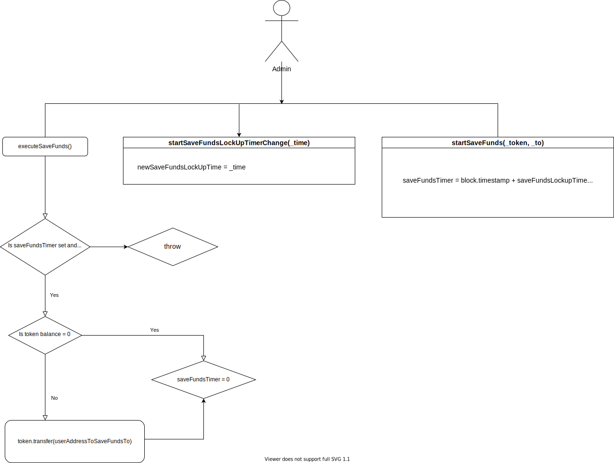

## Mosaic Holding

Mosaic Holding is an upgradeble contract that handles all deposited funds from **Mosaic Vault**.

It interacts with; its interface `IMosaicHolding`, InvestmentStrategy interface `IInvestmentStrategy`, and Openzeppelin's `SafeERC20Upgradeable`, `ReentrancyGuardUpgradeable`, `AccessControlEnumerableUpgradeable`, and `PausableUpgradeable` contracts.

Only the vault or the admin user can interact with the holding contract to transfer tokens.

[list of commands to deploy](/docs/configurations/mosaic-holding.md)

## State Variables

**MOSAIC_VAULT**

A `bytes32`, represents the hashed value of the word MOSAIC_VAULT.

**REBALANCING_BOT**

A `bytes32`, represents the hashed value of the word REBALANCING_BOT.

**tokenAddressToSaveFunds**

An `address`, represents the token of the funds when the `executeSaveFunds()` function is called.

**userAddressToSaveFundsTo**

An `address`, represents the receiver of the funds when the `executeSaveFunds()` function is called.

**saveFundsTimer**

A `uint`, represents the amount of time to wait before the `executeSaveFunds()` function can be called after the `startSaveFunds` has been called.

**saveFundsLockupTime**

A `uint`, represents the additional amount of time that's added to the current `block.timestamp` when the `startSaveFunds`, and `startSaveFundsLockUpTimerChange` functions are called.

**newSaveFundsLockUpTime**

A `uint`, represents the new amount of time to be assigned to `saveFundsLockupTime`.

**durationToChangeTimer**

A `uint`, represents the amount of time to wait before the `setSaveFundsLockUpTime()` function can be called.

**investmentStrategies**

A `mapping`, takes an `address` as key and returns a `boolean` value.

**rebalancingThresholds**

A `mapping`, takes an `address` as key and returns a `uint` value.

## Modifiers

**validAddress()**

| Type      | Parameter | Description                   |
| --------- | --------- | ----------------------------- |
| `address` | \_address | represent an ethereum address |

A modifier that ensures an address isn’t invalid (`0x…0`).

**validAmount()**

| Type   | Parameter | Description                   |
| ------ | --------- | ----------------------------- |
| `uint` | \_value   | represent an unsigned integer |

A modifier that ensures a uint value isn’t below zero.

**onlyAdmin()**

| Type   | Parameter | Description |
| ------ | --------- | ----------- |
| `none` | \_none    | none        |

A modifier that ensures that the caller has an assigned role on Mosaic Holding contract.

**onlyRebalancingOrAdmin()**

| Type   | Parameter | Description |
| ------ | --------- | ----------- |
| `none` | \_none    | none        |

A modifier that ensures that the caller has a role as a rebalancing bot or default admin on Mosaic Holding contract.

**onlyVaultOrAdmin()**

| Type   | Parameter | Description |
| ------ | --------- | ----------- |
| `none` | \_none    | none        |

A modifier that ensures that the caller has a role mosaic value or default admin on Mosaic Holding contract.

## Functions

**initialize()**

| Type      | Parameter | Description               |
| --------- | --------- | ------------------------- |
| `address` | \_admin   | default admin of contract |

A function that set up `DEFAULT_ADMIN_ROLE`, and `MOSAIC_VAULT` roles and assign value to `saveFundsLockupTime`.
Calls the;

`__ReentrancyGuard_init()` function from Openzeppelin ReentrancyGuardUpgradeable smart contract,

`__AccessControl_init()` function from Openzeppelin AccessControlEnumerableUpgradeable smart contract and,

`__Pausable_init()` function from Openzeppelin PausableUpgradeable smart contract.

With the help of initializer modifier, once called it can’t be called again.

**setRebalancingThreshold()**

| Type      | Parameter | Description                                  |
| --------- | --------- | -------------------------------------------- |
| `address` | \_token   | token for which we want to set the threshold |
| `uint`    | \_amount  | the max rebalancing amount for that token    |

A function that can only be called by the admin of the contract, with modifiers; `validAddress` and `validAmount`, emits an event `RebalancingThresholdChanged`, used to define rebalancing max amounts per token.

**extractLiquidityForRebalancing()**

| Type      | Parameter  | Description                             |
| --------- | ---------- | --------------------------------------- |
| `address` | \_token    | token for which we want to rebalance    |
| `uint`    | \_amount   | the amount that's being extracted       |
| `address` | \_receiver | receiver address; has to be whitelisted |

A function with modifiers; `validAddress`, `validAmount`, and `onlyRebalancingOrAdmin`, emits an event `RebalancingInitiated`, used by rebalancing bots to extract liquidity that will be transferred to another layer.

**setUniqRole()**

| Type      | Parameter | Description          |
| --------- | --------- | -------------------- |
| `bytes32` | \_role    | role of the actor    |
| `uint`    | \_actor   | address of the actor |

A function that can only be called by the admin of the contract, with a modifier `validAddress`, used to add uniq role address.

**transfer()**

| Type      | Parameter  | Description                           |
| --------- | ---------- | ------------------------------------- |
| `address` | \_token    | ERC20 token address                   |
| `address` | \_receiver | address of the receiver, vault or EOA |
| `uint`    | \_amount   | amount to transfer                    |

A function that can only be called by the admin or Vault with modifiers; `validAddress`, `validAmount`, and `whenNotPaused`, used to transfer tokens.

**approve()**

| Type      | Parameter | Description                |
| --------- | --------- | -------------------------- |
| `address` | \_spender | address of the spender     |
| `address` | \_token   | address of the ERC20 token |
| `uint`    | \_amount  | amount to transfer         |

A function that can only be called by the admin or Vault with a modifier `whenNotPaused`, used to allow other party to spend from this contract.

**addInvestmentStrategy()**

| Type      | Parameter         | Description                          |
| --------- | ----------------- | ------------------------------------ |
| `address` | \_strategyAddress | IInvestmentStrategy contract address |

A function that can only be called by the admin with a modifier `validAddress`, used to add IInvestmentStrategy supported contracts.

**invest()**

| Type        | Parameter            | Description                                          |
| ----------- | -------------------- | ---------------------------------------------------- |
| `interface` | \_investments        | array of Investment struct (token address, amount)   |
| `address`   | \_investmentStrategy | address of the IInvestmentStrategy admin want to use |
| `bytes`     | \_data               | dynamic data that strategy required                  |

A function that can only be called by the admin with a modifier `validAddress`, emits an event `FundsInvested`, used to invest funds in one of the IInvestmentStrategy from the contract.

**withdrawInvestment()**

| Type        | Parameter            | Description                                          |
| ----------- | -------------------- | ---------------------------------------------------- |
| `interface` | \_investments        | array of Investment struct (token address, amount)   |
| `address`   | \_investmentStrategy | address of the IInvestmentStrategy admin want to use |
| `bytes`     | \_data               | dynamic data that strategy required                  |

A function that can only be called by the admin with a modifier `validAddress`, emits an event `InvestmentWithdrawn`, used to withdraw investment.

**claim()**

| Type      | Parameter            | Description                         |
| --------- | -------------------- | ----------------------------------- |
| `address` | \_investmentStrategy | address of the strategy             |
| `bytes`   | \_data               | dynamic data that strategy required |

A function that can only be called by the admin with a modifier `validAddress`, emits an event `TokenClaimed`, used to claim tokens that different DAO issues for the investors.

**startSaveFunds()**

| Type      | Parameter | Description                                 |
| --------- | --------- | ------------------------------------------- |
| `address` | \_token   | token's balance the owner wants to withdraw |
| `address` | \_to      | receiver address                            |

A function that can only be called by the admin with modifiers; `validAddress`, and `whenPaused`, emits an event `SaveFundsStarted`, used to starts save funds transfer.

**executeSaveFunds()**

| Type   | Parameter | Description |
| ------ | --------- | ----------- |
| `none` | \_none    | none        |

A function that can only be called by the admin with modifiers; `validAddress`, and `whenPaused`, emits an event `LiquidityMoved`, called once the contract is paused and token's available liquidity will be manually moved.

**startSaveFundsLockUpTimerChange()**

| Type   | Parameter | Description           |
| ------ | --------- | --------------------- |
| `uint` | \_time    | lock up time duration |

A function that can only be called by the admin with a modifiers; `validAmount`, emits an event `SaveFundsLockUpTimerStarted`, used to starts save funds lockup timer change.

**setSaveFundsLockUpTime()**

| Type   | Parameter | Description |
| ------ | --------- | ----------- |
| `none` | \_none    | none        |

A function that can only be called by the admin, emits an event `SaveFundsLockUpTimeSet`, used to set save funds lockup time.



**pause()**

| Type   | Parameter | Description |
| ------ | --------- | ----------- |
| `none` | \_none    | none        |

A function that can only be called by the admin with a modifiers; `whenNotPaused`, used to pause contract.

**unpause()**

| Type   | Parameter | Description |
| ------ | --------- | ----------- |
| `none` | \_none    | none        |

A function that can only be called by the admin with a modifiers; `whenPaused`, used to unpause contract.

<!-- Composable holding is also used by the admin to invest funds in [Compound](https://compound.finance/) and [Aave](https://aave.com/).

```
invest(address token, uint256 amount, address investmentStrategy, bytes calldata data)
```

This method is called by the admin to invest tokens in investment protocols. -->

[home](/readme.md)
