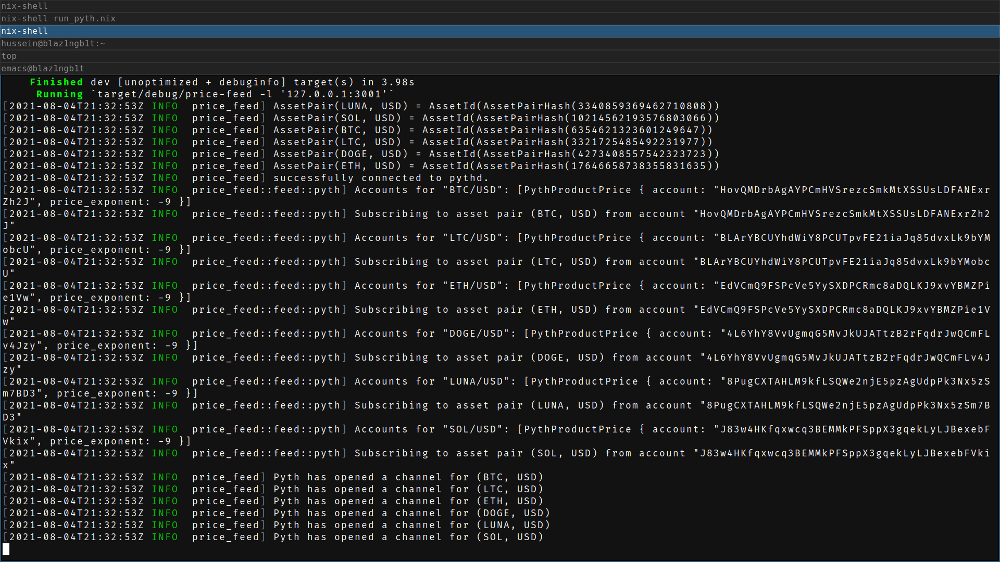

# Draft

Currently, in the pallet, the price of an asset is expressed in USD cents, it's not a ratio between two assets like in exchanges.
The price server handle arbitrary asset pair instead of fixing the denominator to USD, e.g. ETH/BTC, ADA/BTC...

We currently use an arbitrary `asset_id` in the oracle pallet.
To avoid an extra layer of indirection between the pallet and the price server,
the current version assume that the `asset_id` is `FNV1A64(Symbol(AssetPair(X, Y)))` where `Symbol(AssetPair(X, Y)) = "X/Y"`:
- `asset_id(AssetPair(DOGE, USD)) = FNV1A64(Symbol(AssetPair(DOGE, USD))) = 4273408557542323723`
- `asset_id(AssetPair(LUNA, USD)) = FNV1A64(Symbol(AssetPair(LUNA, USD))) = 3340859369462710808`
- `asset_id(AssetPair(ETH,  USD)) = FNV1A64(Symbol(AssetPair(ETH,  USD))) = 17646658738355831635`
- `asset_id(AssetPair(SOL,  USD)) = FNV1A64(Symbol(AssetPair(SOL,  USD))) = 10214562193576803066`
- `asset_id(AssetPair(LTC,  USD)) = FNV1A64(Symbol(AssetPair(LTC,  USD))) = 3321725485492231977`
- `asset_id(AssetPair(BTC,  USD)) = FNV1A64(Symbol(AssetPair(BTC,  USD))) = 6354621323601249647`

# Getting started

1. Run an instance of the composable node.
2. Run `pythd` along with `pyth_tx` using the provided nix script:
  - Open a new terminal and run `nix-shell run_pyth.nix`.
    - A bash function `run` is now available to start `pythd/pyth_tx`
    - Whenever you exit the terminal after having ran the `run` function, the two instances are going to be shutdown.
    - You have accesss to both `pythd/pyth_tx` logs by using $PYTHD_LOG and $PYTH_TX_LOG
3. Run the price server, assuming you are running `RUST_LOG=info cargo run --bin price-feed` .
4. Go on your local [substrate panel](https://polkadot.js.org/apps) and add a new asset, make sure to use one of the `FNV1A64` hash as `asset_id`.
5. Trigger a price request for each `asset_id` you created and watch the oracle state machine progress.
