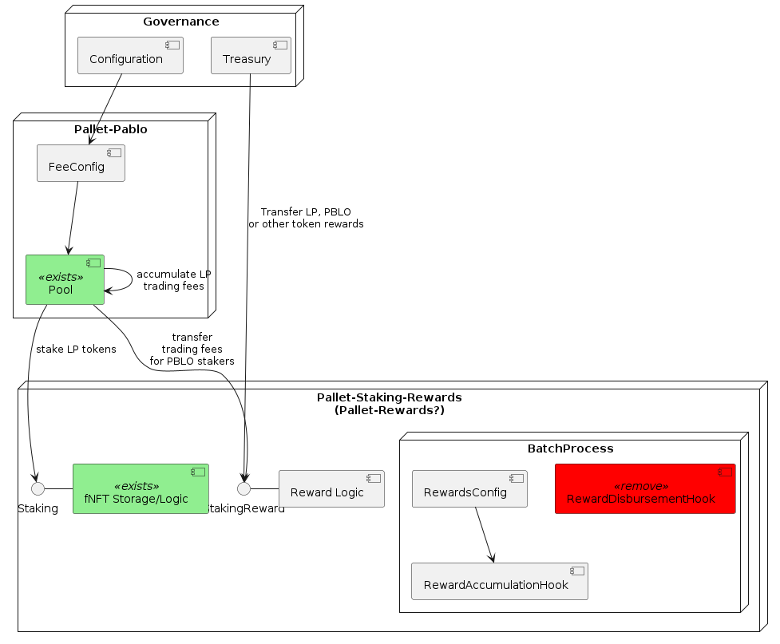
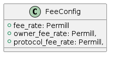

Design Proposal: Pablo Fees & Staking Rewards Distribution
==========================================================

Table of Contents

-   [1. Abstract](#_abstract)
-   [2. Background](#_background)
    -   [2.1. PBLO Token Initial
        Distribution](#_pblo_token_initial_distribution)
    -   [2.2. Pool Fees](#_pool_fees)
        -   [2.2.1. LP Fee Distribution](#_lp_fee_distribution)
-   [3. Use Cases](#_use_cases)
-   [4. Requirements](#_requirements)
    -   [4.1. Pablo Liquidity Providers](#_pablo_liquidity_providers)
    -   [4.2. PBLO Stakers](#_pblo_stakers)
    -   [4.3. PICA Stakers](#_pica_stakers)
    -   [4.4. Pablo Governance](#_pablo_governance)
    -   [4.5. PICA Governance](#_pica_governance)
    -   [4.6. Technical Requirements](#_technical_requirements)
-   [5. Method](#_method)
    -   [5.1. System Overview](#_system_overview)
    -   [5.2. Pallet-Pablo](#_pallet_pablo)
        -   [5.2.1. FeeConfig](#_feeconfig)
        -   [5.2.2. LP Trading Fee
            Distribution](#_lp_trading_fee_distribution)
            -   [5.2.2.1. LP fNFT
                Configuration](#_lp_fnft_configuration)
            -   [5.2.2.2. LP fNFT Creation When Receiving LP Tokens for
                Adding
                Liquidity](#_lp_fnft_creation_when_receiving_lp_tokens_for_adding_liquidity)
            -   [5.2.2.3. Trading Fee
                Distribution](#_trading_fee_distribution)
        -   [5.2.3. PBLO Staker Trading Fee
            Distribution](#_pblo_staker_trading_fee_distribution)
    -   [5.3. Pallet Staking Rewards](#_pallet_staking_rewards)
        -   [5.3.1. Staking Reward
            Calculation](#_staking_reward_calculation)
        -   [5.3.2. PICA/PBLO Token Staking](#_picapblo_token_staking)
            -   [5.3.2.1. RewardsConfig](#_rewardsconfig)
            -   [5.3.2.2. Governance Sets the RewardConfig and Transfers
                the Reward
                Allocation](#_governance_sets_the_rewardconfig_and_transfers_the_reward_allocation)
            -   [5.3.2.3. Governance Sets the Pablo Pool LP Staking
                Reward
                Allocation](#_governance_sets_the_pablo_pool_lp_staking_reward_allocation)
            -   [5.3.2.4.
                RewardAccumulationHook](#_rewardaccumulationhook)
-   [6. Rollout](#_rollout)
-   [Appendix A: Fee Distribution Q&A](#_fee_distribution_qa)

## 1. Abstract

This document proposes the Pablo distribution(token and pool trading
fees) mechanism while considering various options and capturing the
discussions about the subject.

`TODO summarise the mechanism`

## 2. Background

### 2.1. PBLO Token Initial Distribution

According to the [tokenomics design](http://link) the Pablo is supposed
to be distributed as follows,

-   Ecosystem fund - x

-   Farming rewards - y

-   LBP Auction - z

-   …​

TODO fill above with details from the original sheet.

The farming rewards are incentives for liquidity provider(LP)s who stake
their LP tokens for Pablo pools. How much reward is allocated as
incentive for each pool is to be decided by governance.

### 2.2. Pool Fees

Composable intends to distribute some percentage of the
swap(transaction) fees captured by the pools in Pablo dex pallet as
rewards to users who stake their `PBLO` tokens using the staking-rewards
pallet interface. The idea is to incentivize the continuous owning of
the staked `PICA` and `PBLO` to earn these yields which increases the
value of the ecosystem overall by increasing the desirability of the
staked assets.

At the time of writing Pablo has the following fee parameters other than
for liquidity bootstrapping pools(LBP) which do not charge fees,

1.  LP Fee - A percentage of the trading fee that is distributed to
    liquidity providers based on the number of liquidity provider(LP)
    tokens they minted at the time of providing the liquidity.

2.  Pool Owner Fee - A percentage of the trading fee that is distributed
    to the pool owner.

#### 2.2.1. LP Fee Distribution

This is yet to be implemented in Pablo, hence the idea is that it can be
addressed in the context of this proposal.

## 3. Use Cases

Following is a summary of use cases omitting the UI specific use cases
for brevity.

## 4. Requirements

### 4.1. Pablo Liquidity Providers

1.  LPs MUST be able to stake their LP tokens to earn PBLO rewards.

2.  The system MUST support accumulating the LP share of Pablo trading
    fees.

3.  Pablo trading fees(LP fee part) MUST be disbursed according to LP
    token share of each LP.

### 4.2. PBLO Stakers

1.  System MUST allow staking of PBLO.

2.  The system MUST accumulate the rewards share for PBLO holders who
    stake PBLO token, out of the PBLO supply allocated for them.

3.  The system MUST support accumulating the (stakers) reward part of
    the Pablo trading fees.

### 4.3. PICA Stakers

1.  System MUST allow staking of PICA.

2.  The system MUST accumulate the rewards share for PICA holders who
    stake PICA token, out of the PICA supply allocated for them.

3.  The system MUST support accumulating any token rewards other than
    PICA for PICA stakers.

### 4.4. Pablo Governance

1.  Governance MUST be able to set the PBLO token reward allocation.

2.  Governance MUST be able to set the Pablo LP reward proportion for
    each Pablo LP token(i.e Pool) out of PBLO or other token reward
    allocation. This is to incentivize providing liquidity to required
    pools as decided by governance.

3.  Governance MUST be able to adjust the PBLO reward rate(eg: daily)
    based on the incentivization strategy.

4.  Pablo pool protocol fees(for rewarding protocol stakers) SHOULD be
    configurable as a percentage of the pool owner fee.

### 4.5. PICA Governance

1.  Governance MUST be able to set the PICA token reward allocation.

2.  Governance MUST be able to adjust the PICA reward rate based on the
    incentivization strategy.

### 4.6. Technical Requirements

1.  The system MUST allow accumulation and mapping of rewards shares of
    multiple assets types(Eg: PBLO, KSM) to staked position(fNFT) type
    defined by another asset type(eg: PICA).

2.  The system MUST support transfer of rewards using staking-rewards
    pallet to necessary fNFT types.

3.  The system SHOULD support converting a reward accumulated in one
    asset type to another based on a preferred reward asset type
    configuration. Eg: Given a reward accumulated is in Acala it should
    be able to convert that to one of PBLO or PICA using the Pablo DEX
    pools.

    -   This is to handle cases where a Pablo pool fees are in a
        different asset type than what is preferred.

## 5. Method

### 5.1. System Overview

TODO: Suggest rename of staking-reward pallet to pallet-earn or
pallet-rewards.

TODO: What to do for part of protocol fees that should be transferred to
treasury eventually?

### 5.2. Pallet-Pablo

In order to 1. support LP staking 2. LP trading fee distribution and 3.
PBLO staking reward using trading fees, following changes are proposed
for
[Pallet-Pablo](https://github.com/ComposableFi/composable/tree/main/frame/pablo).

#### 5.2.1. FeeConfig

Each pool in Pablo defines a fee percentage to be charged for each
trade. Except for LBPs other pools also define an owner fee that is a
percentage out of the main trading fee. The `FeeConfig` is a new
abstraction over all fees that could be charged on a pool to allow for
extension. At this time a 100% of the owner fee should be defined as a
new field `protocol_fee`.

**Existing code must be modified to use this data structure**.

Given this,

    fee = // calculation depends on the pool type: based on the fee_rate
    owner_fee = fee * owner_fee_rate;
    protocol_fee = owner_fee * protocol_fee_rate;

For all pools launched at the Picasso launch following values would be
set for these configs

    owner_fee_rate = 20%
    protocol_fee_rate = 100% // all owner fees goes to composable to be distributed as rewards

#### 5.2.2. LP Trading Fee Distribution

Pablo needs to send the accumulated fees from trading to an account to
be distributed asynchronously. It is natural to see this distribution
working in a similar way to how staking rewards pallet distributes fNFT
rewards. The idea behind this section is to reuse staking rewards pallet
logic in distributing trading fees earnings to LPs.

##### 5.2.2.1. LP fNFT Configuration

The interface for the configurations does not currently exist on
staking\_rewards pallet, hence it has to be implemented.

##### 5.2.2.2. LP fNFT Creation When Receiving LP Tokens for Adding Liquidity

##### 5.2.2.3. Trading Fee Distribution

This reuses existing fNFT logic to distribute fees accrued for LPs.

#### 5.2.3. PBLO Staker Trading Fee Distribution

This is the reward a `PBLO` staker receives from the trading fees of
Pablo pools. It is equal to the protocol fee charged on Pablo pools.
This can be accomplished by calling the already exisiting
`StakingReward.transfer_reward` interface as follows. According to
product there is also a need to convert whatever the fee asset in to
PBLO to create an demand/additional value for PBLO.

Will it need a change in
[this](https://github.com/ComposableFi/composable/blob/main/frame/composable-traits/src/staking_rewards.rs#L96)
?

### 5.3. Pallet Staking Rewards

This section covers how the staking rewards are distributed using the
[staking rewards
pallet](https://github.com/ComposableFi/composable/tree/main/frame/staking-rewards).

#### 5.3.1. Staking Reward Calculation

PBLO and PICA allocation for stakers needs to be disbursed to the
relevant stakers by some process. The token distribution works as
follows,

    // these are set by governance
    staking reward allocation = a (say in token X)
    reward_rate = r (per epoch?)
    // Assuming there are only 3 Pablo pools named lp1, lp2, lp3
    lp1 reward allocation rate = LP1
    lp2 reward allocation rate = LP2
    lp3 reward allocation rate = LP3

    // given above
    LP1 staking total reward per epoch = a * r * LP1
    LP2 staking total reward per epoch = a * r * LP2
    LP3 staking total reward per epoch = a * r * LP3
    main token(eg: PBLO) staking total reward per epoch = a * r * (1 - LP1 - LP2 - LP3)

As this logic is common to all rewardable tokens in the system like
PBLO, PICA or KSM, hence it is proposed here to add the reward
calculation and disbursement logic in staking-rewards pallet.

#### 5.3.2. PICA/PBLO Token Staking

##### 5.3.2.1. RewardsConfig

This is a configuration data structure stored in staking rewards pallet
per rewarded asset so that [Staking Reward
Calculation](#_staking_reward_calculation) can take place.

##### 5.3.2.2. Governance Sets the RewardConfig and Transfers the Reward Allocation

Following are new extrinsic in the staking rewards pallet that is to be
called by the governance origin to transfer reward allocation.

The account that is transferred-to has to be **a dedicated account** in
staking rewards pallet that tracks the staking reward allocation in a
given token. This is not to mix these allocations with the already
transferred rewards in the staking rewards pallet account.

##### 5.3.2.3. Governance Sets the Pablo Pool LP Staking Reward Allocation

Following is a new extrinsic in the staking rewards pallet that is to be
called by the governance origin to transfer pool LP reward allocation
per pool. Refer [Staking Reward
Calculation](#_staking_reward_calculation).

Note that the extrinsic itself is agnostic to Pablo specifics.
Therefore, it can be used to specify reward allocation for any other
asset that is to be incentivized to be staked. A list data structure
`perAssetRewardAllocation` can be used to store this value in storage.

##### 5.3.2.4. RewardAccumulationHook

Following algorithm is to added as part of the existing [block
hook](https://github.com/ComposableFi/composable/blob/main/frame/staking-rewards/src/lib.rs#L363)
in staking rewards pallet. As it is only accumulating new rewards for an
upcoming epoch, the code is proposed to be run inside a new state
`State:AccumulatingRewards`.

This algorithm runs in
`O(staked_asset_type_count * rewarded_asset_type_count)`.

## 6. Rollout

## Appendix A: Fee Distribution Q&A

Based on the current setup following questions arise when deciding on
the distribution of these fees to relevant liquidity providers, owners
and stakers.

1.  A Protocol Fee for all pools in Pablo (or even protocol pallets
    other than Pablo)?

    Does it make sense to define a protocol fee percentage on top of the
    pool owner fees of the pools so that the protocol fee can be used as
    the pot out of which the stakers are rewarded? Initially the
    Protocol Fee = Pool Owner Fee as the pools are owned by Composable.
    Assumption here is that the stakers would indeed still get a reward
    out of third party created pool fees.

    **Comment:** While having a protocol funding mechanism is valuable,
    initially the protocol fees should zero or minimal.

2.  How does the system reward PICA stakers? Wouldn’t the Pablo protocol
    needs some parameter to define how much of its swap fee or protocol
    fee as referred to above would go to PICA holders? Or do we assume
    that PICA stakers do not get a reward out of the Pablo pool fees?

    1.  If Pablo does reward PICA stakers, the system might need a
        common interface that directs those funds out of Pablo.

    2.  If Pablo does reward PICA stakers, the system might need to have
        a treasury parameter that defines the percentage that goes out
        to PICA holders that can be adjusted overtime.

        **Comment:** PICA stakers would not be rewarded from the Pablo
        fees. PICA stakers are rewarded in newly minted PICA(or PBLO
        later), Mechanism to transfer the PICA tokens for stakers does
        not exist, need to be built.

3.  Does it make sense to define a Pool Owner Fee(Protocol Fee as
    referred to above) for LBPs that goes out to Pablo holders reward
    pool?

**Comment:** Pool fees could be swapped to PBLO token before
distributing to fNFT holders unless those fees are in some pre-defined
set of currencies(eg: KSM, DOT), which creates a demand for PBLO since
the system is buying back PBLO. But for this there should be a market
for PBLO/the other token that is being earned as fees.

**Comment:** LP fees can be distributed based on the fNFT. Minting the
fNFT at the time of LP event might make sense. i.e fNFT represents the
LP position on the pool as well as the rewards position for PBLO tokens
for LPs.

Last updated 2022-05-16 22:47:10 +0200
