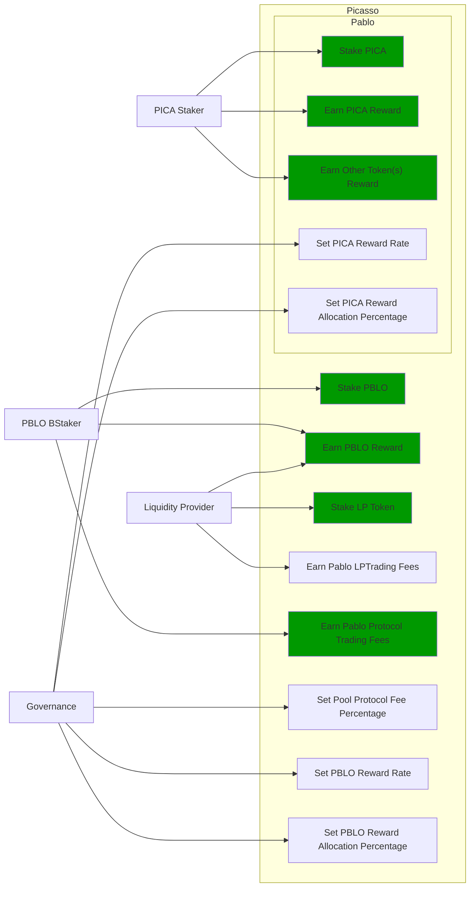

# Design Proposal: Pablo Fees & Staking Rewards Distribution

## Abstract

This document proposes the Pablo distribution(token and pool trading fees)
mechanism while considering various options and capturing the discussions about
the subject.

`TODO summarize the mechanism`

## Background

### PBLO Token Initial Distribution

According to the tokenomics design the Pablo is supposed to be distributed as
follows,

- Ecosystem fund - x
- Farming rewards - y
- LBP Auction - z
- ...

TODO fill above with details from the original sheet.

The farming rewards are incentives for liquidity provider(LP)s who stake their
LP tokens for Pablo pools. How much reward is allocated as incentive for each
pool is to be decided by governance.

### Pool Fees

Composable intends to distribute some percentage of the swap(transaction) fees
captured by the pools in Pablo dex pallet as rewards to users who stake their
`PBLO` tokens using the staking-rewards pallet interface. The idea is to
incentivize the continuous owning of the staked `PICA` and `PBLO` to earn these
yields which increases the value of the ecosystem overall by increasing the
desirability of the staked assets.

At the time of writing Pablo has the following fee parameters:

1.  **LP Fee** - A percentage of the trading fee that is distributed to
    liquidity providers based on the number of LP tokens they recieved when they
    originally provided liquidity.

2.  **Pool Owner Fee** - A percentage of the trading fee that is distributed to
    the pool owner.

#### LP Fee Distribution

This is yet to be implemented in Pablo, hence the idea is that it can be
addressed in the context of this proposal.

## Use Cases

Following is a summary of use cases omitting the UI specific use cases for
brevity.

## Requirements

### Pablo Liquidity Providers

LPs MUST be able to stake their LP tokens to earn rewards allocated for a
particular pool.

- Rewards can be in terms of PBLO, PICA or any other tokens.
- Same pool can receive multiple types of tokens as rewards. The system MUST
  support accumulating the LP share of Pablo trading fees.

Pablo trading fees(LP fee part) MUST be disbursed according to LP token share of
each LP. Fees are accumulated towards increasing liquidity in a pool while
allowing LPs to redeem the fee share with their LP tokens at a preferred time.

### PBLO Stakers

System MUST allow staking of PBLO. This must be implemented through the fNFT
mechanism with multiple time period unlocks being possible for users.  
The system MUST accumulate the rewards share for PBLO holders who stake PBLO
token, out of the PBLO supply allocated for them.  
The system MUST support accumulating the (stakers) reward part of the Pablo
trading fees.  
The system must support rewards being distributed on granular basis - e.g every
6 or 12 hours.  
The users MUST be able to claim the rewards once distributed.  
The system SHOULD support rewards in the form of fNFTs.

### PICA Stakers

System MUST allow staking of PICA. This must be implemented through the fNFT
mechanism with multiple time period unlocks being possible for users.  
The system MUST accumulate the rewards share for PICA holders who stake PICA
token, out of the PICA supply allocated for them.  
The system MUST support accumulating any token rewards other than PICA for PICA
stakers.  
The system must support rewards being distributed on granular basis - e.g every
6 or 12 hours.  
The users MUST be able to claim the rewards once distributed.  
The system SHOULD support rewards in the form of fNFTs.

### Pablo Governance

Governance MUST be able to set the PBLO token reward allocation.  
Governance MUST be able to set the Pablo LP reward proportion for each Pablo LP
token(i.e Pool) out of PBLO or other token reward allocation. This is to
incentivize providing liquidity to required pools as decided by governance.  
Governance MUST be able to adjust the PBLO reward rate(eg: daily) based on the
incentivization strategy.  
Pablo pool protocol fees(for rewarding protocol stakers) SHOULD be configurable
as a percentage of the pool owner fee.

### PICA Governance

Governance MUST be able to set the PICA token reward allocation.  Governance
MUST be able to adjust the PICA reward rate based on the incentivization
strategy.

### Technical Requirements

The system MUST allow accumulation and mapping of rewards shares of multiple
assets types(Eg: PBLO, KSM) to staked position(fNFT) type defined by another
asset type(eg: PICA).  
The system MUST support transfer of rewards using staking-rewards pallet to
necessary fNFT types.  
The system SHOULD support converting a reward accumulated in one asset type to
another based on a preferred reward asset type configuration. Eg: Given a reward
accumulated is in Acala it should be able to convert that to one of PBLO or PICA
using the Pablo DEX pools. _This is to handle cases where a Pablo pool fees are
in a different asset type than what is preferred._

### Financial NFT Requirements

Each staked position MUST be represented as a https://todo.link[fNFT].  
Owning a PBLO staked position fNFT(xPBLO) MUST allow voting for protocol
governance based on the xPBLO granted.  
Each staked position plus its rewards
MUST be transferable by transferring the ownership of its NFT including the
voting rights.

## Method

### System Overview
