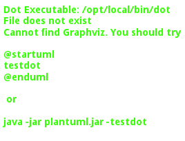
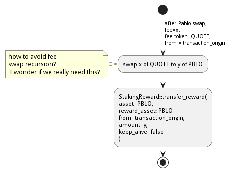
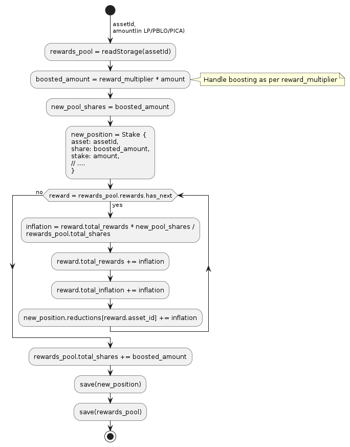
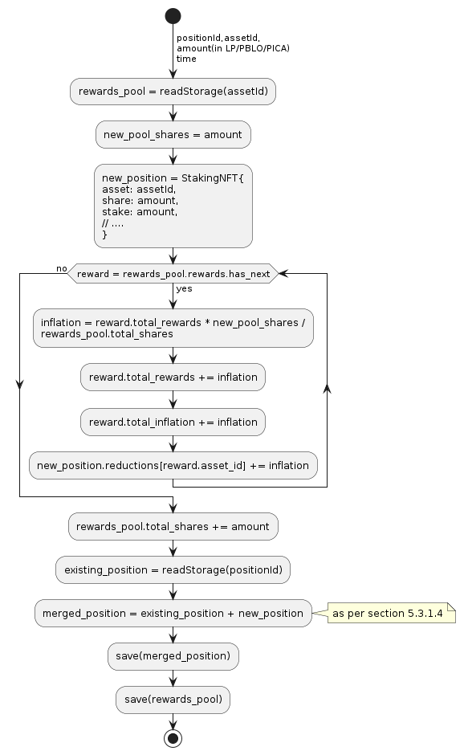
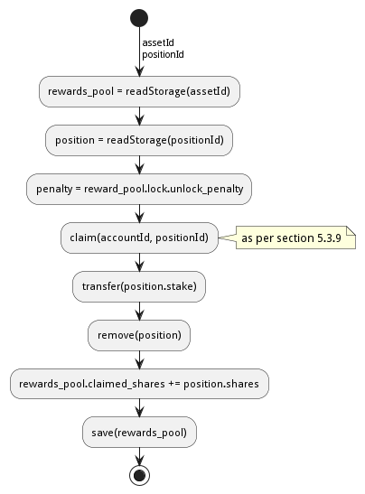
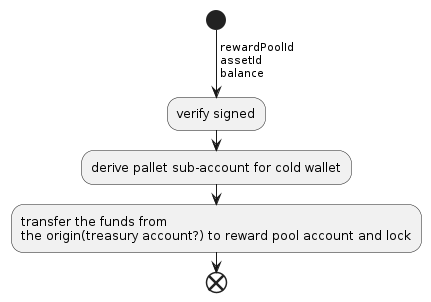
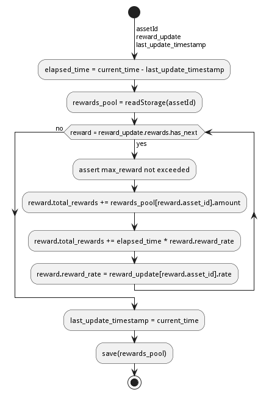
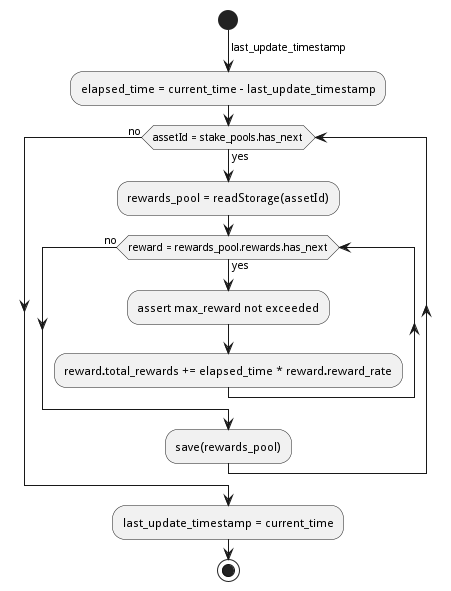
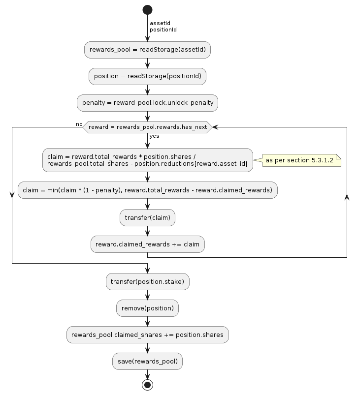

# Design Proposal: Pablo Fees & Staking Rewards Distribution

Table of Contents

-   [1. Abstract](#1-abstract)
-   [2. Background](#2-background)
    -   [2.1. PBLO Token Initial
        Distribution](#21-pblo-token-initial-distribution)
    -   [2.2. Pool Fees](#22-pool-fees)
        -   [2.2.1. LP Fee Distribution](#-lp-fee-distribution)
-   [3. Use Cases](#3-use-cases)
-   [4. Requirements](#4-requirements)
    - [4.1. Pablo Liquidity Providers](#41-pablo-liquidity-providers)
    - [4.2. PBLO Stakers](#42-pblo-stakers)
    - [4.3. PICA Stakers](#43-pica-stakers)
    - [4.4. Pablo Governance](#44-pablo-governance)
    - [4.5. PICA Governance](#45-pica-governance)
    - [4.6. Technical Requirements](#46-technical-requirements)
    - [4.7. Financial NFT Requirements](#47-financial-nft-requirements)
-   [5. Method](#5-method)
    -   [5.1. System Overview](#51-system-overview)
    -   [5.2. Pallet-Pablo](#52-pallet-pablo)
        -   [5.2.1. FeeConfig](#521-feeconfig)
        -   [5.2.2. LP Trading Fee
            Distribution](#522-lp-trading-fee-distribution)
        -   [5.2.3. PBLO Staker Pool
            Creation](#523-pblo-staker-pool-creation)
        -   [5.2.4. PBLO Staker Trading Fee
            Distribution](#524-pblo-staker-trading-fee-distribution)
    -   [5.3. Pallet Staking Rewards - LP/PICA/PBLO/Other Token Staking
        Reward
        Pools](#53-pallet-staking-rewards-lppicapbloother-token-staking-reward-pools)
        -   [5.3.1. Analysis of Reward
            Calculations](#531-analysis-of-reward-calculations)
            -   [5.3.1.1. When adding a new staker ,
                existing stakers()
                reward would
                be,](#5311-when-adding-a-new-staker-n1-existing-stakers-reward-would-be)
            -   [5.3.1.2. When removing a staker(Claim/Unstake) from the pool the above
                addition step has to be
                reverted](#5312-when-removing-a-stakerclaimunstake-from-the-pool-the-above-addition-step-has-to-be-reverted)
            -   [5.3.1.3. When adding a new reward to the pool the
                calculations remain the same other than increasing the
                reward pool as
                follows,](#5313-when-adding-a-new-reward-to-the-pool-the-calculations-remain-the-same-other-than-increasing-the-reward-pool-as-follows)
            -   [5.3.1.4. When extending an existing
                position](#5314-when-extending-an-existing-position)
            -   [5.3.1.5. When splitting an existing
                position](#5315-when-splitting-an-existing-position)
        -   [5.3.2. Data Structures](#532-data-structures)
        -   [5.3.3. Staking](#533-staking)
        -   [5.3.4. Extend Position](#534-extend-position)
        -   [5.3.5. Split Position](#535-split-position)
        -   [5.3.6. Claim/Unstake](#536-claimunstake)
         -   [5.3.7. Reward Pool Governance](#537-reward-pool-governance)
            -   [5.3.7.1. Update Reward Allocation Per
                Pool](#5371-update-reward-allocation-per-pool)
            -   [5.3.7.2. Update Reward Pool](#5372-update-reward-pool)
        -   [5.3.8. RewardAccumulationHook](#538-rewardaccumulationhook)
        -   [5.3.9. Claim](#539-claim)
-   [6. Implementation](#6-implementation)
    -   [6.1. Pallet Pablo: LP Fee + Staking
        Changes](#61-pallet-pablo-lp-fee-staking-changes)
    -   [6.2. Pallet Staking Rewards: PICA/PBLO Staking Related
        Changes](#62-pallet-staking-rewards-picapblo-staking-related-changes)
-   [Appendix A: Trading Fee Inflation to Avoid Dilution of
    LPs](#appendix-a-trading-fee-inflation-to-avoid-dilution-of-lps)
-   [Appendix B: Fee Distribution Q&A](#appendix-b-fee-distribution-qa)

## 1. Abstract

This document proposes the Pablo distribution(token and pool trading
fees) mechanism while considering various options and capturing the
discussions about the subject.

`TODO summarize the mechanism`

## 2. Background

### 2.1. PBLO Token Initial Distribution

**NOTE**: PBLO token does not have a set release date and its details
are not finalized.

The farming rewards are incentives for liquidity provider(LP)s who stake
their LP tokens for Pablo pools. How much reward is allocated as
incentive for each pool is to be decided by governance.

### 2.2. Pool Fees

Composable intends to distribute some percentage of the
swap(transaction) fees captured by the pools in Pablo dex pallet as
rewards to users who stake their `PBLO` tokens using the staking-rewards
pallet interface. The idea is to incentivize the continuous owning of
the staked `PICA` and `PBLO` to earn these yields which increases the
value of the ecosystem overall by increasing the desirability of the
staked assets.

At the time of writing Pablo has the following fee parameters other than
for liquidity bootstrapping pools(LBP) which do not charge fees,

1.  LP Fee - A percentage of the trading fee that is distributed to
    liquidity providers based on the number of liquidity provider(LP)
    tokens they minted at the time of providing the liquidity.

2.  Pool Owner Fee - A percentage of the trading fee that is distributed
    to the pool owner.

#### 2.2.1. LP Fee Distribution

This is yet to be implemented in Pablo, hence the idea is that it can be
addressed in the context of this proposal.

## 3. Use Cases

Following is a summary of use cases omitting the UI specific use cases
for brevity.

## 4. Requirements

### 4.1. Pablo Liquidity Providers

1.  LPs MUST be able to stake their LP tokens to earn rewards allocated
    for a particular pool.

    1.  Rewards can be in terms of PBLO, PICA or any other tokens.

    2.  Same pool can receive multiple types of tokens as rewards.

2.  The system MUST support accumulating the LP share of Pablo trading
    fees.

3.  Pablo trading fees(LP fee part) MUST be disbursed according to LP
    token share of each LP. Fees are accumulated towards increasing
    liquidity in a pool while allowing LPs to redeem the fee share with
    their LP tokens at a preferred time.

### 4.2. PBLO Stakers

1.  System MUST allow staking of PBLO. This must be implemented through
    the fNFT mechanism with multiple time period unlocks being possible
    for users.

2.  The system MUST accumulate the rewards share for PBLO holders who
    stake PBLO token, out of the PBLO supply allocated for them.

3.  The system MUST support accumulating the (stakers) reward part of
    the Pablo trading fees.

4.  The system must support rewards being distributed on granular
    basis - e.g every 6 or 12 hours.

5.  The users MUST be able to claim the rewards once distributed.

6.  The system SHOULD support rewards in the form of fNFTs.

### 4.3. PICA Stakers

1.  System MUST allow staking of PICA. This must be implemented through
    the fNFT mechanism with multiple time period unlocks being possible
    for users.

2.  The system MUST accumulate the rewards share for PICA holders who
    stake PICA token, out of the PICA supply allocated for them.

3.  The system MUST support accumulating any token rewards other than
    PICA for PICA stakers.

4.  The system must support rewards being distributed on granular
    basis - e.g every 6 or 12 hours.

5.  The users MUST be able to claim the rewards once distributed.

6.  The system SHOULD support rewards in the form of fNFTs.

### 4.4. Pablo Governance

1.  Governance MUST be able to set the PBLO token reward allocation.

2.  Governance MUST be able to set the Pablo LP reward proportion for
    each Pablo LP token(i.e Pool) out of PBLO or other token reward
    allocation. This is to incentivize providing liquidity to required
    pools as decided by governance.

3.  Governance MUST be able to adjust the PBLO reward rate(eg: daily)
    based on the incentivization strategy.

4.  Pablo pool protocol fees(for rewarding protocol stakers) SHOULD be
    configurable as a percentage of the pool owner fee.

### 4.5. PICA Governance

1.  Governance MUST be able to set the PICA token reward allocation.

2.  Governance MUST be able to adjust the PICA reward rate based on the
    incentivization strategy.

### 4.6. Technical Requirements

1.  The system MUST allow accumulation and mapping of rewards shares of
    multiple assets types(Eg: PBLO, KSM) to staked position(fNFT) type
    defined by another asset type(eg: PICA).

2.  The system MUST support transfer of rewards using staking-rewards
    pallet to necessary fNFT types.

3.  The system SHOULD support converting a reward accumulated in one
    asset type to another based on a preferred reward asset type
    configuration. Eg: Given a reward accumulated is in Acala it should
    be able to convert that to one of PBLO or PICA using the Pablo DEX
    pools.

    -   This is to handle cases where a Pablo pool fees are in a
        different asset type than what is preferred.

### 4.7. Financial NFT Requirements

1.  Each staked position MUST be represented as a
    [fNFT](https://github.com/ComposableFi/composable/blob/main/rfcs/0006-financial-nft.md).

2.  Owning a PBLO staked position fNFT(xPBLO) MUST allow voting for
    protocol governance based on the xPBLO granted.

3.  Each staked position plus its rewards MUST be transferable by
    transferring the ownership of its NFT including the voting rights.

## 5. Method

### 5.1. System Overview

TODO: What to do for part of protocol fees that should be transferred to
treasury eventually as treasury does not stake it’s PBLO?

### 5.2. Pallet-Pablo

In order to 1. support LP staking 2. LP trading fee distribution and 3.
PBLO staking reward using trading fees, following changes are proposed
for
[Pallet-Pablo](https://github.com/ComposableFi/composable/tree/main/code/parachain/frame/pablo).

#### 5.2.1. FeeConfig

Each pool in Pablo defines a fee percentage to be charged for each
trade.Except for LBPs other pools also define an owner fee that is a
percentage out of the main trading fee. The `FeeConfig` is a new
abstraction over all fees that could be charged on a pool to allow for
extension. At this time a 100% of the owner fee should be defined as a
new field `protocol_fee`.

[FeeConfig](https://github.com/ComposableFi/composable/blob/abf9b87c57856b4e83aac66eaca2734bd2d99044/code/parachain/frame/composable-traits/src/dex.rs#L189)

Given this,

    fee = // calculation depends on the pool type: based on the fee_rate
    owner_fee = fee * owner_fee_rate * (1 - protocol_fee_rate);
    protocol_fee = owner_fee * protocol_fee_rate;

For all pools launched at the Picasso launch following values would be
set for these configs

    owner_fee_rate = 20%
    protocol_fee_rate = 100% // all owner fees goes to composable to be distributed as rewards

#### 5.2.2. LP Trading Fee Distribution

LPs trading fees are calculated and kept as part of the pool liquidity
in Pablo. When LPs remove liquidity from the pool the trading fees are
automatically redeemed according their pool LP ratio, check
[reference](https://hackmd.io/@HaydenAdams/HJ9jLsfTz#Fee-Structure).
This results in trading fee share being diluted overtime for smaller
pools as follows.

After 
trades and 
liquidity additions,

trading fees 

total liquidity 

fees and liquidity returned for an LP amount 

trading fees received 

"When pool size 
increases the amount of trading fees received 
reduces for a particular LP position.

For large pool sizes of 
(steady state) this effect is negligible, hence it’s a good enough
strategy to distribute fees.

But if required this effect can be negated by increasing the trading fee
by a 
while at the same time subtracting it from the total fees paid out
already to liquidity providers. Refer [Trading Fee Inflation to Avoid
Dilution of LPs](#appendix-a-trading-fee-inflation-to-avoid-dilution-of-lps).

#### 5.2.3. PBLO Staker Pool Creation

When creating new Pablo pool, the creator should have option to create a
PBLO staking pool. This newly created staking pool will receive rewards
from trading fees from Pablo pool as mention in section 5.2.4

#### 5.2.4. PBLO Staker Trading Fee Distribution

This is the reward a `PBLO` staker receives from the trading fees of
Pablo pools. It is equal to the protocol fee charged on Pablo pools.
This can be accomplished by calling the already existing
`StakingReward.transfer_reward` interface as follows. According to
product there is also a need to convert whatever the fee asset in to
PBLO to create a demand/additional value for PBLO.

### 5.3. Pallet Staking Rewards - LP/PICA/PBLO/Other Token Staking Reward Pools

This section covers how the staking rewards are distributed using the
[staking rewards
pallet](https://github.com/ComposableFi/composable/tree/main/code/parachain/frame/staking-rewards).

#### 5.3.1. Analysis of Reward Calculations

In order to create the necessary reward pool as well as the rewarding
rate for stakers the following model can be used. It tries to address
the following constraints,

1.  Allow specification of the reward rate for a
    pool (even setting a dynamically changing rate)

2.  Allow addition of new stakers at anytime to a pool, start earning
    immediate rewards

3.  Allow more realtime calculation of rewards on-demand for a given
    pool for a given user.

4.  Allow shorter reward pool calculation epoch with the use of the
    reward rate.

5.  Allow expansion of rewards pools realtime.

6.  Allow extending of staked position in time and amount.

7.  Allow splitting of staked position into smaller positions.

8.  \[Postponed\] Allow compounding of staked position when the rewarded
    asset is the same as staked. Not handled at the moment. Though it is
    possible for users to just re-stake their earned assets.

To analyze the requirement fully, let’s define the following terms for a
given staking reward pool,

Pre-defined reward rate (say per second) 

Pre-defined reward calculation epoch in seconds 

Reward per calculation epoch 

Previous total reward pool before the current epoch 

Assuming there is a per epoch calculation which adds to the pool, the
total reward pool for the current epoch,

Reward pool shares for 
stakers,

Where 
staker share is 

Existing 
staker reward,

##### 5.3.1.1. When adding a new staker , existing stakers() reward would be,

As this is less than what is expected above, an adjustment 
to total reward pool can be made to allow realtime reward calculations,

**Therefore, the existing staker receives the same reward as before**

To compensate for this new adjustment, a reduction 
(equal to )
of reward for each staker needs to be tracked,

← (1)

In general,

##### 5.3.1.2. When removing a staker(Claim/Unstake) from the pool the above addition step has to be reverted

The n+1 stakers claim 
is given by (1). With the reward rate based rewards added in after time

and replacing 
and substituting ,

 

Therefore, the adjustment made above for the total reward pool works as
expected for claims for the all the stakers. As this relationship holds
for any number of stakers the total reward pool need not be adjusted
when removing a staker.

##### 5.3.1.3. When adding a new reward to the pool the calculations remain the same other than increasing the reward pool as follows,

Since already claimed rewards()
are tracked for each staker, they can always claim the new reward share
from 
later.

##### 5.3.1.4. When extending an existing position

Extension of an existing staker position can be treated in the same way
as adding a new staker as the following relationship holds with the new
stake 
and the corresponding inflation ,

new staker to add 
← (2)

Now with (1) + (2),

Therefore, same computation as before with 
number of shares added to the staker position works as expected.

##### 5.3.1.5. When splitting an existing position

As the total reward pool is not affected the splitting is just creating
a new position using some ratio. If the ratio is 
From (1)

First position 

Second position 

Summing these positions would give the original position(equation 1) as
the ratio terms cancel out.

As this method uses a reward pooling based approach to calculate the
rewards for each staker out of it on-demand, rest of the document refers
to this as the "reward pooling(**RP**) based approach".

#### 5.3.2. Data Structures

Staking rewards pallet already uses the following data structure
representing a staking position,

[Stake](https://github.com/ComposableFi/composable/blob/abf9b87c57856b4e83aac66eaca2734bd2d99044/code/parachain/frame/composable-traits/src/staking/mod.rs#L210)

Which is referred to in the algorithms in the following sections.

Now in order to allow redeeming the above staking position, following
data structures is to be tracked in the staking rewards pallet,

[Reward](https://github.com/ComposableFi/composable/blob/abf9b87c57856b4e83aac66eaca2734bd2d99044/code/parachain/frame/composable-traits/src/staking/mod.rs#L20)

[RewardPool](https://github.com/ComposableFi/composable/blob/abf9b87c57856b4e83aac66eaca2734bd2d99044/code/parachain/frame/composable-traits/src/staking/mod.rs#L113)

Following sections describe the algorithms for various operations on the
rewards pool based on these data structures.

#### 5.3.3. Staking

#### 5.3.4. Extend Position

#### 5.3.5. Split Position

#### 5.3.6. Unstake

#### 5.3.7. Reward Pool Governance

##### 5.3.7.1. Update Reward Allocation Per Pool

Each reward pool would have its own reward pot account.

-   Lock the assets in the pool account so that funds can be claimed
    only when unlocked.

-   Reward accumulation logic would just release funds from the pool
    account according to the reward rate.

-   In order to add funds to the pool account, an extrinsic is needed as
    follows:

    -   Input: rewardPoolId, AssetId, Balance

        For governance proposals, one can query storage to get the
        reward pool ID and create a proposal to call the above
        extrinsic.

##### 5.3.7.2. Update Reward Pool

#### 5.3.8. RewardAccumulationHook

Following algorithm should be part of the block hook in the pallet.

#### 5.3.9. Claim

## 6. Implementation

### 6.1. Pallet Pablo: LP Fee + Staking Changes

-   ❏ Implement [FeeConfig](#521-feeconfig) on pallet-pablo across all 3
    types of pools.

-   ❏ Implement [PBLO Staker Trading Fee
    Distribution](#523-pblo-staker-trading-fee-distribution).

### 6.2. Pallet Staking Rewards: PICA/PBLO Staking Related Changes

-   ❏ Implement [RewardAccumulationHook](#538-rewardaccumulationhook).

## Appendix A: Trading Fee Inflation to Avoid Dilution of LPs

New trading fee 

For 
liquidity provider,

With this adjusted value all later additions to LP shares have been
negated when receiving fees for earlier LPs.

## Appendix B: Fee Distribution Q&A

Based on the current setup following questions arise when deciding on
the distribution of these fees to relevant liquidity providers, owners
and stakers.

1.  A Protocol Fee for all pools in Pablo (or even protocol pallets
    other than Pablo)?

    Does it make sense to define a protocol fee percentage on top of the
    pool owner fees of the pools so that the protocol fee can be used as
    the pot out of which the stakers are rewarded? Initially the
    Protocol Fee = Pool Owner Fee as the pools are owned by Composable.
    Assumption here is that the stakers would indeed still get a reward
    out of third party created pool fees.

    **Comment:** While having a protocol funding mechanism is valuable,
    initially the protocol fees should zero or minimal.

2.  How does the system reward PICA stakers? Wouldn’t the Pablo protocol
    needs some parameter to define how much of its swap fee or protocol
    fee as referred to above would go to PICA holders? Or do we assume
    that PICA stakers do not get a reward out of the Pablo pool fees?

    1.  If Pablo does reward PICA stakers, the system might need a
        common interface that directs those funds out of Pablo.

    2.  If Pablo does reward PICA stakers, the system might need to have
        a treasury parameter that defines the percentage that goes out
        to PICA holders that can be adjusted overtime.

        **Comment:** PICA stakers would not be rewarded from the Pablo
        fees. PICA stakers are rewarded in newly minted PICA(or PBLO
        later), Mechanism to transfer the PICA tokens for stakers does
        not exist, need to be built.

3.  Does it make sense to define a Pool Owner Fee(Protocol Fee as
    referred to above) for LBPs that goes out to Pablo holders reward
    pool?

**Comment:** Pool fees could be swapped to PBLO token before
distributing to fNFT holders unless those fees are in some pre-defined
set of currencies(eg: KSM, DOT), which creates a demand for PBLO since
the system is buying back PBLO. But for this there should be a market
for PBLO/the other token that is being earned as fees.

**Comment:** LP fees can be distributed based on the fNFT. Minting the
fNFT at the time of LP event might make sense. i.e fNFT represents the
LP position on the pool as well as the rewards position for PBLO tokens
for LPs.

Last updated 2023-01-17 01:45:40 +0200
