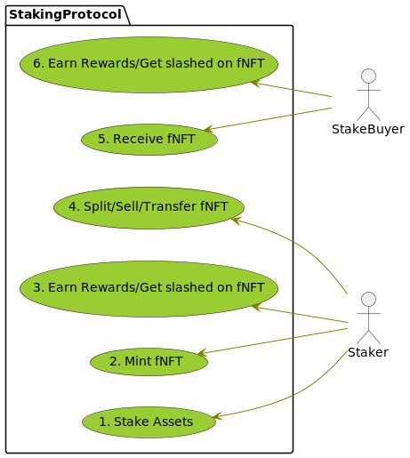

Protocol Specification: Financial Non-Fungible Tokens (fNFT)
============================================================

Table of Contents

-   [1. Abstract](#_abstract)
-   [2. Background](#_background)
-   [3. Goals](#_goals)
    -   [3.1. Example Use Cases](#_example_use_cases)
        -   [3.1.1. Staking](#_staking)
        -   [3.1.2. Debt Instruments](#_debt_instruments)
        -   [3.1.3. Coin Voting Based on fNFT
            Ownership](#_coin_voting_based_on_fnft_ownership)
-   [4. Specification](#_specification)
    -   [4.1. Financial NFT Traits](#_financial_nft_traits)
        -   [4.1.1. Asset Account](#_asset_account)
    -   [4.2. Financial NFT Protocol
        Trait](#_financial_nft_protocol_trait)
    -   [4.3. Cross Consensus Messaging(XCM)
        Concerns](#_cross_consensus_messagingxcm_concerns)
-   [5. Implementation](#_implementation)
-   [6. References](#_references)

<table>
<colgroup>
<col style="width: 25%" />
<col style="width: 25%" />
<col style="width: 25%" />
<col style="width: 25%" />
</colgroup>
<thead>
<tr class="header">
<th>Revision</th>
<th>Date</th>
<th>Comment</th>
<th>Author</th>
</tr>
</thead>
<tbody>
<tr class="odd">
<td>
v0.1
</td>
<td>
2022-08-13
</td>
<td>
Draft version
</td>
<td>
Vim
</td>
</tr>
</tbody>
</table>

## 1. Abstract

This document describes the specification for the Composable Finance’s
Financial Non-Fungible Tokens (fNFT) protocol.

## 2. Background

[Non-fungible
tokens(NFT)](https://en.wikipedia.org/wiki/Non-fungible_token) stored in
a blockchain is commonly used to represent ownership of some asset. For
example one of the most popular use cases of these is the representation
of ownership of a piece of digital art like in the case of [crypto
punks](https://www.larvalabs.com/cryptopunks). A public blockchain as an
immutable ledger allows trading of these assets as financial securities.
Ethereum’s [ERC-721](https://eips.ethereum.org/EIPS/eip-721)
specification is one popular attempt at standardizing these assets for
Ethereum ecosystem using its smart contracts. Standardization allows
these assets to be used in a wide variety of use cases in an
interoperable way including in popular marketplaces.

The perceived value of an NFT as an asset can vary based on what
underlying asset it represents. Composable Finance intends to define a
protocol that allows standardization of operations on those underlying
assets. The motivation is to increase interoperability and the
compatibility of these NFT assets across the broader ecosystem where
Composable Finance intends to become a major asset originator.

## 3. Goals

The following goals are defined to enable a common standard compatible
with any [cross consensus
messaging(XCM)](https://wiki.polkadot.network/docs/learn-crosschain)
compatible blockchain, that allows representation of a financial
position as an fNFT asset.

1.  The fNFT asset MUST be transferable between accounts(owners) without
    the underlying position being mutated in an unintended way.

2.  The owner(account) of the fNFT asset MUST be allowed to perform
    actions that mutate the position according to what’s allowed by the
    asset originating protocol. For example claiming yield for a yield
    baring asset.

3.  The asset originating protocol MUST be able to avoid a direct
    dependency on ownership details of the fNFT asset for its internal
    operations.

4.  The fNFT assets MUST be reusable across any other ecosystem
    protocols that want to use them. Eg: An fNFT market would be able to
    publish a complying NFT asset originating from any other fNFT
    protocol in its catalog.

### 3.1. Example Use Cases

#### 3.1.1. Staking

In the following example a staker receives a fNFT to represent their
staking position, which can be freely traded like any other financial
asset.

#### 3.1.2. Debt Instruments

In the following example a debt instrument is created and sold buy a
borrower as an fNFT to a lender. Whoever owns the fNFT receives the
interest payments and the principle at the end of the loan term.

#### 3.1.3. Coin Voting Based on fNFT Ownership

In the following example an fNFT with locked assets that has voting
power is bought by a voter. Again whoever owns the fNFT receives the
voting power of the underlying assets.

## 4. Specification

This specification consists of two main parts as the following diagram
shows:

The diagram can be summarized as,

*A Financial NFT protocol provides access to value owned by a Financial
NFT that belongs to a collection ID included in the list of collection
asset IDs it exposes.*

The following subsections dives into the specification of the main two
parts illustrated.

<table>
<colgroup>
<col style="width: 50%" />
<col style="width: 50%" />
</colgroup>
<tbody>
<tr class="odd">
<td>

Note

</td>
<td>The interfaces are shown in Rust language syntax for convenience to be used in <a href="https://docs.substrate.io/">Substrate</a> though they can be readily translated into any other programming language.</td>
</tr>
</tbody>
</table>

### 4.1. Financial NFT Traits

Substrate framework already defines
[nonfungibles](https://paritytech.github.io/substrate/master/frame_support/traits/tokens/nonfungibles/index.html)
traits to be implemented by pallets that create, read, update and delete
NFT assets in a generally reusable way. This specification extends one
of those traits to allow for inspection of fNFT assets when implemented
by a NFT pallet.

    /// Inspect trait from substrate shown for completeness
    pub trait Inspect<AccountId> {
        /// Type for identifying a fNFT.
        type ItemId;
        /// Type for identifying a collection (an identifier for an
        /// independent collection of items).
        /// For fNFTs the NFT collection Id should be set as a unique asset ID
        /// for the type of financial asset it represents. This allows
        /// the fNFT protocols to identify asset types it controls.
        type CollectionId;

        fn owner(
            collection: &Self::CollectionId,
            item: &Self::ItemId
        ) -> Option<AccountId>;

        // ...
    }

    /// Wrap any financial position into the ownership of an NFT
    trait FinancialNFT<AccountId>: Inspect<AccountId> {

        /// ID of the Account which holds the assets owned by a financial NFT. The value of the
        /// financial NFT is the sum total of balances of all asset types in this account plus the
        /// future returns minus any liabilities. Future returns and liabilities should be queried
        /// through the originating financial NFT protocol.
        fn asset_account(collection: &Self::CollectionId, instance: &Self::ItemId) -> AccountId;

        /// Retrieve the next valid financial NFT ID for the given collection in order to
        /// mint a new NFT.
        fn get_next_nft_id(collection: &Self::CollectionId) -> Result<Self::ItemId, DispatchError>;
    }

The important thing of note is the introduction of the asset account
concept for each fNFT.

#### 4.1.1. Asset Account

Instead of the fNFT owner account controlling any assets controlled by
the fNFT, asset account serves as an indirection holding the assets
owned by a financial NFT. This allows for the fNFT to be transferred
between owners without the owners having the ability to mutate the
assets in an unintended way. The fNFT originating protocol instead
defines the level of control and actions that an owner could take. i.e.
fNFT protocol ultimately controls the assets according to its design.

### 4.2. Financial NFT Protocol Trait

The following trait must be implemented by any fNFT asset originating
protocol.

    /// Trait to be implemented by protocol supporting financial NFTs.
    pub trait FinancialNFTProtocol {
        /// Type for identifying an item.
        type ItemId;

        /// Asset ID type. This is the type used for financial NFT collection IDs. Following
        /// https://github.com/paritytech/xcm-format#6-universal-asset-identifiers setting collection
        /// IDs as asset IDs (asset class), allows universal identifiers for all asset classes
        /// across eco system projects. Refer xcm::..::MultiLocation
        type AssetId;

        /// Balance type.
        type Balance;

        /// Returns the set of Asset IDs mapping the originated financial NFT collections to
        /// the financial NFT protocol. Used to identify the financial NFT protocol to route
        /// operations related to a given financial NFT.
        ///
        /// Eg: for staking rewards if
        ///  the fNFT collectionId(assetId) of issued fNFTs for staking positions of a particular reward
        ///  pool a is x and for another b is y. Then this function returns vec![x, y].
        fn collection_asset_ids() -> Vec<Self::AssetId>;

        /// The value of the financial NFT is the sum total of balances of all asset types in its
        /// account plus the future returns minus any liabilities.
        ///
        /// - collection: id of the financial NFT collection issued/used by the protocol.
        fn value_of(
            collection: &Self::AssetId,
            instance: &Self::ItemId,
        ) -> Vec<(Self::AssetId, Self::Balance)>;
    }

### 4.3. Cross Consensus Messaging(XCM) Concerns

Polkadot specifies XCM format to allow for communication between
parachains or more broadly between any consensus system like a
blockchain. fNFTs are designed to be compatible between any system that
complies with XCM messaging format. This requires compliance with
[MultiAsset](https://github.com/paritytech/xcm-format/blob/master/README.md#format)
specification. Following is the specification of a MultiAsset format for
a fNFT.

-   `class: Concrete`

    -   `location: MultiLocation` - The location can be specified in two
        ways.

        1.  By addressing the fNFT asset account:

            1.  `parents:` relative navigation

            2.  `InteriorMultiLocation:` Vec\[Parachain, AccountId32\]

        2.  By addressing the fNFT protocol

            1.  `parents:` relative navigation

            2.  `InteriorMultiLocation:` Vec\[Parachain, PalletInstance,
                GeneralIndex(fNFT CollectionId), GeneralKey(fNFT
                ItemId)\]

-   `fun: NonFungible`

<table>
<colgroup>
<col style="width: 50%" />
<col style="width: 50%" />
</colgroup>
<tbody>
<tr class="odd">
<td>

Note

</td>
<td>This section may change based on any changes made to XCM format.</td>
</tr>
</tbody>
</table>

## 5. Implementation

First reference implementation of the specification is the staking
position fNFTs in the [pallet-staking-rewards(Financial NFT
Protocol)](https://github.com/ComposableFi/composable/tree/main/frame/staking-rewards)
together with [pallet-fnft (Financial
NFT)](https://github.com/ComposableFi/composable/tree/main/frame/fnft).

Pallet-fnft uses [substrate account
proxies](https://wiki.polkadot.network/docs/learn-proxies) to set the
owning account of a fNFT as a proxy for its asset account for governance
actions in the runtime(eg: Picasso parachain). This should serve as an
example of extending functionality available to an fNFT owner beyond
what the basic `frame_support::traits::tokens::nonfungibles` traits
allow.

## 6. References

1.  Non-fungible tokens(NFT) -
    <a href="https://en.wikipedia.org/wiki/Non-fungible_token" class="bare">https://en.wikipedia.org/wiki/Non-fungible_token</a>

2.  Crypto punks -
    <a href="https://www.larvalabs.com/cryptopunks" class="bare">https://www.larvalabs.com/cryptopunks</a>

3.  ERC-721 -
    <a href="https://eips.ethereum.org/EIPS/eip-721" class="bare">https://eips.ethereum.org/EIPS/eip-721</a>

4.  cross consensus messaging(XCM) -
    <a href="https://wiki.polkadot.network/docs/learn-crosschain" class="bare">https://wiki.polkadot.network/docs/learn-crosschain</a>

5.  Substrate -
    <a href="https://docs.substrate.io/" class="bare">https://docs.substrate.io/</a>

6.  Substrate nonfungibles traits -
    <a href="https://paritytech.github.io/substrate/master/frame_support/traits/tokens/nonfungibles/index.html" class="bare">https://paritytech.github.io/substrate/master/frame_support/traits/tokens/nonfungibles/index.html</a>

7.  MultiAsset addresses -
    <a href="https://github.com/paritytech/xcm-format/blob/master/README.md#format" class="bare">https://github.com/paritytech/xcm-format/blob/master/README.md#format</a>

8.  Substrate account proxies -
    <a href="https://wiki.polkadot.network/docs/learn-proxies" class="bare">https://wiki.polkadot.network/docs/learn-proxies</a>

Last updated 2022-08-12 12:13:40 +0200
