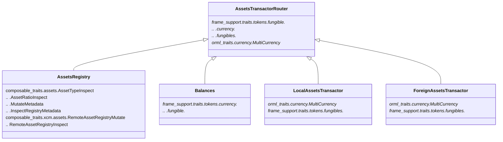

# Redesign Assets System

This RFC will serve to finalize our approach to refactoring assets-registry and 
removing assets, currency-factory, and our dependence on hard-coded assets.

## Context

Previously, we planned to use currency-factory to reserve asset IDs. However,
currency-factory itself was mostly difficult to maintain legacy code with an
asset ID range system that was overly complex and not helpful to our current 
tech stack.

As it stands, we have removed most of the dependence on currency-factory from
Picasso in favor of hard-coded asset IDs. These hard-coded IDs have allowed us
to conduct an initial release using a simplistic storage migration to create
initial pools for Pablo. However, with the dependence on these hard-coded asset
IDs - we now must conduct additional, more complex, storage migrations to add 
more Pablo pools and more tokens.

Instead of depending on these hard-coded asset IDs, we should instead develop
a dynamic ID system that makes it easy for developers to both interact with 
assets within our consensus system and to retrieve information relevant to a 
given asset.

## Requirements

* There exists a double mapping between multi-locations and local asset IDs
  * Zero or One multi-locations ↔ One asset ID

* Given a way to uniquely identify an asset, one should be able to retrieve 
asset metadata (ticker-symbol, decimal precision, and ratio)

* Support the traits from `frame_support::traits::tokens::fungibles`
  * Specifically `MutateHold`

* Ability to mint mintable assets and the inability to mint non-mintable assets

* Support the existing local asset IDs we have hard-coded

* Supply an Asset Transactor to our XCM Config

# Other Solutions

* [Acala](./0013/acala-analysis.md)
* [Moonbeam](./0013/moonbeam-analysis.md)
* [Parallel](./0013/parallel-finance-analysis.md)

<!-- TODO: These are mostly done, but I will introduce them to the repo in 
their own files -->

# Design

Given the scope of assets, the design will be broken down into several more 
consumable sections.

## Local Asset ID Generation

Each asset within our consensus system should have its own local asset ID. 
Currently, we have hard-coded these local IDs rather than dynamically generating 
them as needed. While existing assets should maintain their current ID, we can 
define a new way to derive asset IDs automatically for assets created in the 
future.

To create a local asset ID, we can form a full asset ID from the combination of
the assets' namespace (pallet or protocol) and a nonce/key provided by that 
namespace.

## Foreign Asset ID Generation

Foreign assets should always be created with a provided, and unique, relative 
multi-location. A corresponding local asset ID that implements the `Copy` trait 
is still required in addition to the multi-location. To ensure we have both of 
theses, we can hash the provided multi-location to create a local asset ID.

## Asset Types and Asset Routing

Within our consensus system, we have two primary types of currency mintable and 
non-mintable. Mintable assets tend to be purely local in their scope and 
function while non-mintable assets tend to come into our consensus system 
externally (via XCM). To ensure no overlap in function between these assets,
they each should belong to their own instance of an assets' pallet.

When also considering pallet-balances for our native asset, it becomes clear 
that some amount of assisted routing will be necessary. While routing between 
pallet-assets and pallet-balances is trivial, routing between pallet-balances 
and two instances of pallet-assets becomes more difficult.

Ideally, this routing would not be needed, but both our local and foreign asset 
will, in some instances, interact within the same scope (i.e. Pablo).

Our current asset router (also called pallet-assets, to be renamed to assets 
manager) already completes the more trivial routing. To conduct the non-trivial 
routing, we can depend on asset-registry to inform us if an asset belongs to 
the mintable or non-mintable assets' pallet instance.

## Adapted Asset Registry

Asset Registry must be updated with distinct paths for both local (mintable) and 
foreign (non-mintable) assets.

Asset Registry will also be responsible for maintaining asset metadata.

# Implementation

To complete the implementation of a new assets' system, we will conduct four 
main tasks.

To-Do comments for these tasks will be added in the Dali 
runtime.

## Declare Two pallet-asset Instances

**NOTE:** Currently, moving away from `orml-tokens` is not practical. Given 
`orml-tokens` does not support multiple instances, the two separate instances 
cannot be fully realized. Instead, the transactor will act as though it has two
configured instances, but will point each to the same instance of `orml-tokens`.

A great reference for what it looks like to have two instances of pallet-assets 
can be found within the `PureStake/moonbeam` repository. Within the Moonbeam 
runtime, there are two instances of pallet-assets, the first for foreign assets 
and the second for local assets.

While the approach of having two instances of pallet-assets will work for us, 
it's important to note a difference between the goals of Moonbeam and Picasso.

From Moonbeam's `NormalFilter`:
> Normal Call Filter
> We dont allow to create nor mint assets, this for now is disabled
> We only allow transfers. For now creation of assets will go through
> asset-manager, while minting/burning only happens through xcm messages
> This can change in the future

While Moonbeam does not want asset minting or burning to occur outside XCM, 
on Picasso - minting and burning is a core function of Pablo and Staking.

While using Parity's pallet-assets may be ideal, the lack of lock/hold 
functionality provided by the interface makes it insufficient for our solution. 
Therefore, implementing additional traits not found in orml-tokens on our 
routing layer is instead more ideal, especially since user balances are already 
on chain.

## Update Assets Registry

Assets Registry will be responsible for registering both foreign and local 
assets. As part of the registration process, asset-meta data should be provided 
and updatable through assets-registry.

### Pallet Configuration

To be responsible for registering both foreign and local assets, assets-registry
will need access to the creation functionality of both instances of 
pallet-assets.

**Steps:**

* Provide configuration item for asset creation to assets-registry

* Provide configuration item for max length of ticker-symbols

### Pallet Storage

To accomplish this, minimal storage modifications will be required. The current 
pallet storage items do not need to be altered, but several new ones will need 
to be created.

**Steps:**

* Add a nonce storage item that will be used for generating foreign asset IDs

* Add storage item for Asset ticker-symbol

### Pallet Functions

Assets registry now must support the storage of both local and foreign assets.
To allow for this, the `register_asset` interface must support both types of 
assets. 

To enable this, instead of only passing a multi-location, we switch to an enum 
of either multi-location or local ID.

## Create Assets Transactor Router (Assets Manager)

Assets Manager will be a migration of the current pallet-assets that we created 
to route between pallet-balances and orml-tokens. The primary difference being 
that assets-manager will also need to handle routing between our two instances 
of orml-tokens as well as pallet-balances.

As stated in the design, we can depend on information provided by Assets 
Registry to route between our two instances of pallet-assets. 

**Dependency Graph of the New Assets System:**



**Steps:**

* Rename our `pallet-assets` to `pallet-assets-manager`

* Add routes for both instances to existing functions

* Expose the `metadata::Inspect` and `InspectMetadata` traits from the manager

* Use a call filter to block calls into the individual instances of 
pallet-assets

* Provide assets-manager as the XCM Asset Transactor

### Asset ID Creation

To assist in the routing between both instances of pallet-assets, we can 
dedicate the first 8 bytes to either a pallet ID or other information that 
determines the source of the asset. The remaining 8 bytes of the asset ID can 
be the nonce provided by the source.

To create a hash from the nonce, `sp_core::hashing::blake2_64` can be used

**Steps:**

* Provide assets registry with either our previously described local asset ID
or a multi-location

* If assets registry receives a multi-location, hash the multilocation to create
a new ID

## Migrate Hard-Coded Assets

The data-migration may be handled in two main tasks:

* Append new storage elements to assets-registry
  * Add nonce
  * Add ticker-number to existing tokens
  * Create entries for local assets not previously found in assets-registry

* Migrate existing orml-tokens storage to appropriate instances of orml-tokens

<!-- TODO This should provide more clear details and will in the future -->

# Quality Assurance

This section contains notes that may be relevant for QA when inspecting these 
changes.

## Things to Test

* Asset ID Creation

  With these changes come a mostly automated way to create asset IDs. There will
  be two primary routes for creating assets:

  * Local Assets

    Local assets will consist of two sets of 8 bytes. The first 8 bytes are the
    protocol controlled identifier that should represent the protocol that 
    created the asset. The second 8 bytes are an asset identifier that is unique
    to the asset in the scope of the protocol (this is normally a nonce).

  * Foreign Assets

    Foreign assets have an ID determined my a hashing of their Muli-Location

  With these changes, we need to ensure that these two forms of creating IDs 
  will not contain collisions

* Asset Transactions

  Asset transfers should not have any side effects on accounts or assets not 
  included in a transaction

* Asset Creation / Registration is Permissioned

  Only root/governance should be able to new create assets

# Integrations / FE

This section contains notes that may be relevant to integrating the new 
interface

## Assets Registry Changes

### Events

* `AssetUpdated`

  The `AssetUpdated` event has been replaced by the 3 events 
  `AssetLocationUpdated`, `AssetRatioUpdated`, and `AssetMetadataUpdated`. The 
  new events have the following structure:

  ```rust
  AssetLocationUpdated {
	  asset_id: T::LocalAssetId,
		location: T::ForeignAssetId,
  }

  AssetRatioUpdated {
		asset_id: T::LocalAssetId,
	  ratio: Option<Rational>,
	}

  AssetMetadataUpdated {
		asset_id: T::LocalAssetId,
		name: Vec<u8>,
		symbol: Vec<u8>,
		decimals: u8,
	}
  ```

* `AssetRegistered`

  The `AssetRegistered` event has several new fields. Its new structure is as 
  follows:

  ```rust
  AssetRegistered {
		asset_id: T::LocalAssetId,
		location: T::ForeignAssetId,
		decimals: Option<Exponent>,
		location: Option<T::ForeignAssetId>,
		name: Vec<u8>,
		symbol: Vec<u8>,
		decimals: u8,
		ratio: Option<Rational>,
	}
  ```

### Call

* `register_asset`

  The `register_asset` extrinsic has a new signature. Notably, it now returns a 
  `DispatchResult` and contains fields for all asset data. The signature is as 
  follows:

  ```rust
  pub fn register_asset(
    origin: OriginFor<T>,
    local_or_foreign: LocalOrForeignAssetId<T::LocalAssetId, ForeignAssetId>,
    ratio: Option<Rational>,
    name: Vec<u8>,
    symbol: Vec<u8>,
    decimals: Exponent,
  ) -> DispatchResult;
  ```

  The `LocalOrForeignAssetId` enum is defined as follows:

  ```rust
  pub enum LocalOrForeignAssetId<LocalAssetId, ForeignAssetId> {
  	Local(LocalAssetId),
  	Foreign(ForeignAssetId),
  }
  ```

* `update_asset`

  The `update_asset` extrinsic has been removed in favor of less monolithic 
  update functions. They have the following signatures:

  ```rust
  pub fn update_asset_location(
    origin: OriginFor<T>,
    asset_id: T::LocalAssetId,
    location: T::ForeignAssetId,
  ) -> DispatchResultWithPostInfo;

  pub fn update_asset_ratio(
		origin: OriginFor<T>,
		asset_id: T::LocalAssetId,
		ratio: Option<Rational>,
	) -> DispatchResult

  pub fn update_asset_metadata(
		origin: OriginFor<T>,
		asset_id: T::LocalAssetId,
		name: Option<Vec<u8>>,
		symbol: Option<Vec<u8>>,
		decimals: Option<u8>,
	) -> DispatchResult
  ```

### Storage

* `LocalToForeign`

  The storage item queried by `from_local_asset(local_asset_id)` now only 
  returns the foreign asset ID instead of all metadata and ID.

* `Metadata`

  A new storage item queried by `metadata(local_asset_id)` returns a structure 
  containing asset metadata. The structure is as follows:

  ```rust
  pub struct AssetMetadata<BoundedName, BoundedSymbol> {
  	/// Name of the asset.
  	pub name: BoundedName,
  	/// Symbol of the asset.
  	pub symbol: BoundedSymbol,
  	/// The number of decimals this asset uses to represent one unit.
  	pub decimals: u8,
  }
  ```

## Assets Transactor Router (Assets Manager)

The assets transactor router is nearly identical to the old `pallet-assets` that
we used to use for routing between `pallet-balances` and `orml-tokens`. Only the
differences in the Call/extrinsic functions will be noted here.

### Call

* `mint_initialize`

  The extrinsic `mint_initialize` now requires asset metadata to be created. The
  function signature is as follows:

  ```rust
  pub fn mint_initialize(
		origin: OriginFor<T>,
		protocol_id: [u8; 8],
		nonce: u64,
		name: Vec<u8>,
		symbol: Vec<u8>,
		decimals: u8,
		ratio: Option<Rational64>,
		amount: T::Balance,
		dest: <T::Lookup as StaticLookup>::Source,
	) -> DispatchResult;
  ```

* `mint_initialize_with_governance`

  This extrinsic also now requires asset metadata. Its signature is as follows:

  ```rust
  pub fn mint_initialize_with_governance(
		origin: OriginFor<T>,
		protocol_id: [u8; 8],
		nonce: u64,
		name: Vec<u8>,
		symbol: Vec<u8>,
		decimals: u8,
		ratio: Option<Rational64>,
		amount: T::Balance,
		governance_origin: <T::Lookup as StaticLookup>::Source,
		dest: <T::Lookup as StaticLookup>::Source,
	) -> DispatchResult
  ```
 
# Glossary

* **Multi-Location** - A way to identify a single asset in the scope of multiple
consensus systems

* **Local Asset ID** - A way to identify a single asset within the scope of a
single consensus system

* **Ticker-Symbol** - Small set of letters commonly used to identify an asset 
(PBLO, PICA, BTC, USDT, POOP)

* **decimal precision** - In the context of some amount of a single fungible asset,
the number of digits after the decimal point

* **ratio** - The value ratio between our consensus system's native asset and 
another asset

* **mintable asset** - An asset we can mint within our consensus system

* **non-mintable asset** - An asset we can **NOT** mint within our consensus 
system
