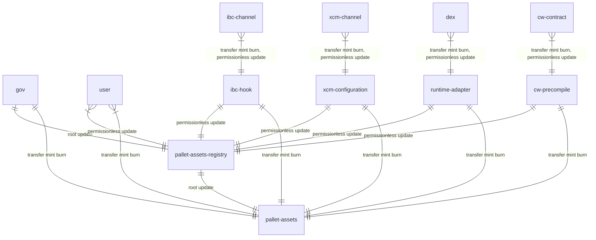

# Overview

New assets, not registered before, can be transferred via Bridges to Dotsama and created by permissionless transactions, including  CosmWasm contracts, without any prior registration or permissioned governance.

Also all permissionless asset still can be governed by Root, they also have admin accounts which are set by by permissionless transactions on creation for source assets (originated from our chains) or set by Root for bridged assets for permissionless updates of some properties.

To create new permissionless asset `CreationFee` must be paid.

## Target semantic data structure

```typescript
// none of these ever set by permissionless transactions/users
interface AssetId {
    // 4 byte number, set once per each consensus connection
    // asset from specific network transferred via XCM or IBC will have same network_id,
    // but different protocol_id
    // picasso id = 0
    network_id : number
    // 8 byte number, hardcoded into runtime codebase
    // examples, are DEX, CW, IBC, XCM, XCVM
    // use pallet identifier where it is fit
    protocol_id : number
    // 4 byte number, incremented predictably by assets-registry or by cross chain governance per protocol_id
    nonce: number
}


interface GovernanceSufficiency {
    /// when set allows to pay ED in this asset
    /// replaced by DEX oracle and some storage multiplier later
    existential_deposit: number?
    /// ratio of PICA token to this assets
    /// when set allows to pay Bridge and BYOG fees
    /// replaced by DEX oracle later
    ratio: Fraction?
}

// payable
type SufficientAsset = OracleSufficiency | GovSufficiency  

// can be modified by Root or AssetsAdmin
interface GovernanceAsset {
    sufficiency: SufficientAsset?
}

type BridgeGovernance = XcmMultiLocation | IbcChannelPrefix
type Location = IbcPrefixedDenom | XcmMultiLocation


interface BridgeAsset {
    location : Location?
    // only it can mint asset
    // IBC does that behind scenes
    // XCM directly uses hash hash of origin as account    
    mint_admin : BridgeGovernance
    // bridge origin cannot burn directly until it executes on behalf some onchain account
    // so no burn_admin
    // no freeze_admin as freeze handled by bridge protocol
}

// permissionless, offchain
interface MetadataAsset {
    // little bit longer
    name: String?
    // super short, ticker
    symbol: String?
    // small number under 8 bits
    decimals: number?
    /// account can set any of above values
    /// any bridged asset can get this one too
    metadata_admin: String?
}

interface PermissionlessAsset {
    mint_admin : String?
    burn_admin : String?
    // stops mint/burn/transfer
    freeze_admin : String?
}

type TrustlessAsset = BridgeAsset | PermissionlessAsset

interface ReceivableAsset {
    gov : GovernedAsset
    trustless: TrustlessAsset?
}


// one may never have account for this asset on this chain
// like centaury assets representation of osmosis ics-20 assets
interface NonReceivableAsset {
    location : Location?
}

interface Asset {
    id : AssetId
    asset : NonReceivableAsset | NonReceivableAsset
    metadata : MetadataAsset? 
}
```

Any checks and limits done to permissioned assets regarding `location` and `Metadata` are same for all assets.

Details of non receivable assets and oracle based sufficiency are not part of this document.

**Attacks**

Any `Governance` parameters cannot be set neither by Bridges nor by permissionless transactions as these allow DDoS chain and fake asset identifiers.


## Implementation notes

### Relevant codebase

- pallet-assets
- pallet-assets-registry
- orml-tokens
- multihop pallets for network registry
- traits and implementations wiring above pallets together and with ibc channel, pallet-ibc/hooks,  and xcm channel, pallets/configurations




### Storage

Storage is more flat than semantic model.

Admin to mint/burn, existential deposits are more related to `assets` pallet. As these are frequent use during mint/burn/transfer inside chain protocols.

Metadata/location/sufficiency/receivability are more lated tp `assets-registry` pallet. These are lower frequency on chain usage outer boundary usage in BYOG/bridges.

### ED (Existential Deposit)

Existential Deposit(ED) is a safeguard against bloating storage of the chain. If a user transfers a nonvaluable asset and sets its ED to 0 or 1, this user will be able to affect performance of the parachain by transferring this asset to many accounts. Thus, to avoid this potential attack vector, we will use Asset Hub (formerly Statemine) approach of non-sufficient assets: a user to be able to recieve permissionless asset needs to hold ED in PICA on Picasso and LAYR on Composable parachains. This approach will limit the growth of the storage. 

The chain needs to make sure that permissionless assets can be transferred to accounts that do not have ED in parachain's native token. It is also required to fail transfers that will result in drop of native token below ED if this account has nonsufficient tokens. [Reference](https://substrate.stackexchange.com/questions/2447/influence-of-existential-deposits-on-account-assets)


#### Recieving Account doesnt hold pica during bridging
**Potential solution**: relayer will send PICA to the reciever in case reciever doesnt have it. In case bridged asset is FlatFee asset, additional fee equal to ED in PICA will be charged from the transferred amount. Otherwise, percentage fee will be applied(To be configured)

#### orml-tokens pallet EDs
Currently assets are being stored in `orml-tokens` pallet which require Existential Deposits for stored assets. 

**Potential Solution**: for non sufficient assets still provide non-zero Existential Deposit parameter which is similar to minimum balance in Asset Hub implementation. Then the Exitstential logic for orml-tokens pallet will stay the same because account wont be able to hold a non sufficient asset without ED in parachain's native token. This will require a new field in AssetsRegistry: is_sufficient. All permissionless assets will have this field to be false by default. Assets created via permissioned extrinsic will allow to choose if asset is sufficient or not. Asset's sufficiency can be changed by governance.

### Scenarios

#### On chain transactions

CW and PD.js permissionless assets are same, because anybody can upload CW contract and execute any transaction on it.


**Create**
- No requires inputs
- `CreationFee` is payed in any assets, default to PICA. Or optional `FeeAsset` parameter is provided with sufficient asset identifier.  
- `Metatdata` properties are optional. 
- No other parameters.
- Optional `admin`s, which defaults to CW address or origin if not specified. 

#### Bridges

Each bridge has `origin`.
In case of IBC it is `channel and port`.
In case of XCM it is `MultiLocation origin`.
Any such origin can be hashed (to account) to produce Account32 which may be set be considered `mint_admin` of asset.

Via governance additional PD.js account or CW contract can be made to be second `metadata_owner` of asset. 

**Create**
- Happens automatically on transfer [1].
- When assets are created by other chains over bridges, no `Metadata` or `sufficiency` provided
- We know `location` of assets from origin and received asset id and this parameter is not optional.
- Location is mapped to `network_id` and `bridge` type to `protocol_id`.
- We take `CreationFee` from relevant source described per bridge next.

#### Sufficiency of IBC ICS-020

1. New token arrives.
2. Relayer pays for execution, including `CreationFee` in PICA.
3. Relayer pays fee for ED for account creation in PICA.

#### Sufficiency of XCM

1. New XCM message arrives with new new unknown yet asset.
2. There must be 2 tokens in Holder.
3. First token pays `CreationFee` (can be any `sufficient` token).
4. Account owner derived from XCM origin (example is sender parachain MultiLocation).
5. First token pays for ED creation.

# References

* [Statemine Ed](https://substrate.stackexchange.com/questions/5917/do-assets-from-the-asset-pallet-on-statemine-mint-have-an-existential-deposi/5923#5923)
* [Control sufficiency via system pallet](https://substrate.stackexchange.com/questions/2447/influence-of-existential-deposits-on-account-assets)
* [Account Structure to Implement nonsufficient assets](https://docs.substrate.io/reference/account-data-structures/)
* [More Statemine ED details](https://substrate.stackexchange.com/questions/6522/does-holding-only-sufficient-asset-in-statemint-imply-there-is-no-ed-for-the-acc/6524#6524)
* [ED dust cleanup](https://substrate.stackexchange.com/questions/3482/how-does-substrate-clean-up-accounts-whose-balance-is-below-the-existential-depo)
* [Cosmos IBC ADR 001: Coin Source Tracing](https://ibc.cosmos.network/main/architecture/adr-001-coin-source-tracing.html)