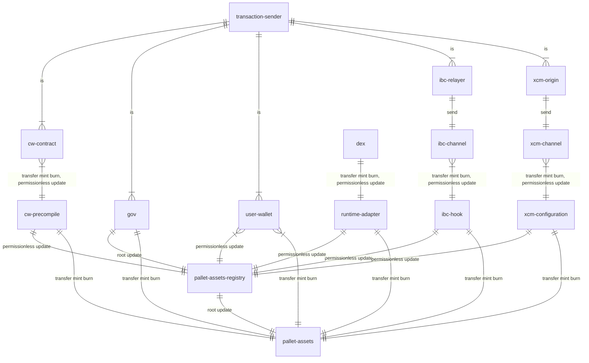

# Overview

New assets, not registered before, can be transferred via Bridges to Dotsama and created by permissionless transactions, including  CosmWasm contracts, without any prior registration or permissioned governance.

Also all permissionless asset still can be governed by Root, they also have admin accounts which are set by by permissionless transactions on creation for source assets (originated from our chains) or set by Root for bridged assets for permissionless updates of some properties.

To create new permissionless asset `CreationDeposit` must be paid.

## Out of scope

Logic and amount of sufficient assets for bridging and BYOG fees remain unchanged. 
So bridges or transactions-senders can decide to pay `CreationDeposit` if the want. That is not managed by us. 

## Target semantic data structure

```typescript
// none of these ever set by permissionless transactions/users
interface AssetId {
    // 4 byte number, set once per each consensus connection
    // asset from specific network transferred via XCM or IBC will have same network_id,
    // but different protocol_id
    // picasso id = 0
    network_id : number
    // 8 byte number, hardcoded into runtime codebase
    // examples, are DEX, CW, IBC, XCM, XCVM
    // use pallet identifier where it is fit
    protocol_id : number
    // 4 byte number, incremented predictably by assets-registry or by cross chain governance per protocol_id
    nonce: number
}


interface GovernanceSufficiency {
    /// when set allows to pay ED in this asset, not PICA, making asset more sufficient
    existential_deposit: number?
    /// ratio of PICA token to this asset
    /// when set allows to pay Bridge and BYOG gas fees in transferred asset 
    ratio: Fraction?
}

// ratio from DEX for example  
interface OracleSufficiency {
    // ...
}

// payable
type Sufficiency = OracleSufficiency | GovSufficiency  

// can be modified by Root or AssetsAdmin
interface GovernedAsset {
    /// always none for freshly created permissionless assets
    /// if enabled, asset can be used to pay for gas and storage
    sufficiency: Sufficiency?
}

type BridgeGovernance = XcmMultiLocation | IbcChannelPrefix
type Location = IbcPrefixedDenom | XcmMultiLocation


interface BridgeAsset {
    location : Location?
    // only it can mint asset
    // IBC does that behind scenes
    // XCM directly uses hash hash of origin as account    
    mint_admin : BridgeGovernance
    // bridge origin cannot burn directly until it executes on behalf some onchain account
    // so no burn_admin
    // no freeze_admin as freeze handled by bridge protocol
}

// permissionless, offchain
interface MetadataAsset {
    // little bit longer
    name: String?
    // super short, ticker
    symbol: String?
    // small number under 8 bits
    decimals: number?
    /// account can set any of above values
    /// any bridged asset can get this one too
    metadata_admin: String?
}

interface PermissionlessAsset {
    mint_admin : String?
    burn_admin : String?
    // stops mint/burn/transfer
    freeze_admin : String?
}

type TrustlessAsset = BridgeAsset | PermissionlessAsset

interface ReceivableAsset {
    gov : GovernedAsset
    trustless: TrustlessAsset?
}


// one may never have account for this asset on this chain
// like centaury assets representation of osmosis ics-20 assets
interface NonReceivableAsset {
    location : Location?
}

interface Asset {
    id : AssetId
    asset : NonReceivableAsset | ReceivableAsset
    metadata : MetadataAsset? 
}
```

Any checks and limits done to permissioned assets regarding `location` and `Metadata` are same for all assets.

Details of non receivable assets and oracle based sufficiency are not part of this document.

**Attacks**

Any `Governance` parameters cannot be set neither by Bridges nor by permissionless transactions as these allow DDoS chain and fake asset identifiers.


## Implementation notes

### Relevant codebase

- pallet-assets
- pallet-assets-registry
- orml-tokens
- multihop pallets for network registry
- traits and implementations wiring above pallets together and with ibc channel, pallet-ibc/hooks,  and xcm channel, pallets/configurations





#### orml-tokens pallet EDs

Currently assets are being stored in `orml-tokens` pallet which require Existential Deposits in stored asset. 
So currently they cannot store no sufficient assets, unlike parity assets hub pallet.

There are solutions possible.

Fork and pull request no sufficient assets support into `orml-tokens`:
```patch
- type ExistentialDeposits: GetByKey<Self::CurrencyId, Self::Balance>;
+ // right is in native token, PICA
+ type ExistentialDeposits: GetByKey<Self::CurrencyId, Either<Self::Balance, Self::Balance>>;
```
and do relevant changes.

Store sufficiency changes in separate storage per asset to avoid storage migration.

Handling non sufficiency outside of above pallet will require reimplementing dusting and account creation fails, which is harder than patching. 

### Storage

Storage is more flat than semantic model.

Admin to mint/burn, existential deposits are more related to `assets` pallet. As these are frequent use during mint/burn/transfer inside chain protocols.

Metadata/location/sufficiency/receivability are more lated tp `assets-registry` pallet. These are lower frequency on chain usage outer boundary usage in BYOG/bridges.

### Existential Deposit(ED)

Ask ChatGPT about `existential deposit in blockchain` , or do a look into [rent-deposit](./0002-rent-deposit.md).

### Sufficient asset

Pays ED in itself as defined by `Sufficiency` and [existential deposit calculations](./0010-define-calculations-of-existential-deposit.md). 


### Non sufficient assets default 

By default any non sufficient asset ED is payed in native token, PICA on Picasso and Centauri.
Transaction sender pays if account not yet exists.

### Non sufficient asset pays in other sufficient

See `Scenarios` for approaches per transaction sender. This protocol is subject some existing codebase limitation.

### Scenarios of permissionless(non sufficient) assets

Any permissionless assets can be governed to be sufficient. So that scenario defaults to permissioned flow.

All scenarios describe non sufficient assets.

#### Direct local on chain transactions

CW and PD.js permissionless assets are same, because anybody can upload CW contract and execute any transaction on it.

**Create**
- No requires inputs
- `CreationDeposit` is payed in any asset, default to PICA. Or optional `FeeAsset` parameter is provided with sufficient asset identifier.  
- `Metatdata` properties are optional. 
- No other parameters.
- Optional `admin`s, which defaults to CW address or `origin` if not specified.

**Mint/Transfer**
- If account does not exist, origin pays `ED` for account in PICA.
- If origin calls extrinsic or CW message directly, it can provide any sufficient asset to pay `ED`.

**Limitation** BYOG is not integrated with transaction execution, so cannot default to pay in BYOG assets. 

#### Bridges

Each bridge has `origin`.
In case of IBC it is `channel and port`.
In case of XCM it is `MultiLocation origin`, example parachain.
Any such origin can be hashed (to account) to produce Account32 which may be set be considered `mint_admin` of asset.

Via governance additional PD.js account or CW contract can be made to be second `metadata_owner` of asset. 

**Create**
- Happens automatically on transfer [1].
- When assets are created by other chains over bridges, no `Metadata` or `sufficiency` provided
- We know `location` of assets from origin and received asset denomination, required.
- Location is mapped to `network_id` and `bridge` type to `protocol_id`.
- If account formed from subaccount of `assets-registry` and location hash has `CreationDeposit` stored, it taken. 
- Else `CreationDeposit` taken from relevant source described per bridge next.

**Note** Any user wallet can transfer to `location` account amount of PICA equal to  `CreationDeposit` 

**Note** Nothing changes in case of sufficient assets, all bridge transfers were and are payed in transferred asset when fee payed as part of it. 

#### IBC ICS-020

1. New token arrives.
2. IBC Relayer pays for execution, including `CreationDeposit` in PICA, unless there was deposit on location. 
3. Relayer pays fee for ED for account creation in PICA, unless somebody put ED before for non existing asset.

#### XCM

1. New XCM message arrives with new new unknown yet asset.
2. There must be 2 tokens in Holder.
3. First token pays `CreationDeposit` (can be any `sufficient` token), unless there was deposit on location. 
4. First token pays ED of account creation, unless somebody put ED before for non existing asset.

# References

* [Statemine Ed](https://substrate.stackexchange.com/questions/5917/do-assets-from-the-asset-pallet-on-statemine-mint-have-an-existential-deposi/5923#5923)
* [Control sufficiency via system pallet](https://substrate.stackexchange.com/questions/2447/influence-of-existential-deposits-on-account-assets)
* [Account Structure to Implement nonsufficient assets](https://docs.substrate.io/reference/account-data-structures/)
* [More Statemine ED details](https://substrate.stackexchange.com/questions/6522/does-holding-only-sufficient-asset-in-statemint-imply-there-is-no-ed-for-the-acc/6524#6524)
* [ED dust cleanup](https://substrate.stackexchange.com/questions/3482/how-does-substrate-clean-up-accounts-whose-balance-is-below-the-existential-depo)
* [Cosmos IBC ADR 001: Coin Source Tracing](https://ibc.cosmos.network/main/architecture/adr-001-coin-source-tracing.html)
