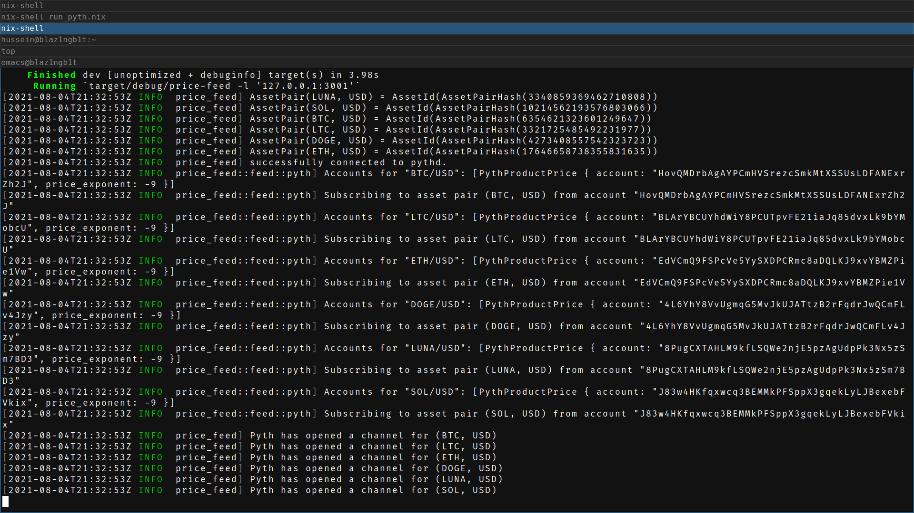

# Draft

Currently, in the pallet, the price of an asset is expressed in USD cents, it's not a ratio between two assets like in exchanges.

We currently use an arbitrary `asset_id` in the oracle pallet.
The server has a hardcoded map (u8 => Asset) to represent this ID.

# Getting started

1. Run an instance of the composable node.
2. ONLY IF PYTH IS USED: Run `pythd` along with `pyth_tx` using the provided nix script:
  - Open a new terminal and run `nix-shell run_pyth.nix`.
  - A bash function `run` is now available to start `pythd/pyth_tx`.
  - Whenever you exit the terminal after having ran the `run` function, the two instances are going to be shutdown.
  - You have accesss to both `pythd/pyth_tx` logs by using $PYTHD_LOG and $PYTH_TX_LOG.
3. Run the price server, assuming you are running `RUST_LOG=info cargo run --bin price-feed` .
4. Go on your local [substrate panel](https://polkadot.js.org/apps) and add a new asset, make sure to use the unique index of an `asset_id` which is located in `asset.rs`
5. Trigger a price request for each `asset_id` you created and watch the oracle state machine progress.
