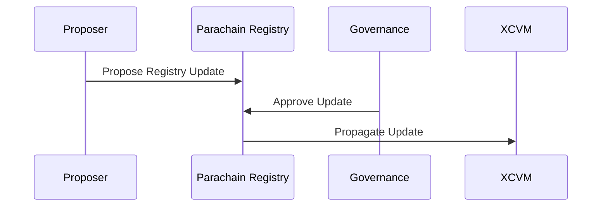

# Global Asset Registry

Within `XCVM` programs, assets are identified by a global identifier, which is the same within each chain. Bitcoin for example is identified by `1`.

```
AssetId ::= u64
```

The XCVM interpreter performs a look-up when executing instructions such as `Spawn` and `Transfer` to translate the local identifier to a global one. Local identifiers are chain specific, such as `address` in EVM chains. There is a two-way supported lookup:

```
AssetsById ::= AssetId -> LocalId
IdByAssets ::= LocalId -> AssetId
```

## Querying the Registry

When constructing `Call`s, we often need to convert `LocalId`s to `LocalId`s based on the `NetworkId`. Even though USDC is an erc20 token on many chains, the actual `address` is different on each chain. For this purpose, the registry also supports converting by NetworkId:

```
AssetsByIdAndNetwork ::= AssetId NetworkId -> LocalId
LocalIdOn ::= LocalId NetworkId -> LocalId
```

These mappings should be used to ensure that the following program is constructed properly:

```
Spawn XYZ [}
    Call { LocalId }
] { {AssetId}: {Amount} }
```

Here the constructor needs to ensure that `AssetId` maps to the `LocalId` on chain `XYZ`. This can be hardcoded, or achieved by an alternative registry, but more robustly by interacting with our registry, to guarantee that the mapping is the same.

### Queryable Data

On-chain, we store as little data as possible, thus per asset the only values stored are:

```
AssetData ::= AssetId LocalId Decimals
Decimals ::= u8
```

Where `Decimals` can be used to identify the decimal point location. This is especially important when bridging between fastly different ecosystems, where for example 1 USDC could be expressed as `100` in one ecosystem, and `1_000_000` in another.

## Updating the Registry

The Asset Registry is always updated from the Composable Parachain, and then updates are propagated over `XCVM` to connected chains.



This means that the most current source of truth (SoT) is the Composable Parachain state.

In case of emergencies, asset registries on connected chains can be updated directly. These updates can be disputed and must then be settled by governance. Some examples of emergencies:

- Block reorderings changing `LocalIds`.
- Protocol errors (bugs).