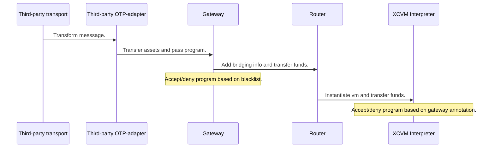
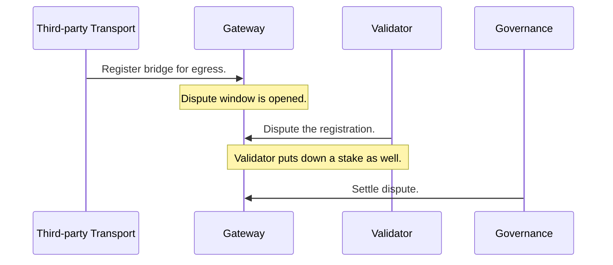
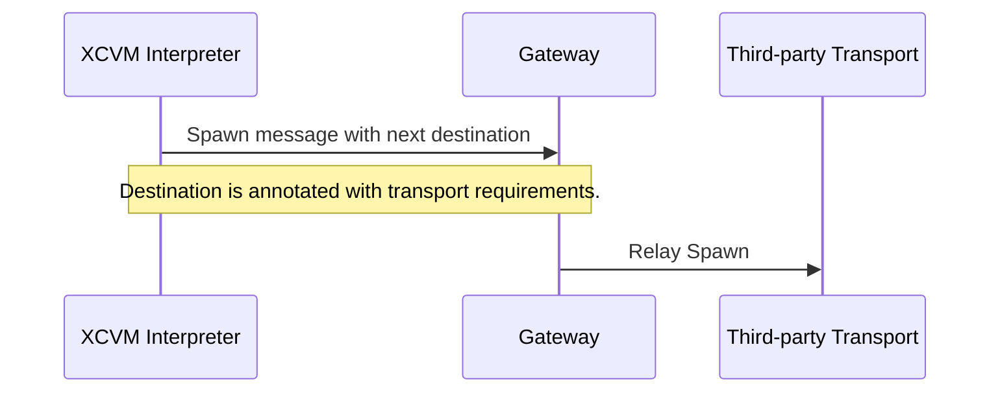
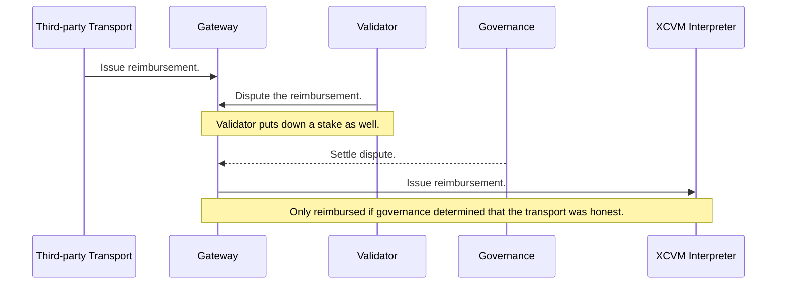

# Open Transport Protocol

Although [IBC](./ibc.md) is the default and preferred transport method within the `XCVM`, we also support arbitrary third party protocols. The abstract interface for registration and participation in `XCVM` transactions is what we call `OTP`.

For a transport to be OTP compatible, it has to support the following operations:

1. Fungible token transfers.
2. Opaque data transfers.

Ideally, a protocol supports both in a single operation, although most bridges will need to be wrapped in an additional set of contracts to be fully compatible.

`OTP` handles the following operations:

1. Maintaining a blacklist of transports.
2. Ingress of messages on the chain.
3. Registration of routing.
4. Egress of messages on the chain. 

## Blacklist

The blacklist is used to enact emergency operations in case of bridge fraud, which can be caused by hacks, or bugs within the system. The blacklist globally disables bridges based on `LAYR` governance.

Note that the blacklist is not used to manage ecosystem specific risk, such as toxic assets. It only concerns itself with bridges where the message authenticity can no longer be guaranteed.

## XCVM Ingress

A transport does not need to register itself to pass messages into the `XCVM`, it can do so directly, assuming that the interpreter instance accepting the transport's messages has whitelisted this transport. 

The following diagram describes the flow of data (and funds) when OTP is used to for ingress of programs.



Although the diagram simplifies the work that the OTP-adapter might need to perform, it can be relatively complicated depending on how the transport operates. We go into more concrete implementations [later](#possible-implementations) in this document. 

## Registration of Routes

For a transport to be possible be selected by the Gateway to transfer messages to different chains, a more involved registration process is required. 

- A stake needs to be put down, which is used to reward disputers in case of bridge fraud.
- Metadata on the bridge must be provided, including 
    1. The `Account` of the administrator, used to deregister the bridge, and add routes.
    2. Destinations reachable through this bridge.

```
RegistrationInfo ::= Account [Destination]
Destination      ::= NetworkId [AssetId]
```

Immediately after registration, the bridge registration can be disputed for approximately 72 hours. The stake can be lost during this time, if governance determines that the registration is fraudulent. If a dispute is triggered, the registration can be delayed by up to 2 weeks.

#### Disputed Registration

The following diagram displays the sequence of a registration, including the dispute by a validator.



Validators can be any entity, including a user triggering the dispute through our UI, as well as nodes automatically tracking registrations. For bridging teams, it is especially important to dispute registrations of your bridge with an incorrect administrator account.

## Egress of messages

Once a transport has been succesfully registered, it becomes accessible to the `Gateway`, which might route traffic based on transport requirements from the interpreter instance dispatching the program. By default, all OTP transports are considered `Trusted`, meaning that no traffic is routed through them unless specifically opted-in by the interpreter instance. 

Later we may add means through governance to upgrade transports to the `Trustless` status using governance. This will accomodate transports such as `XCMP`.



### Fees

`XCVM` is relatively unopiniated about handling fees, leaving that up to the users by adding an output to reward the relayer. Read more on how we defined fees [here](../../SPEC.md#fees). 

A note on this, fees are specified by the program, meaning that the bridge itself cannot charge a fee directly on the `Assets` being transfered. The third-party OTP-adapter will need to take this into account, by possibly using internal APIs of the bridging contract to ensure that no fees are charged based on the `Assets` transferred.

## Reimbursements

When a transports fails to transmit a message (such as an IBC timeout or network congestion) the `Third-party Transport` issues a reimbursement to the `Gateway` which then informs the interpreter instance of the failure.

For `OTP`-registerd transports, the reimbursement itself can be disputed as well. After issueing the reimbursement to the Gateway, a short-lived dispute window (hours) allows validators to dispute the reimbursement. This avoids the attack vector where a bridge has identified a contract which will retry a cross-chain operation until success, and extract value from that by issueing malicious reimbursements (a cross-chain re-entrancy attack).



## Example Implementations

### Multisignature (or TSS based) Bridge

### Updater Architecture using Merkle Roots